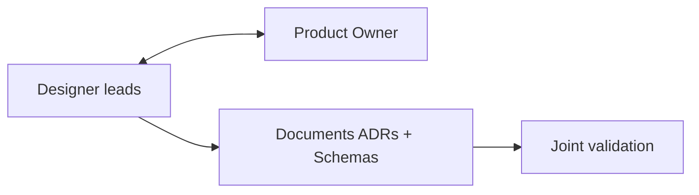
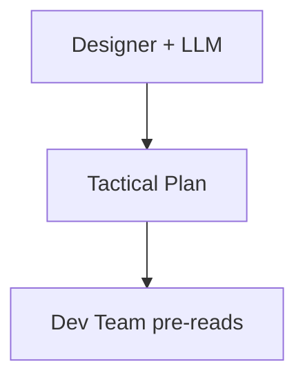
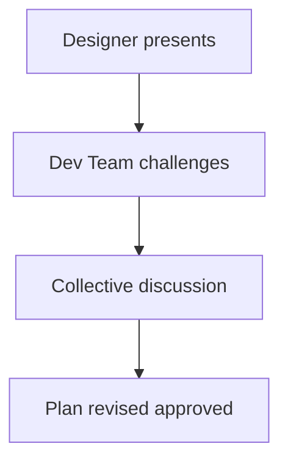
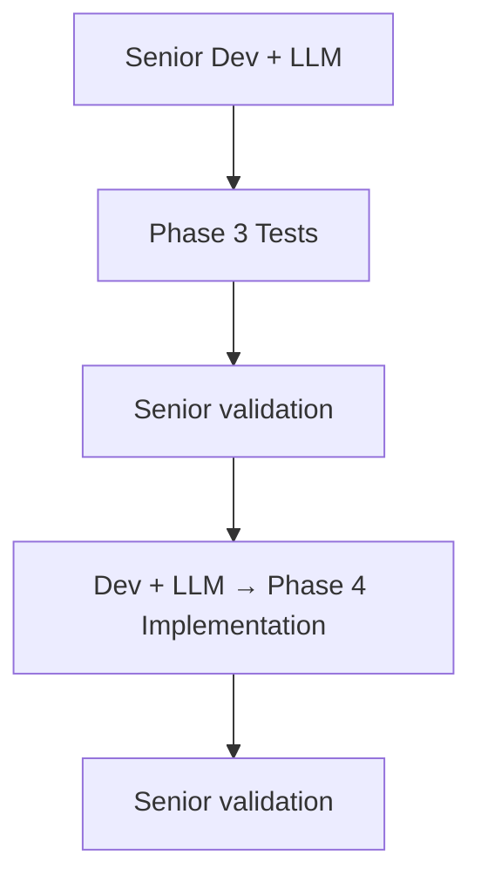
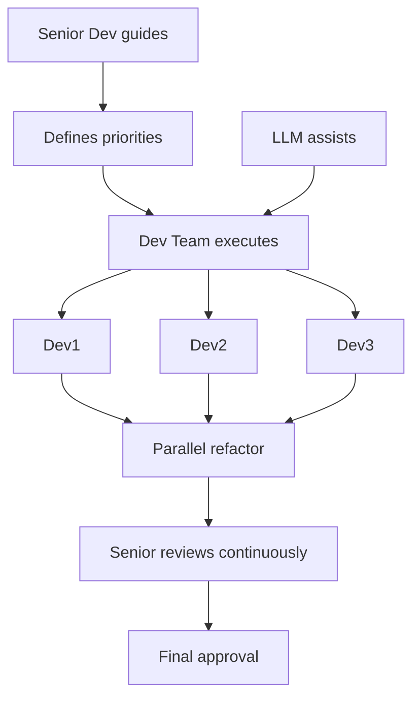
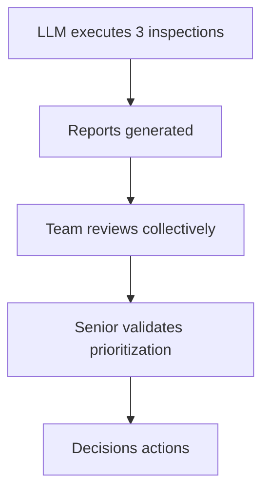

# Roles and Responsibilities

This document defines the key roles in the Structured LLM methodology and their specific responsibilities across the 6 phases. Structured LLM is designed to adapt to different team structures, from startups to large enterprises.

## Role Philosophy

**Structured LLM prioritizes organizational flexibility**: The roles described here are **responsibilities**, not rigid job titles. One person can hold multiple roles, and a role can be shared among multiple people depending on your team size and structure.

**Key principle**: What matters is not *who* holds the title, but *who* assumes the responsibility at each phase.

## Role Overview

### Main Role per Phase

| Phase | Primary Role | Supporting Roles | Human/LLM Ratio |
|-------|--------------|-----------------|-----------------|
| Phase 1 | Designer | Product Owner | 65% / 35% |
| Phase 2A | Designer + LLM | Dev Team (review) | 45% / 55% |
| Phase 2B | Designer + Dev Team | — | 80% / 20% |
| Phase 3 | Senior Dev + LLM | — | 30% / 70% |
| Phase 4 | Dev + LLM | Senior Dev (validation) | 25% / 75% |
| Phase 5 | Dev Team | Senior (guide) | 70% / 30% |
| Phase 6 | Team + LLM | Senior (validation) | 40% / 60% |

## Role Definitions

### 1. Designer

**Who can play this role**:
- Software architect (ideal)
- Senior technical analyst
- Experienced tech lead
- Senior developer with design talent

**Primary responsibilities**:
- Translate business needs into architectural decisions
- Identify technical constraints and trade-offs
- Create and document ADRs (Architecture Decision Records)
- Validate that proposed solutions meet strategic objectives
- Guide the team in understanding architectural vision

**Required skills**:
- Systems thinking (understanding how components interconnect)
- Experience with architectural patterns and trade-offs
- Ability to articulate technical decisions for business audience
- Judgment on scalability, performance, maintainability

**Time commitment**:
- Phase 1: 1-2 days (primary role)
- Phase 2: 4-6 hours (generation + critical handoff)
- Phases 3-6: Consultation availability (2-4 hours per phase)

### 2. Product Owner

**Who can play this role**:
- Scrum/Agile Product Owner
- Product Manager
- Senior business analyst
- Product lead

**Primary responsibilities**:
- Define business success criteria
- Prioritize features and arbitrate trade-offs
- Validate that solution meets business needs
- Represent end users and stakeholders
- Approve tactical plan before development

**Required skills**:
- Deep domain expertise
- Prioritization and arbitration ability
- Communication between technical and business
- Product vision and roadmap

**Time commitment**:
- Phase 1: 4-8 hours (continuous validation)
- Phase 2B: 2 hours (Critical Handoff)
- Phase 6: 1-2 hours (optional final validation)

### 3. Senior Developer

**Who can play this role**:
- Developer with 5+ years experience
- Technical tech lead
- Senior software engineer
- Developer with specific domain expertise

**Primary responsibilities**:
- Validate test quality and completeness (Phase 3)
- Validate implementation correctness (Phase 4)
- **Guide the team in refactoring** (Phase 5)
- Validate inspection results (Phase 6)
- Technical mentor for less experienced developers

**Required skills**:
- Deep technical expertise in technology stack
- TDD and code quality experience
- Mentoring and knowledge transfer ability
- Judgment on maintainability and long-term evolution

**Time commitment**:
- Phase 3: 30-45 minutes (test validation)
- Phase 4: 20-30 minutes (implementation validation)
- Phase 5: 6-12 hours (continuous refactoring guidance)
- Phase 6: 2-3 hours (inspection validation)

### 4. Development Team

**Who can play this role**:
- Developers of all levels (junior to senior)
- The complete team assigned to the project
- Can include specialists (frontend, backend, data, etc.)

**Primary responsibilities**:
- **Review and challenge the tactical plan** (Phase 2B)
- Identify technical risks and dependencies
- **Execute refactoring under senior guidance** (Phase 5)
- Review and approve inspections (Phase 6)
- Develop collective code ownership

**Required skills**:
- Technical skills in project technology stack
- Collaborative work ability
- Willingness to learn and improve
- Critical thinking (challenge assumptions)

**Time commitment**:
- Phase 2A: 1-2 hours (pre-read tactical plan)
- Phase 2B: 90-120 minutes (Critical Handoff)
- Phase 3-4: Optional observation/learning
- Phase 5: 6-12 hours (active refactoring work)
- Phase 6: 2-3 hours (inspection review)

## Collaboration Dynamics

### Phase 1: Strategic Architecture

**Dynamic**: Iterative dialogue between technical vision and business needs. Designer proposes solutions, Product Owner validates business alignment.

### Phase 2A-2B: Tactical Plan + Critical Handoff

**Phase 2A: Plan Generation**

**Phase 2B: Critical Handoff**

**Key dynamic**: The Critical Handoff (Phase 2B) is the moment where the Designer's vision meets the team's reality. The team MUST actively challenge—a passive team signals a problem.

**Red flags**:
- Silent team (no questions/concerns)
- Rubber-stamp approval without discussion
- Estimations diverge > 50% between Designer and Team

### Phase 3-4: TDD RED-GREEN

**Dynamic**: Fast, highly automated phases. Senior validates but does not code directly. Focus on speed with quality guaranteed by tests.

### Phase 5: Refactoring (Central Dynamic)

**Key dynamic**:
- **Senior does NOT do all the work alone**
- Senior identifies opportunities: "This module has duplication, who wants to extract it?"
- Team proposes approaches: "Could we use Strategy pattern here?"
- Senior guides: "Good idea, but watch for over-engineering. Start simple."
- Team implements under guidance
- Senior reviews and adjusts continuously

**Benefits**:
- Learning through practice (team develops skills)
- Scalability (multiple parallel refactorings)
- Ownership (team proud of the result)
- Senior is a force multiplier (guides 3-4 people simultaneously)

**Anti-patterns to avoid**:
- ❌ Senior does everything, team watches → No learning, bottleneck
- ❌ Team alone without guidance → Risk of over-engineering or under-refactoring
- ✅ **Active team under Senior guidance → Scalable, learning, efficient**

### Phase 6: Triple Inspection (Optional)

**Dynamic**: Automated inspections, human decisions. Team learns to read and interpret inspection reports, Senior validates that prioritization is appropriate.

## Scaling by Team Size

### Startup / Small Team (2-4 people)

**Typical mapping**:
- **Tech Founder**: Designer + Senior Dev
- **Dev 1-2**: Development Team
- **Founder/PM**: Product Owner

**Adjustments**:
- Same person plays multiple roles
- Critical Handoff less formal (team discussion)
- Phase 5: Tech founder guides but also participates in refactoring
- Faster decisions, less formal documentation

**Concrete example**:
- **Phase 1**: Tech founder (2h) defines architecture with PM
- **Phase 2B**: Team discussion 60 min around table
- **Phase 5**: Tech founder + Dev1 refactor together, pairing

### Medium Team (5-10 people)

**Typical mapping**:
- **Architect/Tech Lead**: Designer
- **Senior Dev (2-3)**: Senior Dev (can share roles)
- **Dev (3-5)**: Development Team
- **Product Owner**: Product Owner

**Adjustments**:
- More specialized roles but still flexible
- Critical Handoff formal with structured agenda
- Phase 5: 2-3 parallel refactorings under Senior guidance
- Complete but pragmatic documentation

**Concrete example**:
- **Phase 2B**: Formal meeting 90 min, all present
- **Phase 5**:
  - Senior1 guides Dev1 + Dev2 on Module A
  - Senior2 guides Dev3 + Dev4 on Module B
  - Common review end of day

### Large Team (10+ people)

**Typical mapping**:
- **Principal Architect**: Designer
- **Tech Leads (2-3)**: Assistant Designers
- **Senior Dev (4-6)**: Senior Dev
- **Dev (10+)**: Development Team
- **Product Manager + BAs**: Product Owner (collective)

**Adjustments**:
- More formal hierarchy necessary
- Critical Handoff by sub-teams with synthesis
- Phase 5: Multiple parallel refactorings, coordination essential
- Extensive documentation, formalized processes

**Concrete example**:
- **Phase 1**: Principal Architect + 2 Tech Leads co-create
- **Phase 2B**:
  - 3 Handoff sessions (one per sub-team)
  - Final consolidation session
- **Phase 5**:
  - 4 parallel groups (Senior + 2-3 Devs each)
  - Daily 30 min sync across all Seniors

## Skills Matrix

### Skills by Role

| Skill | Designer | Product Owner | Senior Dev | Dev Team |
|-------|----------|---------------|-----------|----------|
| **Systems thinking** | Expert | Intermediate | Advanced | Base |
| **Architectural patterns** | Expert | — | Advanced | Intermediate |
| **Domain expertise** | Intermediate | Expert | Intermediate | Base |
| **TDD/Testing** | Intermediate | — | Expert | Advanced |
| **Refactoring** | Advanced | — | Expert | Intermediate+ |
| **Technical communication** | Expert | Expert | Advanced | Intermediate |
| **Mentoring** | Advanced | — | Expert | Variable |
| **Business trade-offs** | Advanced | Expert | Intermediate | Base |

### Typical Progression

**Developer → Senior Dev**:
1. Master technology stack (2-3 years)
2. Deep TDD experience (1-2 years practice)
3. First guided refactorings (6-12 months)
4. Mentoring junior developers (6+ months)
5. Autonomous code validation

**Senior Dev → Designer**:
1. Systems thinking developed (3-5 years)
2. Architectural patterns experience (2-3 years)
3. Technical/business trade-offs (2+ years)
4. Stakeholder communication (1-2 years)
5. Autonomous architectural decisions

## Common Pitfalls

### 1. Isolated Designer
**Problem**: Designer decides alone, team executes blindly
**Solution**: Mandatory Critical Handoff (Phase 2B), team actively challenges

### 2. Senior Does Everything
**Problem**: Senior codes all refactoring, team is passive
**Solution**: Senior guides, team executes. Learning > short-term speed

### 3. Rigid Roles
**Problem**: "I'm a Dev, not Senior, so I can't comment on architecture"
**Solution**: Encourage contribution at all levels. Junior may have valuable insights.

### 4. Absent Product Owner
**Problem**: PO not involved Phase 1-2, discovers result Phase 6
**Solution**: PO validates at Phase 1 and Phase 2B minimum. No late surprises.

### 5. Non-Challenging Team
**Problem**: Team approves everything at Critical Handoff without questions
**Solution**: Create psychological safety culture. Questions = strength, not weakness.

## Role Health Indicators

:::tip[Positive Signals]
- Team asks 10+ questions at Critical Handoff
- Designer vs Team estimations diverge < 20%
- Juniors contribute refactoring ideas Phase 5
- Senior guides 3+ people simultaneously Phase 5
- Product Owner validates without surprise Phase 2B
:::

:::danger[Negative Signals]
- Team silent at Critical Handoff
- Estimations diverge > 50%
- Senior codes 90%+ of refactoring alone
- Product Owner discovers solution Phase 6
- "That's not my role" repeated frequently
:::

## Final Recommendations

1. **Flexibility > Rigidity**: Adapt roles to your organizational context
2. **Responsibility > Title**: What matters is who does what, not business cards
3. **Collaboration > Hierarchy**: Encourage contribution at all levels
4. **Learning > Speed**: Phase 5 with team slower initially but better long-term ROI
5. **Collective Ownership**: Entire team responsible for quality, not just Senior/Designer

**SLLD works best when roles are shared responsibilities with clear leadership, not isolated silos.**
