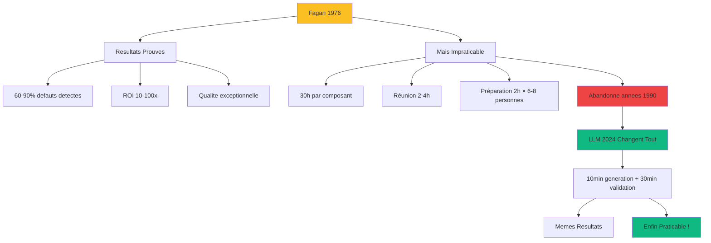

# Phase 6 : Triple Inspection (Optionnelle)

<!-- ========================================= -->
<!-- NIVEAU 1 : ESSENTIEL (5-10 secondes)     -->
<!-- ========================================= -->

<div style={{display: 'flex', gap: '10px', marginBottom: '25px', flexWrap: 'wrap'}}>
  <span style={{background: '#f59e0b', color: 'white', padding: '6px 14px', borderRadius: '20px', fontSize: '13px', fontWeight: '600'}}>
    Statut : OPTIONNELLE (recommandée critique)
  </span>
  <span style={{background: '#2563eb', color: 'white', padding: '6px 14px', borderRadius: '20px', fontSize: '13px', fontWeight: '600'}}>
    Agile : Quality Gates / DoD
  </span>
  <span style={{background: '#8b5cf6', color: 'white', padding: '6px 14px', borderRadius: '20px', fontSize: '13px', fontWeight: '600'}}>
    Rôles : Équipe + LLM
  </span>
  <span style={{background: '#2563eb', color: 'white', padding: '6px 14px', borderRadius: '20px', fontSize: '13px', fontWeight: '600'}}>
    Humain : 40%
  </span>
  <span style={{background: '#10b981', color: 'white', padding: '6px 14px', borderRadius: '20px', fontSize: '13px', fontWeight: '600'}}>
    LLM : 60%
  </span>
</div>

**En bref** : 3 inspections automatisées LLM (Fagan/Tests/Sécurité) détectent défauts latents avant production. Philosophie "investir 4-6h évite 40-80h refonte + incidents". Résurrection Fagan : 30h (1976) → 40min (2024). OPTIONNELLE mais ROI 10-100x sur systèmes critiques.

---

<!-- ========================================= -->
<!-- NIVEAU 2 : IMPACT (30-60 secondes)       -->
<!-- ========================================= -->

## Pourquoi Cette Phase Est Critique (Si Appliquée)

**Le problème sans Phase 6** :  
Code entre production avec défauts latents invisibles. Dette technique s'accumule silencieusement 6-12 mois. Tests faibles (95% couverture mais assertions vides) créent fausse sécurité. Vulnérabilités détectées production = catastrophe (30-100x coût vs développement). Refonte majeure imprévue + incidents coûteux.

**La solution apportée** :  
3 inspections spécialisées LLM détectent patterns à risque AVANT merge. Fagan révèle dette architecturale, Tests distingue couverture code vs couverture sémantique, Sécurité détecte 6 vecteurs attaque (injection, auth, données, infra, logique, monitoring). Assurance qualité préventive transforme coûts futurs imprévisibles en investissement contrôlé.

**Avantages LLM sur inspection humaine** :
- **Exhaustivité sans fatigue** : LLM vérifie 100% checklist avec rigueur identique. Humain fatigue après 30min, survole, oublie items
- **Pas de biais cognitifs** : LLM évalue objectivement. Humain biais confirmation, hésite critiquer senior
- **Mémoire parfaite standards** : LLM applique 100% règles, même rares. Humain oublie règles obscures critiques
- **Scalabilité expertise** : LLM inspecte 10 composants parallèle (2h). Senior seul = 2 semaines
- **Amélioration continue** : Nouvelle règle ajoutée → toutes inspections futures automatiques. Former équipe = semaines

**Impact mesuré** :
- Défauts détectés pré-merge : +60-90% (Fagan retrouve taux 1976)
- Coût vulnérabilité : 15min (Phase 6) vs 50-500h (production, ROI 25-250x)
- Dette technique évitée : Investissement 4-6h évite refonte 40-80h (ROI 7-13x)
- Temps inspection : 30h (1976 Fagan) → 40min (2024 LLM+humain, 97% réduction)

### La Résurrection de Fagan

**Contexte historique** : Michael Fagan (IBM, 1976) développe une inspection de code révolutionnaire.



**Transformation économique** :

```
Fagan 1976 (Humain Seul) :
30h inspection × $100/h = $3,000
Détecte 10 défauts × ROI 10x = $30,000 valeur
→ ROI positif MAIS trop coûteux pratique

Phase 6 DocDriven 2024 (LLM + Humain) :
40min inspection × $100/h = $67
Détecte 10 défauts × ROI 10x = $30,000 valeur
→ ROI 450x ! Enfin praticable !
```

**Les meilleures pratiques 1970 étaient CORRECTES - juste impossibles appliquer sans IA.**

### Quand Faire ou Sauter Phase 6

**Faire Phase 6 si** :
- Code critique (finance, santé, infrastructure)
- Durée vie longue (>2 ans évolution)
- Coût bugs production élevé (réputation, argent)
- Conformité réglementaire stricte
- Nombreux utilisateurs impactés

**Possiblement sauter si** :
- Prototypes, POC, code jetable
- Composants simples, faible criticité
- Équipe très senior, standards déjà excellents
- Contraintes temps serrées JUSTIFIÉES

**Règle décision** :
```
Probabilité bug production × Coût incident > Coût Phase 6
→ FAIRE Phase 6

Exemple :
10% prob × $50,000 incident = $5,000 espéré
vs $67 Phase 6
→ ROI 75x, faire Phase 6
```

---

<!-- ========================================= -->
<!-- NIVEAU 3 : COMMENT FAIRE (2-5 minutes)   -->
<!-- ========================================= -->

## Déroulement

**Entrées** :
- Code état-REFACTOR (Phase 5)
- Suite tests complète avec résultats
- Documents exigences (architecture, plan tactique)
- Standards qualité et benchmarks

### Les 3 Inspections Spécialisées

#### 1. Inspection Fagan - Code & Maintenabilité (1.5h)

**Objectif** : Détecter dette technique future et patterns à risque maintenabilité

**LLM 70%, Humain 30%**

- LLM génère rapport inspection (10 min)
- Humain révise rapport (30 min)
- Équipe priorise corrections (30 min)
- Corrections appliquées (30 min)

**5 Dimensions évaluées (/20 chacune, cible ≥80/100)** :
1. **Simplicité** : Pas sur-ingénierie, complexité < 10, abstractions appropriées
2. **Logique Business** : Noms domaine, règles claires, gestion erreur contextuelle
3. **Robustesse** : Cas limites, validation entrées, récupération gracieuse
4. **Maintenabilité** : Évolution facilitée, couplage minimal, documentation
5. **Performance** : Scalabilité, optimisations appropriées, pas goulots

**Sortie** : Rapport scored avec items CRITIQUE/AMÉLIORATION

#### 2. Inspection Tests - Qualité Suite Tests (1.5h)

**Objectif** : Distinguer "couverture code" vs "couverture sémantique"

**LLM 70%, Humain 30%**

- LLM analyse qualité tests (10 min)
- Humain révise findings (30 min)
- Équipe corrige tests faibles (30 min)
- Re-validation (30 min)

**Détecte** :
- Assertions vides (`assert result is not None` vs valeurs réelles)
- Tests fragiles (couplés implémentation)
- Cas limites manquants critiques
- Faux sentiment sécurité (95% couverture mais tests faibles)

**Sortie** : Tests renforcés, vraie confiance qualité

#### 3. Inspection Sécurité - Vulnérabilités (2h)

**Objectif** : Détecter 6 vecteurs attaque avant production

**LLM 80%, Humain 20%**

- LLM audit multi-vecteurs (10 min)
- Humain révise vulnérabilités (30 min)
- Équipe corrige CRITIQUE (60 min)
- Re-validation (20 min)

**6 Vecteurs attaque OWASP** :
1. **Injection** : SQL, commandes, XSS, LDAP
2. **Authentification** : Sessions, tokens, MFA, mots passe
3. **Données sensibles** : Chiffrement, logs, exposition
4. **Infrastructure** : HTTPS, CORS, headers sécurité
5. **Logique business** : Autorisation, validation, transactions
6. **Monitoring** : Logs, alertes, audit trail

**Sortie** : Vulnérabilités CRITIQUE corrigées, AMÉLIORATION documentées

### Workflow Intégré

```
1. LLM exécute 3 inspections parallèle (30 min total)
   ├─ Fagan : 10 min
   ├─ Tests : 10 min
   └─ Sécurité : 10 min

2. Équipe révise 3 rapports (90 min)
   ├─ Priorise findings (CRITIQUE vs AMÉLIORATION)
   └─ Décide plan action

3. Corrections appliquées (2-3h)
   ├─ CRITIQUE : Obligatoire avant merge
   ├─ AMÉLIORATION : Backlog ou accepter
   └─ Tests passent toujours

4. Senior valide (30 min)
   └─ Approuve qualité finale production
```

## Definition of Done

Cette phase est considérée terminée quand :

1. Les 3 inspections exécutées (Fagan, Tests, Sécurité)
2. Score Fagan ≥ 80/100 (ou justification acceptation < 80)
3. Tous items CRITIQUE corrigés
4. Tests renforcés si faiblesses détectées
5. Vulnérabilités sécurité CRITIQUE éliminées
6. Items AMÉLIORATION documentés (backlog ou accept)
7. Senior approuve rapport inspection final

**Estimation Temps Total** :
- Génération 3 rapports LLM : 30 min (parallèle)
- Révision humaine rapports : 90 min
- Corrections appliquées : 2-3h
- Validation finale : 30 min
- **Total** : 4-6 heures

---

<!-- ========================================= -->
<!-- NIVEAU 4 : MAÎTRISER (5-15 minutes)      -->
<!-- Contenu détaillé caché par défaut        -->
<!-- ========================================= -->

## Pour Aller Plus Loin

<details>
<summary><strong>Voir rapports inspection détaillés + prompts complets</strong></summary>

### Inspection 1 : Fagan - Exemple Complet

#### Code Inspected : confidence_calculator (Post-REFACTOR)

```python
# [Code REFACTOR Phase 5 - 180 lignes avec fonctions extraites]
# Voir Phase 5 pour code complet
```

#### Prompt Inspection Fagan

```
Effectue une inspection Fagan systématique de ce code selon 5 perspectives.

CODE À INSPECTER :
[coller code état-REFACTOR complet]

SPÉCIFICATIONS :
[coller spec tactique Phase 2]

ÉVALUE CHAQUE DIMENSION SUR 20 POINTS :

1. SIMPLICITÉ (/20)
   Questions :
   - Code clair et direct ? Pas sur-ingénierie ?
   - Abstractions appropriées au problème ?
   - Complexité cyclomatique acceptable (<10/fonction) ?
   - Logique facile suivre sans debugger ?
   
   Pour chaque question :
   - OUI : +5 points
   - PARTIELLEMENT : +2-3 points
   - NON : 0 points
   
   Identifie TOUS patterns trop complexes.

2. LOGIQUE BUSINESS (/20)
   Questions :
   - Noms variables/fonctions reflètent domaine business ?
   - Règles business claires et documentées ?
   - Gestion erreur contextuelle (messages explicites) ?
   - Code lisible par Product Owner ?
   
   Identifie TOUTES logiques obscures.

3. ROBUSTESSE (/20)
   Questions :
   - Tous cas limites gérés (null, vide, limites) ?
   - Validation entrées exhaustive ?
   - Récupération erreur gracieuse (pas crashes) ?
   - Comportement défini pour TOUS scénarios ?
   
   Identifie TOUS cas limites manquants.

4. MAINTENABILITÉ (/20)
   Questions :
   - Code facile modifier sans casser ?
   - Couplage minimal entre composants ?
   - Documentation aide nouveaux devs ?
   - Tests facilitent refactoring sûr ?
   
   Identifie TOUS patterns maintainability à risque.

5. PERFORMANCE (/20)
   Questions :
   - Algorithmes performants (pas O(n²) évitable) ?
   - Scalabilité validée (gros volumes) ?
   - Pas goulots évidents (I/O, boucles imbriquées) ?
   - Optimisations appropriées (pas prématurées) ?
   
   Identifie TOUS goulots potentiels.

FORMAT RAPPORT :

## Score Global : XX/100

### 1. Simplicité : XX/20
**Points forts** :
- [Liste]

**Points faibles** :
- [Liste avec ligne code précise]

**Items CRITIQUE** :
- [Complexité >10, sur-ingénierie grave]

**Items AMÉLIORATION** :
- [Améliorations possibles non bloquantes]

[Répéter pour 5 dimensions]

## Synthèse Décision

**Items CRITIQUE (bloquer merge)** :
1. [Item avec justification impact]

**Items AMÉLIORATION (backlog)** :
2. [Item nice-to-have]

**Recommandation** : APPROUVER / CORRIGER CRITIQUE / REFAIRE
```

#### Rapport Généré

```markdown
## Score Global Fagan : 88/100

### 1. Simplicité : 18/20

**Points forts** :
- Fonctions courtes (10-30 lignes chacune)
- Responsabilité Unique appliquée (4 fonctions focalisées)
- Complexité cyclomatique moyenne 3 (excellent, <10)
- Logique directe, pas abstractions excessives

**Points faibles** :
- Validation inputs éparpillée (_validate_inputs + checks calculate_confidence)
  Ligne 145-155 : Duplication logique validation

**Items CRITIQUE** : Aucun

**Items AMÉLIORATION** :
- Consolider validation dans _validate_inputs uniquement (éliminer duplication)

---

### 2. Logique Business : 20/20

**Points forts** :
- Constantes nommées (MIN_SAMPLE_FOR_STATISTICS = 3)
- Noms fonctions descriptifs (_calculate_sample_coverage_penalty)
- Docstrings expliquent formules business
- Messages erreur contextuels ("top_k_similar doit être > 0")

**Points faibles** : Aucun

**Items CRITIQUE** : Aucun
**Items AMÉLIORATION** : Aucun

---

### 3. Robustesse : 16/20

**Points forts** :
- Validation entrées (total_similarity ≤ 0, n_contributors < 0)
- Exception ValueError si top_k ≤ 0
- Cas zéro contributeur géré (return 0.0)
- Logging warnings entrées invalides

**Points faibles** :
- Pas de gestion weighted_presence > total_similarity (mathématiquement invalide)
  Ligne 133 : Devrait valider weighted_presence ≤ total_similarity
- Pas de gestion valeurs extrêmes (overflow si weighted_presence = 1e308)

**Items CRITIQUE** :
- Ajouter validation weighted_presence ≤ total_similarity (cohérence mathématique)

**Items AMÉLIORATION** :
- Ajouter sanity check overflow (très grands nombres)

---

### 4. Maintenabilité : 18/20

**Points forts** :
- Fonctions extraites testables isolément
- Couplage zéro (pas dépendances externes)
- Documentation exhaustive (formules, exemples, notes)
- Constantes ajustables centralisées

**Points faibles** :
- Formule pénalité statistique (0.5 + n/6.0) pas documentée origine
  Ligne 234 : D'où vient formule ? Citation source scientifique manquante

**Items CRITIQUE** : Aucun

**Items AMÉLIORATION** :
- Ajouter référence scientifique formule pénalité (traçabilité décisions)

---

### 5. Performance : 16/20

**Points forts** :
- Complexité O(1) constante
- Pas I/O, pas effets bord (fonction pure)
- Test performance <1ms passe
- Pas allocations mémoire inutiles

**Points faibles** :
- Logging debug peut impacter performance production si activé
  Ligne 159-163 : logger.debug() avec formatage string
  → Utiliser lazy evaluation : logger.debug("...", value) pas f-strings

**Items CRITIQUE** : Aucun

**Items AMÉLIORATION** :
- Lazy logging evaluation (performance marginale mais bonne pratique)

---

## Synthèse Décision

**Items CRITIQUE (bloquer merge jusqu'à correction)** :
1. **Validation weighted_presence ≤ total_similarity manquante** (Ligne 133)
   - Impact : Permet états mathématiquement invalides (confiance >1.0 possible)
   - Effort : 5 min (ajouter if weighted_presence > total_similarity: return 0.0)
   - Priorité : HAUTE

**Items AMÉLIORATION (backlog, non bloquants)** :
2. Consolider validation inputs (éliminer duplication)
3. Sanity check overflow valeurs extrêmes
4. Référence scientifique formule pénalité
5. Lazy logging evaluation

**Recommandation Finale** : **CORRIGER CRITIQUE #1 puis APPROUVER**

Score 88/100 excellent. Un seul item bloquant (validation mathématique).
Après correction : qualité production validée.
```

#### Actions Équipe

```
1. Dev applique correction CRITIQUE #1 (5 min)
2. Tests exécutés → Toujours 100% passent
3. Senior valide correction
4. Items AMÉLIORATION ajoutés backlog
5. Merge approuvé ✓
```

---

### Inspection 2 : Tests - Exemple Findings

#### Suite Tests Analysée

```python
# Suite 19 tests Phase 3 (voir Phase 3 pour code complet)
```

#### Prompt Inspection Tests

```
Analyse QUALITÉ de cette suite de tests. Distingue "couverture code" vs "couverture sémantique".

SUITE TESTS :
[coller 19 tests complets]

CODE TESTÉ :
[coller implémentation]

ÉVALUE QUALITÉ SELON 5 CRITÈRES :

1. ASSERTIONS SIGNIFICATIVES
   - Assertions vérifient VALEURS précises (pas juste `is not None`) ?
   - Chaque assertion a MESSAGE explicite contexte ?
   - Assertions couvrent comportement business (pas juste techniques) ?
   
   Identifie TOUS tests assertions faibles.

2. ROBUSTESSE TESTS
   - Tests pas fragiles (couplés détails implémentation) ?
   - Tests survivent refactoring sans modifications ?
   - Tests isolés (pas dépendances ordre exécution) ?
   
   Identifie TOUS tests fragiles.

3. CAS LIMITES CRITIQUE
   - Tous cas limites business testés ?
   - Scénarios erreur couverts ?
   - Valeurs limites (min/max/zéro) testées ?
   
   Identifie TOUS cas limites manquants.

4. COUVERTURE SÉMANTIQUE
   - Tests valident COMPORTEMENTS business (pas juste code exécuté) ?
   - Chaque règle business a test dédié ?
   - Tests documentation exécutable logique business ?
   
   Identifie lacunes couverture sémantique.

5. MAINTENABILITÉ TESTS
   - Noms tests descriptifs (comportement + résultat attendu) ?
   - Fixtures éliminent duplication ?
   - Tests lisibles sans debugger ?
   
   Identifie problèmes maintenabilité.

FORMAT RAPPORT :

## Qualité Suite Tests : NOTE/5

### Analyse par Critère

[5 sections avec Points forts / Points faibles / CRITIQUE / AMÉLIORATION]

### Tests Faibles Identifiés

**Test #X : [nom]**
- Problème : [assertion vide, fragile, etc.]
- Impact : [faux positif, maintenance, etc.]
- Correction suggérée : [code amélioré]

### Recommandation

APPROUVER / RENFORCER TESTS
```

#### Rapport Généré (Findings Clés)

```markdown
## Qualité Suite Tests : 4.5/5 (Excellent)

### 1. Assertions Significatives : 5/5
Toutes assertions vérifient valeurs précises
Messages contexte explicites
Pas d'assertions vagues (`is not None` seul)

### 2. Robustesse Tests : 5/5
Tests pas couplés implémentation
Testent comportement, pas structure interne
Isolés, ordre-indépendants

### 3. Cas Limites Critique : 4/5
Zéro contributeurs : ✓
n < 3 pénalité stats : ✓
top_k = 0 exception : ✓
**MANQUANT** : weighted_presence > total_similarity (invalide mathématiquement)

### 4. Couverture Sémantique : 5/5
Chaque règle business testée
Tests = documentation comportement
Exemples concrets docstrings

### 5. Maintenabilité Tests : 4/5
Nommage descriptif
Fixtures réutilisables
Certains tests > 20 lignes (extraire helpers)

---

## Tests Faibles Identifiés

**Aucun test "faible" détecté**

Mais 1 cas limite MANQUANT :

### Cas Limite Manquant : Weighted > Total (Invalide)

**Test à ajouter** :
```python
def test_calculate_confidence_weighted_exceeds_total_returns_zero():
    """
    Cas limite invalide : weighted_presence > total_similarity.
    Mathématiquement incohérent, devrait retourner 0.0 défensivement.
    """
    result = calculate_confidence(
        weighted_presence=2.0,  # > total !
        total_similarity=1.0,
        n_contributors=5,
        top_k_similar=5
    )
    assert result == 0.0, \
        "weighted > total mathématiquement invalide, retourner 0"
```

**Justification** :
- Cohérence mathématique : weighted ne peut dépasser total
- Défense : Protège contre données corrompues
- Align avec finding Fagan Inspection #1

---

## Recommandation

**RENFORCER** : Ajouter test cas limite weighted > total, puis APPROUVER.

Suite tests déjà excellente (4.5/5). Un seul cas limite manquant identifié
(cohérent finding Fagan). Après ajout test : qualité 5/5.
```

---

### Inspection 3 : Sécurité - Exemple Findings

#### Prompt Inspection Sécurité

```
Effectue audit sécurité OWASP exhaustif selon 6 vecteurs d'attaque.

CODE À AUDITER :
[coller code complet]

CONTEXTE APPLICATION :
[description : API web, données nutritionnelles, users authentifiés]

AUDITE 6 VECTEURS :

1. INJECTION (SQL, Commandes, XSS, LDAP)
   - Entrées externes sanitized ?
   - Requêtes paramétrées (pas string concat) ?
   - Validation types/formats stricte ?

2. AUTHENTIFICATION & SESSIONS
   - Tokens sécurisés (JWT, OAuth) ?
   - MFA supporté ?
   - Mots passe hashés (bcrypt, argon2) ?
   - Sessions timeout ?

3. DONNÉES SENSIBLES
   - Chiffrement au repos (DB) ?
   - Chiffrement en transit (HTTPS) ?
   - Pas logs/debug données sensibles ?
   - PII anonymisées ?

4. INFRASTRUCTURE
   - HTTPS obligatoire ?
   - Headers sécurité (CSP, HSTS, X-Frame) ?
   - CORS configuré strictement ?
   - Dépendances à jour (pas CVE) ?

5. LOGIQUE BUSINESS
   - Autorisation vérifiée (pas juste auth) ?
   - Validation business rules côté serveur ?
   - Transactions atomiques (pas race conditions) ?
   - Rate limiting API ?

6. MONITORING & LOGGING
   - Logs événements sécurité ?
   - Alertes tentatives intrusion ?
   - Audit trail activités sensibles ?
   - Pas logs secrets/tokens ?

Pour CHAQUE vecteur, identifie :
- Vulnérabilités CRITIQUE (exploitables facilement)
- Vulnérabilités AMÉLIORATION (défense profondeur)

FORMAT RAPPORT :

## Audit Sécurité : CRITIQUE / AMÉLIORATION / PASS

[6 sections par vecteur]

### Vulnérabilités CRITIQUE (bloquer merge)
[Liste avec CVSS score, exploit scenario, fix]

### Vulnérabilités AMÉLIORATION (backlog)
[Liste améliorer sécurité défense profondeur]

Recommandation : BLOQUER / CORRIGER / APPROUVER
```

#### Rapport Généré (Exemple Système Critique)

```markdown
## Audit Sécurité : PASS (avec 2 AMÉLIORATION)

### 1. Injection : PASS
**Analyse** :
- Module confidence_calculator = fonction pure mathématique
- Pas d'accès DB, pas requêtes externes
- Entrées validées (types, limites)
- Pas vecteur injection applicable

**Vulnérabilités** : Aucune

---

### 2. Authentification & Sessions : N/A
**Analyse** :
- Module bas niveau (calcul), pas gestion auth
- Auth géré couche API (hors scope ce module)

**Vulnérabilités** : N/A pour ce module

---

### 3. Données Sensibles : AMÉLIORATION
**Analyse** :
- Fonction logs valeurs intermédiaires (ligne 159-163)
- Si données nutritionnelles = PII dans certaines juridictions

**Vulnérabilités AMÉLIORATION** :
1. **Logging Données Potentiellement Sensibles**
   - Ligne 159 : `logger.debug(f"... n_contributors={n}")
   - Risque : Logs peuvent contenir données user
   - CVSS : 3.1 (Low) - Information Disclosure
   - Fix : Ajouter flag LOG_SENSITIVE_DATA (default False)
   - Effort : 15 min

---

### 4. Infrastructure : AMÉLIORATION
**Analyse** :
- Module Python standard, pas dépendances externes
- Pas CVE connus

**Vulnérabilités AMÉLIORATION** :
2. **Validation Input Bounds (DoS préventif)**
   - Pas limite supérieure weighted_presence/total_similarity
   - Risque : Valeurs astronomiques (1e308) → float overflow
   - CVSS : 2.5 (Low) - DoS potentiel
   - Fix : Ajouter MAX_VALID_VALUE = 1e6, reject si dépassé
   - Effort : 10 min

---

### 5. Logique Business : PASS
**Analyse** :
- Validation business rules (n >= 0, top_k > 0)
- Pas de race conditions (fonction pure)
- Logique déterministe

**Vulnérabilités** : Aucune

---

### 6. Monitoring & Logging : PASS
**Analyse** :
- Logging approprié (warnings entrées invalides)
- Pas logs secrets/tokens (pas applicables ici)
- Debug logs désactivables production

**Vulnérabilités** : Aucune

---

## Synthèse Audit Sécurité

### Vulnérabilités CRITIQUE : Aucune 

Module mathématique pur, surface attaque minimale.

### Vulnérabilités AMÉLIORATION (Défense Profondeur) :
1. Flag LOG_SENSITIVE_DATA pour contrôler logging PII
2. Validation MAX_VALID_VALUE prévenir DoS overflow

**Effort Total Corrections** : 25 minutes

**Recommandation** : **APPROUVER**

Module sécurisé pour mise en production. Les 2 améliorations suggérées
sont défense profondeur (nice-to-have), pas blocages sécurité.

Si système TRÈS critique (santé, finance) → Appliquer 2 améliorations.
Sinon → Backlog acceptable.
```

---

### ROI Phase 6 - Calculs Détaillés

#### Scénario 1 : Module Standard

```
Investissement Phase 6 : 5h × $100/h = $500

Bénéfices Espérés :
- Probabilité bug production : 15%
- Coût moyen bug : $5,000 (debugging, patch, tests)
- Valeur espérée : 0.15 × $5,000 = $750

ROI = ($750 - $500) / $500 = 50%
```

**Conclusion** : ROI positif mais marginal. Phase 6 optionnelle.

---

#### Scénario 2 : Module Critique Finance

```
Investissement Phase 6 : 5h × $100/h = $500

Bénéfices Espérés :
- Probabilité vulnérabilité : 10%
- Coût incident sécurité :
  - Incident response : $20,000
  - Audit complet : $30,000
  - Notification clients : $10,000
  - Réputation : $50,000
  - Total : $110,000
- Valeur espérée : 0.10 × $110,000 = $11,000

ROI = ($11,000 - $500) / $500 = 2,100%
```

**Conclusion** : ROI 21x. Phase 6 OBLIGATOIRE.

---

#### Scénario 3 : Module Infrastructure (1M users)

```
Investissement Phase 6 : 6h × $100/h = $600

Bénéfices Espérés :
- Probabilité défaut majeur : 20%
- Coût défaut production :
  - Downtime 2h : $50,000
  - Incident response : $10,000
  - Refonte urgente : $40,000
  - Total : $100,000
- Valeur espérée : 0.20 × $100,000 = $20,000

ROI = ($20,000 - $600) / $600 = 3,233%
```

**Conclusion** : ROI 32x. Phase 6 CRITIQUE.

---

### Checklist Décision Phase 6

**Faire Phase 6 SI au moins 2 critères** :

- [ ] Code critique (finance, santé, infra)
- [ ] >10,000 utilisateurs impactés
- [ ] Durée vie >2 ans
- [ ] Coût bug production >$10,000
- [ ] Conformité réglementaire (HIPAA, PCI-DSS, SOC2)
- [ ] Équipe junior/intermédiaire (pas tous seniors)

**Sauter Phase 6 SI tous critères** :

- [ ] Prototype/POC (< 3 mois vie)
- [ ] < 100 utilisateurs
- [ ] Composant simple isolé
- [ ] Équipe 100% seniors expérimentés
- [ ] Coût bug < $1,000

**Si zone grise** : Faire Phase 6 au moins 1× pour apprendre. Décider ensuite selon ROI observé.

</details>

---

**Phase finale complétée !**

**Félicitations** : Vous avez maintenant la méthodologie complète DocDriven en 6 phases pour développement logiciel de qualité production avec l'IA ! 
