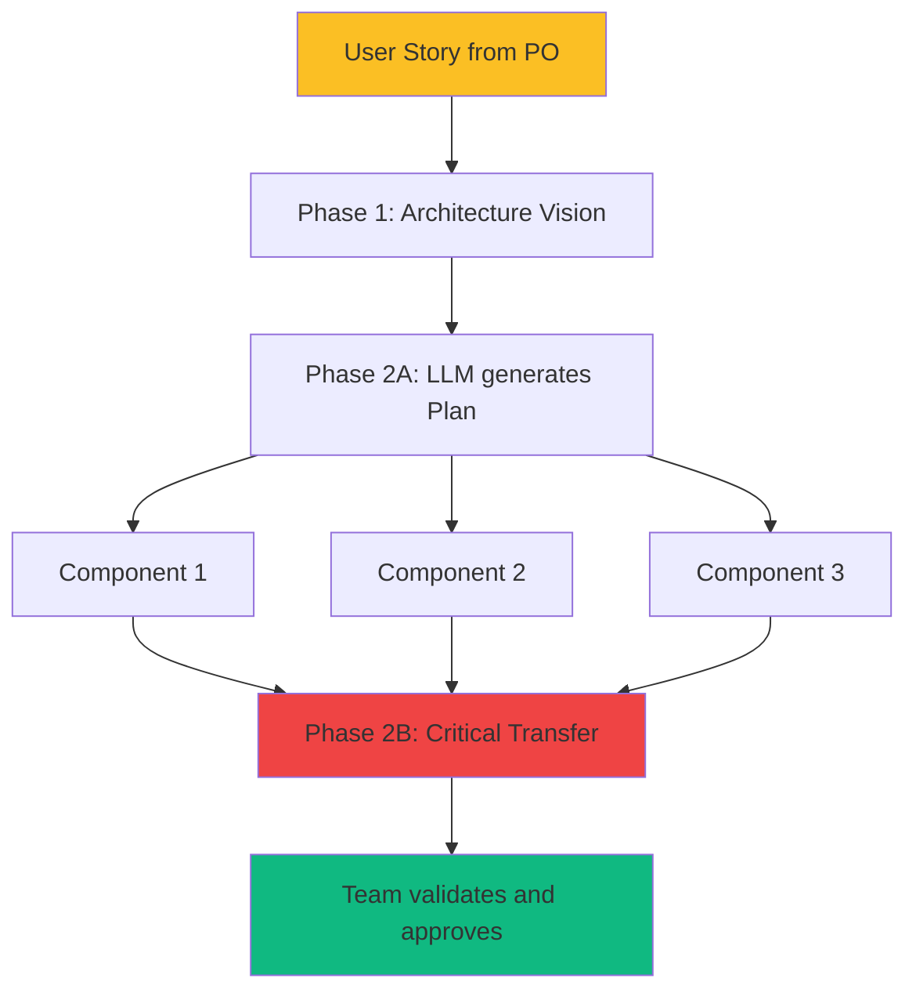

# Phase 2: Tactical Planning + Critical Transfer

<!-- ========================================= -->
<!-- LEVEL 1: ESSENTIAL (5-10 seconds)        -->
<!-- ========================================= -->

<div style={{display: 'flex', gap: '10px', marginBottom: '25px', flexWrap: 'wrap'}}>
  <span style={{background: '#2563eb', color: 'white', padding: '6px 14px', borderRadius: '20px', fontSize: '13px', fontWeight: '600'}}>
    Agile: Story Refinement + Sprint Planning
  </span>
  <span style={{background: '#8b5cf6', color: 'white', padding: '6px 14px', borderRadius: '20px', fontSize: '13px', fontWeight: '600'}}>
    Roles: Designer + Dev Team
  </span>
  <span style={{background: '#6366f1', color: 'white', padding: '6px 14px', borderRadius: '20px', fontSize: '13px', fontWeight: '600'}}>
    Human guides, LLM generates
  </span>
</div>

---

**In brief**: Transforms User Stories into exhaustive technical implementation plans via LLM. The team validates during Critical Transfer—DC²'s most important meeting.

---

<!-- ========================================= -->
<!-- LEVEL 2: IMPACT (30-60 seconds)          -->
<!-- ========================================= -->

## Why This Phase Is Critical

**The problem without Phase 2**:
The team begins coding with a fragmented understanding of the architectural vision. Misunderstandings surface late (Phase 4-5), requiring costly and unexpected refactoring.

**The solution provided**:
Critical Transfer detects and resolves misunderstandings BEFORE the first line of code is written. Shared and validated architectural vision. Designer-team alignment is verified.

**LLM limitations addressed**:
- **Complex semantic dependencies**: LLM forces complete articulation of interfaces, implementation sequences, and component relationships
- **No operational memory**: Tactical plan becomes the persistent "external memory" consulted in subsequent phases


### Link with Agile

**Phase 2 = Story Refinement + Sprint Planning.**

Instead of decomposing User Stories from scratch during refinement, the team starts with a detailed technical plan pre-generated by the LLM that it can critique, improve, and validate. Same decomposition quality, far less time, more exhaustive plan.



**Example of integration into a typical Sprint**:
- Week before: PO presents User Stories, Designer performs Phase 1
- Day 1 Sprint: Phase 2A (morning) + Team pre-reads (afternoon)
- Day 2 Sprint: Phase 2B (Critical Transfer) = Technical Sprint Planning

---

<!-- ========================================= -->
<!-- LEVEL 3: HOW TO DO IT (2-5 minutes)      -->
<!-- ========================================= -->

## Process

**Inputs**:
- Strategic Architecture Document (Phase 1)
- Prioritized User Stories from Product Backlog
- Technology stack standards and team preferences
- Timeline requirements and external dependencies
- Quality standards and testing requirements

### Part A: Tactical Plan Generation ⏱️

**1. LLM Generation**
- LLM reads strategic architecture document
- Generates detailed implementation roadmap
- Decomposes solution into approximately 3-5 components with specifications
- Designer validates alignment with Phase 1 decisions

**2. Team Pre-Reading**
- Team receives generated tactical plan
- Each member reads individually
- Notes questions, concerns, identified risks
- Prepares preliminary effort estimates

### Part B: Critical Transfer ⏱️⏱️⏱️

**3. Presentation**
- Designer presents architectural vision
- Explains decomposition into components
- Justifies major technical choices

**4. Active Challenge**
- Team asks questions, challenges assumptions
- Identifies gaps, missing dependencies, risks
- Validates effort estimates
- Discussion of technical feasibility

**5. Collaborative Revision**
- LLM incorporates feedback into revised plan
- Generates summary of decisions

**6. Final Validation**
- Review revised plan
- Formal approval for Phase 3 transition
- Plan recorded in version control

**Outputs**:
- Tactical plan approved by Designer and Team
- Detailed specifications per component (I/O, responsibilities, dependencies)
- Defined and justified technology stack
- Aligned effort estimates
- Documented risks and dependencies

## Definition of Done

This phase is considered complete when:

1. The tactical plan decomposes the solution into ~3-5 implementation phases with clear milestones
2. Each component has detailed specification (inputs, outputs, responsibilities, dependencies)
3. Technology stack is defined with justification of framework and library choices
4. Dev team has reviewed the plan, and all concerns are documented and resolved
5. Effort estimates are aligned between designer and team (variance < 20%)
6. All external dependencies are identified (APIs, data sources, third-party systems)
7. Designer and Product Owner approve the final plan before Phase 3

---

<!-- ========================================= -->
<!-- LEVEL 4: MASTER (5-15 minutes)           -->
<!-- Detailed content hidden by default        -->
<!-- ========================================= -->

## Going Further

<details>
<summary><strong>See concrete examples, prompts, and detailed templates</strong></summary>

### Complete Example: User Story → Tactical Plan

#### Initial User Story (Product Owner)

```
As a user,
I want to see prediction confidence with each result
So that I can evaluate the reliability of recommendations

Acceptance Criteria:
- Confidence score 0-100% displayed clearly
- Explanation of factors influencing confidence
- Visual indicator (green/yellow/red) according to level
```

#### Phase 1: Architecture Vision (Designer)

Decision: Place confidence logic in business layer, integrate with existing recommendation pipeline. ADR: Sample size penalty to avoid overconfidence.

#### Phase 2A: Tactical Plan Generated (LLM)

**Decomposition into 3 components**:

**Component 1: `confidence_calculator`**
- **Responsibility**: Calculate raw confidence score with penalties
- **Inputs**:
  - `weighted_presence: float` - Sum (similarity × presence)
  - `total_similarity: float` - Sum of similarity scores
  - `n_contributors: int` - Number of contributor items
  - `top_k_similar: int` - Target count (typically 5)
- **Outputs**:
  - `confidence_score: float` - Score [0, 1]
- **Dependencies**: None (pure module, testable in isolation)
- **Algorithm**:
  1. Calculate raw confidence: weighted_presence / total_similarity
  2. Sample size penalty: min(n_contributors / top_k, 1.0)
  3. Statistical penalty if n < 3: 0.5 + (n / 6.0)
  4. Return: confidence × penalties

**Component 2: `confidence_explainer`**
- **Responsibility**: Generate explanation of confidence factors
- **Inputs**:
  - `confidence_score: float`
  - `n_contributors: int`
  - `top_k_similar: int`
- **Outputs**:
  - `explanation: str` - Explanatory text
  - `factors: List[str]` - List of key factors
- **Dependencies**: None
- **Logic**:
  - If n < 3: "Very small sample, reduced confidence"
  - If n < top_k: "Limited data, {n}/{top_k} sources"
  - If score > 0.8: "Strong confidence, many concordant sources"

**Component 3: `confidence_presenter`**
- **Responsibility**: Format for UI (color, text)
- **Inputs**:
  - `confidence_score: float`
  - `explanation: str`
- **Outputs**:
  - `display_data: Dict` - {score_percent, color, label, explanation}
- **Dependencies**: None
- **Color mapping**:
  - score ≥ 0.8: Green (#10b981)
  - score 0.5-0.8: Yellow (#fbbf24)
  - score < 0.5: Red (#ef4444)

**Integration sequence**:
```python
# In existing recommendation pipeline
score = confidence_calculator.calculate(...)
explanation = confidence_explainer.explain(score, ...)
display = confidence_presenter.format(score, explanation)
```

#### Phase 2B: Critical Transfer

**Final Estimates**:
- Designer: "3 simple modules, 6-8h total"
- Team: "With tests and refactoring, more like 8-10h"
- **Alignment**: 8-10h retained (11% variance, < 20% ✓)

### Recommended Prompts

#### Tactical Plan Generation (Phase 2A)

```
Generate a detailed tactical implementation plan for this User Story:

USER STORY:
[paste complete User Story with acceptance criteria]

STRATEGIC ARCHITECTURE (context):
[paste relevant Phase 1 ADRs and decisions]

TECHNICAL CONSTRAINTS:
- Stack: Python 3.11+, FastAPI
- Standards: Type hints mandatory, 90%+ test coverage
- Performance: <100ms API endpoint latency

DECOMPOSE into 3-5 components with FOR EACH component:

1. **Component Name** (snake_case)
2. **Responsibility**: One clear sentence of role
3. **Inputs**: Precise types, meaning, constraints
4. **Outputs**: Precise types, format, constraints
5. **Dependencies**: Which other components/services required
6. **Algorithm/Logic**: Main steps (not code, description)
7. **Quality Criteria**: Complexity, performance, testability

THEN:
- **Integration Sequence**: How components assemble
- **Critical Interfaces**: Integration points with existing system
- **Identified Risks**: Technical, performance, dependencies

Format: Structured markdown, clear, unambiguous.
```

#### Revision Post-Critical Transfer

```
Revise this tactical plan incorporating Critical Transfer feedback:

ORIGINAL TACTICAL PLAN:
[paste plan generated in Phase 2A]

TEAM FEEDBACK (Critical Transfer):
[paste discussion notes - questions, concerns, proposed revisions]

DECISIONS MADE:
[paste decisions - what is accepted, rejected, modified]

GENERATE REVISED tactical plan with:
1. Modifications explicitly marked and integrated
2. Responses to concerns documented
3. Additional identified risks added
4. Updated estimates if applicable

Format: Same structure as original plan, with "REVISED:" sections for changes.
```

### Quality Standards

#### Good Tactical Plan

**Characteristics**:
- **Decoupled components**: Each module testable in isolation, minimal dependencies
- **Clear interfaces**: Explicit inputs/outputs, well-defined contracts
- **Logical sequence**: Implementation order obvious (dependencies → consuming components)
- **Unambiguous specifications**: Not vague "handle errors," but "raise ValueError if x < 0"
- **Estimable**: Team can estimate effort for each component

**Example**:
```
Module: user_validator
Inputs: email: str, age: int
Outputs: ValidationResult(valid: bool, errors: List[str])
Logic:
  1. Verify email format (RFC 5322 regex)
  2. Verify age in [13, 120]
  3. Return result with specific errors
```

#### Poor Tactical Plan

**Problems**:
- **Tight coupling**: Module A directly calls Module B's private methods
- **Circular dependencies**: A depends on B, B depends on A
- **Vague specs**: "Validate user" without details, "Handle edge cases"
- **Incoherent order**: Components ordered randomly, not by dependencies
- **Impossible to estimate**: "User management module" too large/vague

**Example**:
```
Module: user_manager
Inputs: user_data (unspecified format)
Outputs: Result (unspecified type)
Logic: Manage users and their data
```
→ Too vague, impossible to implement

### Common Pitfalls

#### 1. Passive Team at Critical Transfer

**Problem**:
Team approves everything without questions. Silence = tacit approval. Designer thinks "everything is clear," but team is just afraid to question.

**Solution**:
- **Create psychological safety**: Designer explicitly says "I WANT your questions, even 'dumb' ones"
- **Ask direct questions**: "Backend Dev, what do you think about external API error handling?"
- **Red flag if zero questions**: Silent team = problem. Dig into why.

---

#### 2. Plan Too Detailed (Over-Engineering)

**Problem**:
LLM generates plan with 15 microservices components, complex design patterns, premature abstractions. Team overwhelmed.

**Solution**:
- **3-5 component rule**: Maximum 5 modules for typical user story
- **Strict YAGNI**: "You Aren't Gonna Need It"—only what serves this story
- **Designer filters**: Validates appropriate complexity for problem

**Prompt adjustment**:
```
Decompose into 3-5 SIMPLE components.
YAGNI principle: generate ONLY what serves this story.
No premature abstractions, no complex patterns.
Simple code > clever code.
```

---

#### 3. Divergent Estimates Not Reconciled

**Problem**:
Designer estimates 6h, Team estimates 15h (150% variance). Moves to Phase 3 without resolving divergence. Sprint planning fails.

**Solution**:
- **Tolerance threshold: 20%**: If variance > 20%, STOP and investigate
- **Understand why**:
  - Did Designer miss complexity?
  - Did Team misunderstand approach?
  - Underestimated technical risks?
- **Revise plan**: Simplify OR increase time scope
- **Never ignore divergence**: Symptom of deep misunderstanding

**Check Definition of Done #5**: "Estimates aligned (variance < 20%)"

---

#### 4. Unidentified External Dependencies

**Problem**:
Perfect plan but forgets module depends on external API not yet deployed, or data that doesn't exist in database.

**Solution**:
- **Dependency checklist**:
  - External APIs (availability, SLA, auth)
  - Data sources (DB tables, schemas)
  - Internal services (other teams)
  - Third-party libraries (version, license)
- **Validate BEFORE Phase 3**: Identified blockers = pause until resolved
- **Fallbacks**: If dependency uncertain, prepare mock/stub

**Check Definition of Done #6**: "All external dependencies identified"

---

#### 5. Product Owner Absent from Critical Transfer

**Problem**:
PO not present. Team validates technical plan that doesn't really meet business needs.

**Solution**:
- **PO present minimum 30 min**: At start (presentation) and end (validation)
- **Explicit business validation**: PO confirms "This plan meets the story"
- **Fast business decisions**: If business question arises, PO decides on the spot

**Check Definition of Done #7**: "Designer AND Product Owner approve"

### Relationship with Agile - Details

#### Precise Mapping of Agile Concepts → DC²

| Agile Concept | DC² Equivalent | Key Difference |
|---------------|---------------------|----------------|
| **User Story** | Input Phase 1-2 | Story remains at functional user level |
| **Story Refinement** | Phase 2B (Critical Transfer) | Team revises pre-generated plan vs creates from scratch |
| **Sprint Planning** | Phase 2B + start Phase 3 | Technical planning already done, just validate + test |
| **Tasks** | Phase 2 Components | Components = tasks with exhaustive specs |
| **Acceptance Criteria** | Phase 3 Tests | Criteria become automated executable tests |
| **Definition of Done** | Per-Phase DoD | Granular DoD per phase, not just story completion |
| **Story Points** | Hour Estimates Phase 2 | More precise estimates thanks to detailed plan |

#### Typical 2-Week Sprint Integration

**Sprint N-1 (Preparation)**:
- PO presents User Stories at Product Backlog Refinement
- Designer performs Phase 1 for prioritized stories (architecture)

**Sprint N - Day 1 (Monday)**:
- Morning: Phase 2A (LLM generates tactical plans—30-40 min)
- Afternoon: Team reads plans, prepares questions (30-60 min each)

**Sprint N - Day 2 (Tuesday)**:
- Morning: Phase 2B (Critical Transfer—90-120 min) = Technical Sprint Planning
- Afternoon: Phase 3 (Test Generation—1.5h)
- End of day: Final estimates, commitment

**Sprint N - Days 3-10**:
- Phases 4-5: Implementation + Refactoring
- Daily standup as usual
- Phase 6 (optional) if component is critical

**Sprint N - Final Days**:
- PO Demo
- Retrospective

#### Agile Tools Compatibility

**Jira / Azure DevOps**:
- User Story stays in backlog
- Phase 2 Components = Story Sub-tasks
- Tactical Plan = attached as document
- Phase 3 Tests = Test Cases linked to story

**Jira Example**:
```
User Story: PROJ-123 "Display prediction confidence"
├─ Sub-task: PROJ-124 "Implement confidence_calculator"
├─ Sub-task: PROJ-125 "Implement confidence_explainer"
└─ Sub-task: PROJ-126 "Implement confidence_presenter"

Attachments:
├─ Tactical_Plan_PROJ-123.md (Phase 2)
├─ Architecture_Decision_Confidence.md (Phase 1)
└─ Tests_PROJ-123.py (Phase 3)
```

</details>

---

**Next step**: [Phase 3: TDD RED - Test Generation →](/phase3-tdd-red)

**Need help?** Consult the [Roles and Responsibilities document](/roles-et-responsabilites) to clarify who does what in this phase.
