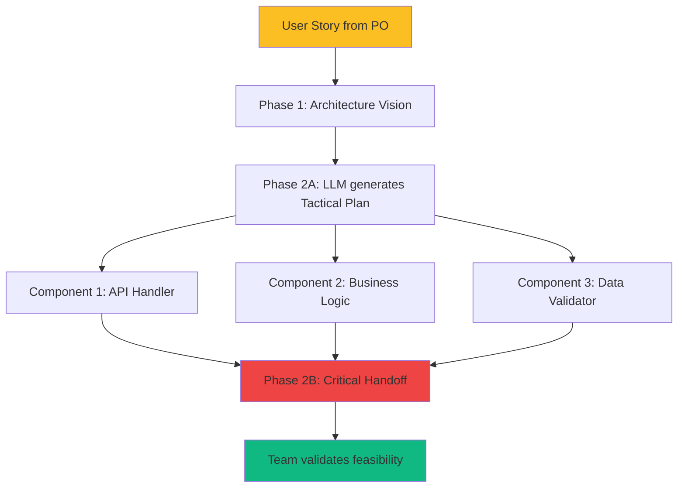

# Phase 2: Tactical Planning and Critical Handoff

<div style={{display: 'flex', gap: '10px', marginBottom: '25px', flexWrap: 'wrap'}}>
  <span style={{background: '#2563eb', color: 'white', padding: '6px 14px', borderRadius: '20px', fontSize: '13px', fontWeight: '600'}}>
    Agile: Story Refinement + Sprint Planning
  </span>
  <span style={{background: '#64748b', color: 'white', padding: '6px 14px', borderRadius: '20px', fontSize: '13px', fontWeight: '600'}}>
    Duration: 4-6 hours
  </span>
  <span style={{background: '#8b5cf6', color: 'white', padding: '6px 14px', borderRadius: '20px', fontSize: '13px', fontWeight: '600'}}>
    Roles: Designer + Dev Team
  </span>
  <span style={{background: '#2563eb', color: 'white', padding: '6px 14px', borderRadius: '20px', fontSize: '13px', fontWeight: '600'}}>
    Human: 45%
  </span>
  <span style={{background: '#10b981', color: 'white', padding: '6px 14px', borderRadius: '20px', fontSize: '13px', fontWeight: '600'}}>
    LLM: 55%
  </span>
</div>

Phase 2 transforms the strategic architecture into a detailed implementation plan and creates critical alignment between the designer's vision and the development team's understanding. It is divided into two parts: tactical plan generation (Part A) and the critical handoff that validates feasibility (Part B).

As we saw in the introduction, LLMs struggle with complex semantic dependencies. They do not naturally see how different parts of a system interconnect or how decisions in one module impact other modules. Phase 2 solves this by forcing complete articulation of all dependencies, interfaces, and implementation sequences in a detailed tactical plan. Each component is documented with its inputs, outputs, and relationships to other components.

Furthermore, LLMs lack persistent operational memory between interactions. Without explicit context, they forget previously made decisions or established constraints. Thanks to the tactical specifications produced in Phase 2, all architectural decisions, technical constraints, and implementation choices are documented in a structured manner. This plan becomes the "external memory" that the LLM will consult in subsequent phases.

Without this phase, the development team begins coding with a fragmented understanding of the architectural vision. Misunderstandings surface late (Phase 4-5), requiring costly refactoring. The Critical Handoff (Part B) is the decisive moment where these misunderstandings are detected and resolved BEFORE the first line of code is written.

## 🔗 Relationship with Agile User Stories

**Phase 2 is the bridge between User Stories and technical implementation.**

In traditional Agile, the Product Owner writes User Stories (user-facing functional level), then the team decomposes them into technical tasks during Story Refinement and Sprint Planning. Phase 2 Structured LLM automates and structures this technical decomposition with the help of the LLM.

### Typical Workflow: User Story → Tactical Plan



**Concrete Example**:

**User Story (PO)**:
```
As a user,
I want to see the prediction confidence with each result
So that I can evaluate the reliability of recommendations

Acceptance Criteria:
- Confidence score 0-100% displayed
- Explanation of confidence factors
- Visual indicator (green/yellow/red)
```

**Phase 1 (Designer)**: Decides overall architecture—where to place confidence logic, how to integrate with existing pipeline

**Phase 2A (LLM generates)**: Detailed tactical plan
- `confidence_calculator` module: Calculates score with penalties
- `confidence_explainer` module: Generates factor explanation
- `confidence_presenter` module: Formats for UI (colors, text)
- Interfaces between modules, call sequence, data structures

**Phase 2B (Critical Handoff—Team)**:
- "Will the penalty calculation be fast enough in production?"
- "Do we need to hide these scores for free users?"
- "How do we handle confidence if external API goes down?"
- Revisions applied, plan validated

### Structured LLM Development Advantage over Traditional Story Refinement

**Traditional Story Refinement**:
```
Team: "How do we do this story?"
Designer: "We could do X, Y, Z..."
Team: "Yes, but if we do X, then..."
→ 2-3 hours of discussion to converge
```

**Phase 2 Structured LLM**:
```
LLM: Generates detailed plan X, Y, Z in 10 minutes
Team: Reads plan pre-meeting (30 min)
Critical Handoff: Challenges existing plan (90 min)
→ Same quality, 50% less time, more complete plan
```

**Instead of starting from a blank slate, the team starts with a detailed technical plan it can critique, improve, and validate.** This significantly accelerates refinement while increasing technical decomposition quality.

### Precise Agile → Structured LLM Mapping

| Agile Concept | Structured LLM Equivalent | Key Difference |
|---|---|---|
| **User Story** | Input Phase 1-2 | Story remains functional level |
| **Story Refinement** | Phase 2B (Critical Handoff) | Team revises pre-generated plan vs. creates from scratch |
| **Sprint Planning** | Phase 2B + Phase 3 | Technical planning already done, remains validation |
| **Tasks** | Components Phase 2 | Components = tasks with exhaustive specs |
| **Acceptance Criteria** | Tests Phase 3 | Criteria become executable tests |
| **Definition of Done** | DoD Phase 2 + Phase 6 | DoD per phase, not just at story end |

### Integration into Typical Agile Sprint

**Week Before Sprint**:
- PO presents User Stories at Product Backlog Refinement
- Designer performs Phase 1 for prioritized stories

**Sprint Start (Day 1)**:
- Phase 2A: LLM generates tactical plans (morning)
- Team reads plans (afternoon)

**Sprint Planning (Day 2)**:
- Phase 2B: Critical Handoff = Technical Sprint Planning
- Final estimations, commitments
- Phase 3: Test generation (end of day)

**Sprint (Days 3-10)**:
- Phases 4-5: Implementation + Refactor
- Phase 6: Inspection (optional, if critical)

**SLLD does not replace Agile—it turbocharges your Story Refinement and Sprint Planning with LLM assistance.**

:::warning[Critical Attention]
This phase contains THE decisive moment of the methodology: the Critical Handoff (Part B). It is the meeting where architectural vision meets development reality. Do not underestimate its importance—this is where major problems are detected BEFORE coding begins.
:::

---

**Inputs**:

- Strategic Architecture Document (from Phase 1)
- Team capacity and velocity metrics
- Technology stack standards and preferences
- Timeline requirements and dependencies
- Quality standards and testing requirements

## Part A: Tactical Plan Generation

**Activities**:

1. **Tactical Plan Generation** (LLM 90%, Designer 10%)

    - The LLM reads the strategic architecture document
    - Generate a detailed implementation roadmap
    - Decompose the solution into phases/milestones
    - Create technical specifications for each component
    - The designer validates alignment with strategic decisions

2. **Team Review Meeting** (Human 80%, LLM 20%)—**CRITICAL HANDOFF**

    - Development team reads tactical plan (1-2 days before meeting)
    - 90-120 minute review meeting with Designer + Dev team
    - Team challenges assumptions, identifies gaps
    - Effort estimation and timeline validation
    - Identification of dependencies and risks
    - LLM takes notes, generates meeting summary

3. **Plan Refinement** (LLM 60%, Team 40%)

    - LLM incorporates team feedback into the plan
    - Team validates revisions
    - Designer approves final plan
    - Commit plan to version control

**Definition of Done—Phase 2**:

This phase is considered complete when:

1. The tactical plan decomposes the solution into 3-5 implementation phases with clear milestones
2. Each component has a detailed specification (inputs, outputs, responsibilities, dependencies)
3. The technology stack is defined with justification for framework and library choices
4. The development team has reviewed the plan and their concerns are documented and resolved
5. Effort estimations are aligned between designer and team (variance < 20%)
6. All external dependencies are identified (APIs, data sources, third-party systems)
7. The designer and Product Owner approve the final plan before proceeding to Phase 3

**Outputs**:

Tactical Implementation Plan (1,500-3,000 words) containing:

- **Implementation Roadmap**: 3-5 phases with clear milestones
- **Component Specifications**: Each component with inputs/outputs/responsibilities
- **Technology Stack**: Frameworks, libraries, tools justified
- **Testing Strategy**: Approach for unit/integration/end-to-end testing
- **Risk Mitigation**: Technical risks with mitigation plans
- **Resource Allocation**: Who does what, timeline estimations
- **Dependencies**: External dependencies and integration points
- **Quality Gates**: Success criteria for each phase

**Validation Criteria**:

:::tip[Validation Criteria]
- The team understands and agrees with the implementation approach
- Effort estimations match team capacity (not overcommitted)
- All dependencies identified (internal + external)
- Technical specifications detailed enough to begin coding
- Risks identified with mitigation strategies
- Testing strategy covers all component interactions
- The designer confirms alignment with strategic architecture
:::

**Time Estimation**:

- LLM plan generation: 1-2 hours
- Team pre-reading: 1-2 hours per person
- Review meeting: 90-120 minutes
- Plan refinement: 2-4 hours (LLM + team validation)
- **Total**: 1-2 days elapsed time

**Prompt Examples**:

_Prompt 1—Initial Tactical Plan Generation_:

```
Generate a detailed tactical implementation plan from this strategic architecture:
[paste strategic architecture document]

The plan should include:
1. Implementation Roadmap: Decompose the solution into 3-5 phases
2. Component Specifications: For each component, define:
   - Purpose and responsibilities
   - Inputs and outputs (data structures)
   - Dependencies on other components
   - Testing requirements
3. Technology Stack: Recommend frameworks/libraries with justification
4. Risk Mitigation: Technical risks and how to address them
5. Timeline Estimations: Phase durations (in person-weeks)

Consider this team context:
- Team size: [X developers]
- Tech stack: [Python, PostgreSQL, React, etc.]
- Testing standards: [TDD, 95% coverage, etc.]
- Timeline: [delivery date]

Format as complete markdown document with clear sections.
```

_Prompt 2—Plan Refinement After Team Review_:

```
The development team has reviewed the tactical plan and provided this feedback:
[paste team concerns/questions]

Revise the tactical plan to address:
1. [Specific concern 1]
2. [Specific concern 2]
3. [Specific concern 3]

Maintain alignment with the strategic architecture while incorporating team feedback. Show what changed and why.
```

## Part B: The Critical Handoff

This is the **most important meeting** in the methodology—where architectural vision meets development reality.

**Critical Handoff Meeting Agenda** (90-120 minutes):

1. **Context Setting** (10 min)

    - Designer briefly recaps the strategic architecture
    - Clarify business priorities and success criteria

2. **Tactical Plan Presentation** (30 min)

    - Designer presents the tactical plan (generated by LLM)
    - Focus on implementation roadmap and component interactions
    - No interruptions, only clarification questions

3. **In-Depth Review** (40 min)

    - Team challenges assumptions ("Will this really work?")
    - Identify missing edge cases, error conditions
    - Discuss alternative implementation approaches
    - Estimate effort for each phase
    - Raise technical risks

4. **Dependency & Risk Mapping** (15 min)

    - Identify external dependencies (APIs, data sources, etc.)
    - Evaluate risks with team consensus on severity
    - Assign risk mitigation owners

5. **Decision & Next Steps** (15 min)

    - Decide: Approve, Revise, or Escalate
    - If approved: Commit to starting Phase 3 (TDD RED)
    - If revise: Define what must change, timeline for revision
    - If escalate: Major gaps found, strategic architecture review needed

**Success Criteria for Handoff**:

:::tip[Success Criteria]
- Team can explain the implementation approach back to the designer
- No major unresolved concerns "this won't work"
- Effort estimations in agreement within 20% between designer and team
- All developers understand their role in Phases 3-6
:::

**Red Flags During Handoff**:

:::danger[Watch For]
- Team is silent or passive (not engaging with plan)
- Statements "We'll figure it out during coding" (plan too vague)
- Effort estimations diverge by > 50% between designer and team
- Missing technical details (how do components communicate?)
- Dependencies on systems the team does not control or understand
:::

**Escalation Process**:

- **Minor gaps**: Revise plan in 1-2 days, asynchronous review, proceed
- **Major gaps**: Second handoff meeting required after revision
- **Fundamental issues**: Return to Phase 1, strategic architecture needs rework

**Common Pitfalls**:

:::danger[Avoid]
- **Skipping team review**: Designer assumes plan is perfect, team executes blindly
- **Rubber-stamp approval**: Team does not challenge plan, discovers problems during coding
- **Insufficient technical detail**: "Use a database" instead of "PostgreSQL with JSONB columns for flexible metadata"
- **Unrealistic timelines**: Ignoring team capacity, vacations, other commitments
- **Missing dependencies**: External APIs, data sources not identified until integration
- **No risk discussion**: Team discovers risks when they encounter them
:::
