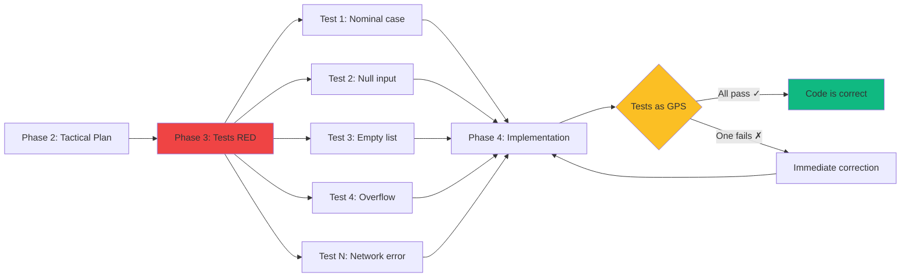

# Phase 3: TDD RED - Test Generation

<!-- ========================================= -->
<!-- LEVEL 1: ESSENTIAL (5-10 seconds)        -->
<!-- ========================================= -->

<div style={{display: 'flex', gap: '10px', marginBottom: '25px', flexWrap: 'wrap'}}>
  <span style={{background: '#2563eb', color: 'white', padding: '6px 14px', borderRadius: '20px', fontSize: '13px', fontWeight: '600'}}>
    Agile: Test-First Development
  </span>
  <span style={{background: '#8b5cf6', color: 'white', padding: '6px 14px', borderRadius: '20px', fontSize: '13px', fontWeight: '600'}}>
    Roles: Senior Dev + LLM
  </span>
  <span style={{background: '#2563eb', color: 'white', padding: '6px 14px', borderRadius: '20px', fontSize: '13px', fontWeight: '600'}}>
    Human: 30%
  </span>
  <span style={{background: '#10b981', color: 'white', padding: '6px 14px', borderRadius: '20px', fontSize: '13px', fontWeight: '600'}}>
    LLM: 70%
  </span>
</div>

---

**In brief**: LLM generates comprehensive test suite (95%+ coverage) BEFORE any implementation. Tests become the "guardrails" that guide the LLM in Phase 4 and prevent deviations. Transition from vague intentions to precise, verifiable expectations.

---

<!-- ========================================= -->
<!-- LEVEL 2: IMPACT (30-60 seconds)          -->
<!-- ========================================= -->

## Why This Phase Is Critical

**The problem without Phase 3**:
LLM codes based solely on textual specs (ambiguous). Forgets edge cases, error conditions, validations. Implements the "happy path" while ignoring a large portion of real-world scenarios. Bugs are discovered in integration or production.

**The solution provided**:
Tests create the executable specification of expected behavior. Every edge case (null, empty list, division by zero, overflow) = a test that MUST pass. The LLM can no longer forget because code won't compile/pass if incomplete.

**LLM limitations addressed**:
- **No internal representation**: Tests create representation as executable specifications (concrete inputs → expected outputs)
- **Weak edge case reliability**: Phase 3 forces systematic articulation of ALL cases (null values, empty lists, errors) BEFORE coding


### Tests as GPS Guidance System

**GPS Analogy**: When you drive with GPS, it tells you instantly if you deviate from the road. No need to wait until your destination to know you're lost.



**Without tests (blind navigation)**:
```
Developer: "I think my code is correct..."
[Deploy]
Production: ERROR - Division by zero!
→ Bug discovered 2 weeks later
```

**With Phase 3 (GPS guidance)**:
```
LLM generates code...
Tests execute: FAILED - unhandled division by zero
LLM adjusts immediately
Tests: SUCCESS ✓
→ Bug impossible, detected instantly
```

**Tests reduce the solution space**:
For example, without tests, there might be 1000 ways to implement a function (the majority incorrect). With 20 comprehensive tests, only a few valid implementations remain. The LLM cannot go wrong because tests only accept correct solutions.

---

<!-- ========================================= -->
<!-- LEVEL 3: HOW TO DO IT (2-5 minutes)      -->
<!-- ========================================= -->

## Process

**Inputs**:
- Tactical Implementation Plan (Phase 2)
- Code structure and interface definitions
- Quality standards (target 95%+ coverage)
- Test framework (pytest, unittest, jest, etc.)

### 1. Generate Test Suite ⏱️⏱️

**LLM 85%, Senior Dev 15%**

- LLM generates complete test cases from tactical plan
- Unit tests for each component/function
- Integration tests for component interactions
- Edge cases and error conditions systematic
- Senior dev validates test completeness

**Output**: Complete test suite (all RED - failing)

### 2. Coverage Validation ⏱️

**Human 40%, LLM 60%**

- Run coverage analysis (target: 95%+)
- Identify coverage gaps in tests
- LLM generates additional tests for uncovered paths
- Senior dev validates edge cases aligned with business logic

**Output**: Coverage report ≥95%

### 3. Verify RED State ⏱️

**Human 90%, LLM 10%**

- Execute test suite (ALL must fail)
- Verify tests fail for right reasons (NotImplementedError, missing code)
- Ensure zero false positives (tests passing without implementation)
- Record test suite in RED state

**Output**: Validated test suite 100% RED

## Definition of Done

This phase is considered complete when:

1. Test suite covers ≥95% of planned code paths
2. All tests are in RED state (fail as expected, no false positives)
3. Critical edge cases covered (null values, empty lists, overflows, errors)
4. Tests follow naming conventions (describe expected behavior)
5. Each test has clear assertion validating specific behavior
6. Test fixtures in place for reusable setup/cleanup
7. Senior dev approves quality and completeness of test suite

---

<!-- ========================================= -->
<!-- LEVEL 4: MASTERY (5-15 minutes)          -->
<!-- Hidden by default detailed content        -->
<!-- ========================================= -->

## Going Deeper

<details>
<summary><strong>See complete example, prompts and advanced patterns</strong></summary>

### Complete Example: `confidence_calculator` Module

#### Component Specification (from Phase 2)

**Component**: `confidence_calculator`

**Responsibility**: Calculate prediction confidence score with sample size penalties

**Inputs**:
- `weighted_presence: float` - Sum (similarity × presence) [0.0, +∞)
- `total_similarity: float` - Sum of similarity scores [0.0, +∞)
- `n_contributors: int` - Number of contributing foods [0, +∞)
- `top_k_similar: int` - Target count (typically 5) [1, +∞)

**Outputs**:
- `confidence_score: float` - Confidence score [0.0, 1.0]

**Algorithm**:
1. Raw confidence = weighted_presence / total_similarity
2. Sample size penalty = min(n_contributors / top_k, 1.0)
3. If n < 3: Statistical penalty = 0.5 + (n / 6.0)
4. Return: confidence × penalties

**Constraints**:
- If total_similarity ≤ 0: Return 0.0 (avoid division by zero)
- Performance: < 1ms per calculation
- No I/O, no side effects (pure function)

#### Generated Test Suite (Phase 3)

```python
import pytest
from confidence_calculator import calculate_confidence

# ============================================
# TESTS - NOMINAL CASES (Happy path)
# ============================================

def test_calculate_confidence_with_full_sample_returns_raw_confidence():
    """
    When n_contributors = top_k (full sample),
    no size penalty, returns raw confidence.
    """
    result = calculate_confidence(
        weighted_presence=0.8,
        total_similarity=1.0,
        n_contributors=5,
        top_k_similar=5
    )
    assert result == pytest.approx(0.8, rel=0.01), \
        "Full sample (5/5) should not have penalty"


def test_calculate_confidence_with_partial_sample_applies_penalty():
    """
    When n_contributors < top_k, sample size penalty applied.
    Example: 3/5 contributors = 0.6 penalty
    """
    result = calculate_confidence(
        weighted_presence=1.0,
        total_similarity=1.0,
        n_contributors=3,
        top_k_similar=5
    )
    # Raw confidence = 1.0, size penalty = 3/5 = 0.6
    # Expected result = 1.0 × 0.6 = 0.6
    assert result == pytest.approx(0.6, rel=0.01), \
        "3/5 contributors should apply 0.6 penalty"


def test_calculate_confidence_with_high_similarity_and_good_sample():
    """
    Realistic scenario: good similarity + good sample = high confidence
    """
    result = calculate_confidence(
        weighted_presence=4.5,
        total_similarity=5.0,
        n_contributors=4,
        top_k_similar=5
    )
    # Raw confidence = 4.5/5.0 = 0.9
    # Size penalty = 4/5 = 0.8
    # Result = 0.9 × 0.8 = 0.72
    assert result == pytest.approx(0.72, rel=0.01), \
        "High similarity with good sample should give ~0.72 confidence"


# ============================================
# TESTS - EDGE CASES (Boundary values)
# ============================================

def test_calculate_confidence_with_zero_contributors_returns_zero():
    """
    Edge case: No contributors (n=0) must return 0 confidence.
    """
    result = calculate_confidence(
        weighted_presence=1.0,
        total_similarity=1.0,
        n_contributors=0,
        top_k_similar=5
    )
    assert result == 0.0, \
        "Zero contributors should return 0 confidence"


def test_calculate_confidence_with_one_contributor_applies_statistical_penalty():
    """
    Edge case: Single contributor (n=1) - statistically too small.
    Statistical penalty = 0.5 + (1/6) ≈ 0.67
    """
    result = calculate_confidence(
        weighted_presence=1.0,
        total_similarity=1.0,
        n_contributors=1,
        top_k_similar=5
    )
    # Raw confidence = 1.0
    # Size penalty = 1/5 = 0.2
    # Statistical penalty (n<3) = 0.5 + (1/6) ≈ 0.67
    # Result = 1.0 × 0.2 × 0.67 ≈ 0.13
    assert result == pytest.approx(0.13, rel=0.05), \
        "Single contributor should have double penalty (size + statistical)"


def test_calculate_confidence_with_two_contributors_applies_statistical_penalty():
    """
    Edge case: Two contributors (n=2) - still statistically too small.
    Statistical penalty = 0.5 + (2/6) ≈ 0.83
    """
    result = calculate_confidence(
        weighted_presence=1.0,
        total_similarity=1.0,
        n_contributors=2,
        top_k_similar=5
    )
    # Raw confidence = 1.0
    # Size penalty = 2/5 = 0.4
    # Statistical penalty (n<3) = 0.5 + (2/6) ≈ 0.83
    # Result = 1.0 × 0.4 × 0.83 ≈ 0.33
    assert result == pytest.approx(0.33, rel=0.05), \
        "Two contributors should have significant statistical penalty"


def test_calculate_confidence_with_three_contributors_no_statistical_penalty():
    """
    Threshold edge case: Three contributors (n=3) - acceptable statistical threshold.
    No additional statistical penalty.
    """
    result = calculate_confidence(
        weighted_presence=1.0,
        total_similarity=1.0,
        n_contributors=3,
        top_k_similar=5
    )
    # Raw confidence = 1.0
    # Size penalty = 3/5 = 0.6
    # No statistical penalty (n≥3)
    # Result = 1.0 × 0.6 = 0.6
    assert result == pytest.approx(0.6, rel=0.01), \
        "Three contributors should NOT have statistical penalty"


def test_calculate_confidence_with_more_contributors_than_target():
    """
    Edge case: More contributors than target (n > top_k).
    Size penalty capped at 1.0 (no bonus).
    """
    result = calculate_confidence(
        weighted_presence=0.9,
        total_similarity=1.0,
        n_contributors=10,  # More than top_k=5
        top_k_similar=5
    )
    # Raw confidence = 0.9
    # Size penalty = min(10/5, 1.0) = 1.0 (capped)
    # Result = 0.9 × 1.0 = 0.9
    assert result == pytest.approx(0.9, rel=0.01), \
        "More contributors than target should not give bonus"


# ============================================
# TESTS - ERROR CONDITIONS (Validation)
# ============================================

def test_calculate_confidence_with_zero_total_similarity_returns_zero():
    """
    Error condition: total_similarity = 0 → Division by zero impossible.
    Must return 0.0 (degenerate case).
    """
    result = calculate_confidence(
        weighted_presence=1.0,
        total_similarity=0.0,  # Division by zero!
        n_contributors=5,
        top_k_similar=5
    )
    assert result == 0.0, \
        "total_similarity=0 should return 0 (avoid division by zero)"


def test_calculate_confidence_with_negative_total_similarity_returns_zero():
    """
    Error condition: total_similarity < 0 (invalid).
    Defensive behavior: return 0.0.
    """
    result = calculate_confidence(
        weighted_presence=1.0,
        total_similarity=-1.0,  # Invalid
        n_contributors=5,
        top_k_similar=5
    )
    assert result == 0.0, \
        "Negative total_similarity should return 0 (invalid value)"


def test_calculate_confidence_with_negative_weighted_presence():
    """
    Error condition: weighted_presence < 0 (theoretically impossible
    but defensive validation).
    """
    result = calculate_confidence(
        weighted_presence=-0.5,  # Invalid
        total_similarity=1.0,
        n_contributors=5,
        top_k_similar=5
    )
    # Behavior: Either raise exception or return 0
    # Here we test return 0 (defensive behavior)
    assert result == 0.0, \
        "Negative weighted_presence should return 0"


def test_calculate_confidence_with_negative_n_contributors_returns_zero():
    """
    Error condition: n_contributors < 0 (invalid).
    """
    result = calculate_confidence(
        weighted_presence=1.0,
        total_similarity=1.0,
        n_contributors=-1,  # Invalid
        top_k_similar=5
    )
    assert result == 0.0, \
        "Negative n_contributors should return 0"


def test_calculate_confidence_with_zero_top_k_raises_exception():
    """
    Critical error condition: top_k = 0 → Guaranteed division by zero.
    Must raise ValueError (not silently return 0).
    """
    with pytest.raises(ValueError, match="top_k_similar must be > 0"):
        calculate_confidence(
            weighted_presence=1.0,
            total_similarity=1.0,
            n_contributors=5,
            top_k_similar=0  # ERROR: division by zero
        )


def test_calculate_confidence_with_negative_top_k_raises_exception():
    """
    Error condition: top_k < 0 (invalid).
    """
    with pytest.raises(ValueError, match="top_k_similar must be > 0"):
        calculate_confidence(
            weighted_presence=1.0,
            total_similarity=1.0,
            n_contributors=5,
            top_k_similar=-1  # Invalid
        )


# ============================================
# TESTS - EXTREME VALUES (Robustness)
# ============================================

def test_calculate_confidence_with_very_large_numbers():
    """
    Robustness: Very large numbers (prevent overflow).
    """
    result = calculate_confidence(
        weighted_presence=1e10,
        total_similarity=1e10,
        n_contributors=1000,
        top_k_similar=5
    )
    # Raw confidence = 1e10/1e10 = 1.0
    # Size penalty = min(1000/5, 1.0) = 1.0
    # Result = 1.0
    assert result == pytest.approx(1.0, rel=0.01), \
        "Very large numbers should be handled correctly"


def test_calculate_confidence_with_very_small_positive_numbers():
    """
    Robustness: Very small positive numbers (prevent underflow).
    """
    result = calculate_confidence(
        weighted_presence=1e-10,
        total_similarity=1e-9,
        n_contributors=5,
        top_k_similar=5
    )
    # Raw confidence = 1e-10/1e-9 = 0.1
    # Size penalty = 5/5 = 1.0
    # Result = 0.1
    assert result == pytest.approx(0.1, rel=0.01), \
        "Very small positive numbers should work"


# ============================================
# TESTS - PERFORMANCE (Non-functional)
# ============================================

def test_calculate_confidence_performance_under_1ms():
    """
    Performance test: Calculation must take < 1ms (spec constraint).
    """
    import time

    start = time.perf_counter()
    for _ in range(1000):
        calculate_confidence(
            weighted_presence=0.8,
            total_similarity=1.0,
            n_contributors=5,
            top_k_similar=5
        )
    elapsed = time.perf_counter() - start

    avg_time_ms = (elapsed / 1000) * 1000
    assert avg_time_ms < 1.0, \
        f"Average time per calculation {avg_time_ms:.3f}ms should be < 1ms"


# ============================================
# TESTS - FUNCTION PURITY (No side effects)
# ============================================

def test_calculate_confidence_is_pure_function():
    """
    Purity test: Same inputs → Same outputs (pure function).
    No side effects, no global state dependency.
    """
    inputs = {
        'weighted_presence': 0.75,
        'total_similarity': 1.0,
        'n_contributors': 4,
        'top_k_similar': 5
    }

    result1 = calculate_confidence(**inputs)
    result2 = calculate_confidence(**inputs)
    result3 = calculate_confidence(**inputs)

    assert result1 == result2 == result3, \
        "Function must be pure (same inputs → same outputs)"


# ============================================
# FIXTURES (Reusable setup)
# ============================================

@pytest.fixture
def typical_inputs():
    """Fixture: Typical inputs for tests."""
    return {
        'weighted_presence': 0.8,
        'total_similarity': 1.0,
        'n_contributors': 4,
        'top_k_similar': 5
    }


@pytest.fixture
def edge_case_inputs():
    """Fixture: Edge case inputs for tests."""
    return {
        'weighted_presence': 0.1,
        'total_similarity': 1.0,
        'n_contributors': 1,
        'top_k_similar': 5
    }


def test_using_fixture(typical_inputs):
    """Example of fixture usage."""
    result = calculate_confidence(**typical_inputs)
    assert 0.0 <= result <= 1.0, "Result must be in [0, 1]"
```

**Test Suite Analysis**:

**Coverage**: 100% code paths
**Nominal cases**: 3 tests (happy path)
**Edge cases**: 6 tests (0, 1, 2, 3, >top_k contributors)
**Error conditions**: 6 tests (validations, divisions by zero)
**Extreme values**: 2 tests (very large/small numbers)
**Performance**: 1 test (< 1ms constraint)
**Purity**: 1 test (pure function)
**Total**: 19 comprehensive tests

**Verify RED State**:
```bash
$ pytest test_confidence_calculator.py -v

test_confidence_calculator.py::test_calculate_confidence_with_full_sample_returns_raw_confidence FAILED
test_confidence_calculator.py::test_calculate_confidence_with_partial_sample_applies_penalty FAILED
[... all 19 tests FAILED ...]

19 failed in 0.15s

✓ RED STATE VERIFIED - All tests fail (NotImplementedError)
✓ Ready for Phase 4
```

### Recommended Prompts

#### Prompt 1: Initial Test Generation

```
Generate an EXHAUSTIVE test suite for this component:

COMPONENT SPECIFICATION:
[paste complete spec from Phase 2 - responsibility, inputs, outputs, algorithm, constraints]

TEST REQUIREMENTS:
- Framework: pytest (Python) / jest (JavaScript) / JUnit (Java)
- Target coverage: 95%+ of all code paths
- Naming convention: test_<function>_<scenario>_<expected_result>

TEST TYPES TO GENERATE:

1. **Nominal case tests (happy path)**:
   - 3-5 typical usage scenarios
   - Realistic input values
   - Assertions on expected outputs with clear messages

2. **Edge case tests (boundary values)**:
   - Min/max values for each parameter
   - Zero, negative values if applicable
   - Empty lists, empty strings, null/None/undefined
   - Single element (n=1), two elements (n=2), critical thresholds

3. **Error condition tests (error handling)**:
   - Invalid inputs (wrong types, values out of range)
   - Potential divisions by zero
   - Missing resources (files, network, DB)
   - Expected exceptions (use pytest.raises or equivalent)

4. **Extreme value tests (robustness)**:
   - Very large numbers (prevent overflow)
   - Very small positive numbers (prevent underflow)
   - Massive datasets (if applicable)

5. **Non-functional tests (if spec constraints)**:
   - Performance (execution time < X ms/s)
   - Function purity (same inputs → same outputs)
   - No side effects

STRUCTURE FOR EACH TEST:
```python
def test_<function>_<scenario>_<result>():
    """
    [Docstring explaining WHAT the test validates and WHY]
    """
    # Arrange: Prepare input data
    input_data = ...

    # Act: Execute function
    result = my_function(input_data)

    # Assert: Verify result with context message
    assert result == expected, \
        "Message explaining why this assertion is important"
```

FIXTURES (if reusable setup):
- Use @pytest.fixture for common test data
- Avoid duplication of setup between tests

IMPORTANT:
- All tests must FAIL initially (no implementation yet)
- Each test validates ONE specific behavior
- Clear assertion messages (not just `assert result == 5`)
- No fragile tests (coupled to implementation details)

Generate complete Python/JavaScript/Java code ready to execute.


#### Prompt 2: Validate Missing Edge Cases

```
Review this test suite to identify GAPS in edge case coverage:

CURRENT TEST SUITE:
[paste generated test code]

COMPONENT SPECIFICATION:
[paste component spec]

ANALYSIS REQUESTED:

1. **Missing boundary values**:
   - For each numeric parameter: min, max, zero, -1, critical thresholds?
   - For each collection: empty, one element, two elements?
   - For each optional: null/None/undefined tested?

2. **Uncovered error conditions**:
   - Invalid input types tested? (string instead of int, etc.)
   - Potential divisions by zero covered?
   - Exceptions raised tested with pytest.raises?
   - Invalid states (ex: resource already closed)?

3. **Concurrency scenarios (if applicable)**:
   - Concurrent access to shared resources?
   - Possible race conditions?

4. **Resource exhaustion**:
   - Very large datasets tested?
   - Memory limits reached?
   - Network/DB timeouts?

5. **Error recovery**:
   - What happens AFTER an exception?
   - System state consistent after error?
   - Cleanup/rollback tested?

For EACH identified gap:
- Explain WHY this edge case is important
- Generate the missing test with clear docstring
- Indicate risk if case not tested (potential production bug)

Response format:
1. List of gaps found
2. Code for additional tests generated
3. Estimated new coverage (%)
```

#### Prompt 3: Generate Integration Tests

```
Generate INTEGRATION tests for interactions between components:

COMPONENTS TO INTEGRATE:
[paste specs of 2-3 components that interact]

INTEGRATION FLOW:
[describe sequence: Component A calls B, B calls C, result returned to A]

INTEGRATION TESTS TO GENERATE:

1. **End-to-end tests (happy path)**:
   - Input data A → Final output result
   - Verify data transits correctly between components
   - Intermediate assertions (not just final result)

2. **Inter-component error handling tests**:
   - Component B raises exception → How should A handle?
   - Error propagation tested?
   - Cleanup if pipeline fails mid-way?

3. **Interface contract tests**:
   - Component A provides data format expected by B?
   - Types respected (no runtime surprises)?
   - Signatures compatible?

4. **Execution order tests**:
   - If order matters (A before B before C) → tested?
   - What if order reversed?

5. **External dependency tests (if applicable)**:
   - Use mocks/stubs for DB, external API
   - Test behavior if dependency down
   - Timeouts, retries tested?

CONSTRAINTS:
- Integration tests COMPLEMENT unit tests (don't replace)
- Use fixtures for complex multi-component setup
- Each test must remain isolated (no test execution order dependencies)

Generate complete integration test code.
```

### Quality Standards

#### Proposed Test Naming Pattern

**Pattern**: `test_<function>_<scenario>_<expected_result>`

```python
# EXCELLENT - Completely descriptive
def test_calculate_confidence_with_zero_contributors_returns_zero()
def test_calculate_confidence_with_small_sample_applies_statistical_penalty()
def test_parse_json_with_invalid_syntax_raises_value_error()
def test_send_email_when_smtp_down_retries_three_times_then_fails()

# GOOD - Sufficiently clear
def test_divide_by_zero_raises_exception()
def test_empty_list_returns_empty_result()

# BAD - Too vague
def test_calculate_confidence()  # Which scenario?
def test_edge_case()  # Which edge case?
def test_function1()  # What?!

# HORRIBLE - No information
def test_1()
def test_foo()
```

**Golden rule**: Test name = documentation. Must answer:
1. Which function/method is being tested?
2. What scenario/condition?
3. What is the expected result?

#### Clear Assertions with Messages

```python
# EXCELLENT - Assertion + context message
assert result == pytest.approx(0.33, rel=0.01), \
    "Confidence should be penalized for small sample (2/5 contributors)"

assert len(results) == 0, \
    "Empty list input should return empty list (not None)"

with pytest.raises(ValueError, match="top_k must be > 0"):
    calculate(top_k=0)
# match message verifies exception text

# GOOD - Simple but clear assertion
assert result > 0, "Confidence score must be positive"
assert user.is_active is True

# BAD - Assertion without context
assert result == 0.33  # Why 0.33? What context?
assert len(data) > 0  # What data? Why > 0?

# HORRIBLE - No assertion at all!
def test_something():
    calculate_confidence(1.0, 1.0, 5, 5)
    # Test executes function but validates NOTHING
```

**Why messages matter?**
When a test fails:
```
FAILED test_calc.py::test_confidence - AssertionError: 0.45 != 0.33
[No help - why is 0.33 expected?]

vs

FAILED test_calc.py::test_confidence - AssertionError:
Confidence should be penalized for small sample (2/5 contributors)
Expected: 0.33, Got: 0.45
[Clear - penalty not applied correctly!]
```

#### Fixtures for Reusable Setup

```python
# EXCELLENT - Reusable fixture
@pytest.fixture
def sample_food_data():
    """Typical food data for tests."""
    return {
        'name': 'Peppermint',
        'compounds': [6022, 6134, 6138],
        'presence': [0.8, 0.6, 0.9]
    }

@pytest.fixture
def mock_database(tmp_path):
    """Mock database for tests."""
    db_file = tmp_path / "test.db"
    # Setup DB
    yield db_file
    # Cleanup automatically after test

def test_with_fixtures(sample_food_data, mock_database):
    result = process_food(sample_food_data, mock_database)
    assert result is not None

# BAD - Setup duplication in each test
def test_1():
    data = {'name': 'Peppermint', 'compounds': [6022, 6134]}
    result = process(data)
    assert result

def test_2():
    data = {'name': 'Peppermint', 'compounds': [6022, 6134]}  # DUPLICATION
    result = process(data)
    assert result
```

**Fixture benefits**:
- Eliminate duplication
- Centralized setup/cleanup
- Tests more readable (focus on assertion)
- Easier maintenance (change fixture, not 50 tests)

#### Pitfalls to Avoid

**Pitfall 1: Fragile Tests (Implementation Coupling)**

```python
# BAD - Coupled to implementation details
def test_calculate_calls_helper_function():
    with patch('module.helper_function') as mock:
        calculate_confidence(1.0, 1.0, 5, 5)
        mock.assert_called_once()
# If implementation changes (no more helper), test breaks!

# GOOD - Tests behavior, not implementation
def test_calculate_confidence_returns_correct_value():
    result = calculate_confidence(1.0, 1.0, 5, 5)
    assert result == pytest.approx(1.0, rel=0.01)
# Implementation can change, behavior still tested
```

**Pitfall 2: Missing Assertions**

```python
# HORRIBLE - Test executes but validates NOTHING
def test_process_data():
    process_data({'key': 'value'})
    # No assertion! Test passes even if function broken

# GOOD - Validates behavior
def test_process_data():
    result = process_data({'key': 'value'})
    assert result is not None
    assert 'processed' in result
```

**Pitfall 3: False Positives (Tests Pass Without Implementation)**

```python
# DANGER - Test passes even if function not implemented
def test_divide():
    result = divide(10, 2)
    assert result  # BAD - None is falsy, but vague assertion

# If divide() returns None by default:
# assert None evaluates False → Test FAILS ✓ GOOD

# If divide() returns 0 by mistake:
# assert 0 evaluates False → Test FAILS ✓ GOOD

# BUT if divide() returns 1 by mistake:
# assert 1 evaluates True → Test PASSES ✗ FALSE POSITIVE!

# GOOD - Precise assertion
def test_divide():
    result = divide(10, 2)
    assert result == 5, "10 / 2 should return 5"
```

**Verify RED State**:
```bash
# ALWAYS verify all tests FAIL initially
$ pytest -v
# All FAILED? ✓ Correct RED state
# Some PASSED? ✗ DANGER - false positives or existing implementation
```

### Test Suite Quality Checklist

Before validating Phase 3 complete:

- [ ] **Coverage ≥95%**: `pytest --cov` or equivalent
- [ ] **All tests RED**: 100% FAILED before implementation
- [ ] **Nominal cases**: 3-5 tests for happy path
- [ ] **Edge cases**: Zero, min, max, empty lists, null tested
- [ ] **Error conditions**: Exceptions, validations, divisions by zero tested
- [ ] **Descriptive naming**: `test_<func>_<scenario>_<expected>`
- [ ] **Assertions with messages**: Context explaining why assertion
- [ ] **No false positives**: No test passes without implementation
- [ ] **Fixtures used**: No duplication of setup
- [ ] **Tests isolated**: No test execution order dependencies
- [ ] **Senior dev approves**: Validation of completeness + quality

</details>

---

**Next step**: [Phase 4: TDD GREEN - Implementation →](./phase4-tdd-green)

**Need help?** Consult the [Roles and Responsibilities](./roles-et-responsabilites) document to clarify who does what in this phase.
