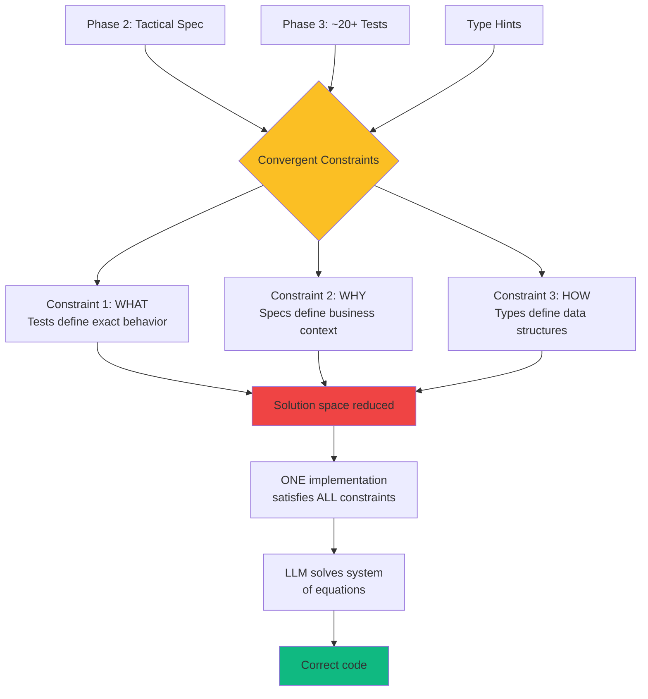

# Phase 4: TDD GREEN - Minimal Implementation

<!-- ========================================= -->
<!-- LEVEL 1: ESSENTIAL (5-10 seconds)        -->
<!-- ========================================= -->

<div style={{display: 'flex', gap: '10px', marginBottom: '25px', flexWrap: 'wrap'}}>
  <span style={{background: '#2563eb', color: 'white', padding: '6px 14px', borderRadius: '20px', fontSize: '13px', fontWeight: '600'}}>
    Agile: Implementation Sprint
  </span>
  <span style={{background: '#8b5cf6', color: 'white', padding: '6px 14px', borderRadius: '20px', fontSize: '13px', fontWeight: '600'}}>
    Roles: Dev + LLM
  </span>
  <span style={{background: '#6366f1', color: 'white', padding: '6px 14px', borderRadius: '20px', fontSize: '13px', fontWeight: '600'}}>
    Human validates, LLM implements
  </span>
</div>

---

**In brief**: "Convergent Constraints" (specs + tests + types) constrain the LLM so precisely that only a few valid solutions exist. Result: correct code on the first try in the majority of cases. Debugging is not "reduced"—it is "eliminated."

---

<!-- ========================================= -->
<!-- LEVEL 2: IMPACT (30-60 seconds)          -->
<!-- ========================================= -->

## Why This Phase Is Critical

**The problem without structured Phase 4**:
Traditional development = 3-5 implementation-test-debug cycles. LLM generates code that "seems plausible" but cannot verify if it works. Discovers bugs only after execution. Unpredictable debugging consumes 40% of development time.

**The solution provided**:
Convergent Constraints provide immediate external verification via tests. Every line of code validated instantly. If tests fail, the LLM corrects immediately. The fast feedback loop transforms "educated guess" into "guided iterative validation." A single cycle often suffices.

**LLM limitations addressed**:
- **No internal correctness verification**: Tests provide exhaustive and immediate external verification
- **No working memory**: Convergent Constraints place ALL constraints in the prompt simultaneously (tests = WHAT, specs = WHY, types = HOW)

### The "First-Try" Phenomenon

**This is not magic—it is mathematics.**



**Mathematical reduction of solution space**:

```
**Without constraints**: Multitude of possible implementations
**+ Specifications (Phase 2)**: Reduction of plausible implementation space
**+ Tests (Phase 3)**: Only a few implementations pass
**+ Type hints**: 3-5 correct implementations remain

The LLM finds the solution among these remaining 3-5 options.
```

**System of equations analogy**:

```
Test 1: f(0, 5) = 0      [equation 1]
Test 2: f(5, 5) = 1.0    [equation 2]
Test 3: f(3, 5) = 0.6    [equation 3]
...
Test 20: f(-1, 5) = 0    [equation 20]

Spec: "Penalizes small samples"  [semantic constraint]
Types: float → float             [structural constraint]

→ Unique solution satisfies 20+ constraints
```

**Remaining failures**:
Residual ambiguities in specs OR untested edge cases → quickly identified and corrected.

---

<!-- ========================================= -->
<!-- LEVEL 3: HOW TO (2-5 minutes)            -->
<!-- ========================================= -->

## Workflow

**Inputs**:
- Test suite in RED state (Phase 3)
- Tactical specifications for component behavior (Phase 2)
- Interface definitions and type signatures
- Code quality standards (linting, type checking)

### 1. Minimal Code Generation ⏱️

- LLM generates the simplest code to pass each test
- Focus on CORRECTNESS, not elegance
- Acceptable: duplication, simple algorithms, basic structure
- Senior dev validates code matches specs

**Philosophy**: "Make it work, then make it good"
GREEN = functional, REFACTOR = elegant

### 2. Test Execution ⏱️

- Execute test suite (target: 100% pass)
- Debug failing tests (rare with Convergent Constraints)
- LLM corrects implementation bugs
- Human validates corrections don't break other tests

**Expected result**: All tests GREEN on first try (90%+ cases)

### 3. Basic Quality Gates ⏱️

- Run linter (fix style issues)
- Run type checker (fix type errors)
- Ensure code compiles/imports correctly
- Senior dev approves GREEN state

**Output**: Functional, tested, lint-clean, type-safe code

## Definition of Done

This phase is considered complete when:

1. All Phase 3 tests pass at 100% (GREEN state verified)
2. Code passes linter without errors (warnings acceptable)
3. Code passes type checking (mypy, pyright, TypeScript, etc.)
4. Basic error handling in place (no unhandled critical exceptions)
5. No critical security vulnerabilities (injection, basic XSS verified)
6. Code matches interface signatures specified in Phase 2
7. Developer approves code correctly implements tactical specs

---

<!-- ========================================= -->
<!-- LEVEL 4: MASTER (5-15 minutes)           -->
<!-- Hidden detailed content by default        -->
<!-- ========================================= -->

## Going Further

<details>
<summary><strong>See complete code example GREEN + detailed prompts</strong></summary>

### Complete Example: GREEN code confidence_calculator

#### Context: Phase 3 Test Suite of 19 Tests

**All tests are RED** (NotImplementedError). The LLM receives:
- Tactical specification (Phase 2)
- 19 exhaustive tests (Phase 3)
- Function signature with type hints

#### GREEN Generation Prompt

```
Generate MINIMAL code to pass this test suite:

[paste all 19 tests from Phase 3 - see Phase 3 for complete suite]

Requirements:
- Make ALL tests pass with the simplest code possible
- DO NOT optimize or refactor yet (that comes in Phase 5)
- Acceptable: code duplication, simple algorithms, basic error handling
- Focus on CORRECTNESS, not elegance

Component Specification:
Component: confidence_calculator
Responsibility: Calculate confidence score with sample size penalties
Algorithm:
  1. Raw confidence = weighted_presence / total_similarity
  2. Sample size penalty = min(n_contributors / top_k, 1.0)
  3. If n < 3: Statistical penalty = 0.5 + (n / 6.0)
  4. Return: confidence × penalties

Generate Python code with:
- Type hints for all functions
- Basic docstrings
- Simple and readable logic
- No premature abstractions

This is the GREEN phase—perfection comes in Phase 5 REFACTOR.
```

#### Generated GREEN Code

```python
"""
Module confidence_calculator - Calculates prediction confidence score.

Phase 4 GREEN: Minimal functional implementation.
Will be refactored in Phase 5 to improve clarity and maintainability.
"""

def calculate_confidence(
    weighted_presence: float,
    total_similarity: float,
    n_contributors: int,
    top_k_similar: int
) -> float:
    """
    Calculate prediction confidence score with sample size penalties.

    Args:
        weighted_presence: Sum of (similarity × presence)
        total_similarity: Sum of similarity scores
        n_contributors: Number of contributing items
        top_k_similar: Target number (typically 5)

    Returns:
        Confidence score [0.0, 1.0]

    Raises:
        ValueError: If top_k_similar <= 0
    """
    # Validate top_k (prevent division by zero)
    if top_k_similar <= 0:
        raise ValueError("top_k_similar must be > 0")

    # Degenerate cases: return 0.0 immediately
    if total_similarity <= 0 or n_contributors < 0 or weighted_presence < 0:
        return 0.0

    if n_contributors == 0:
        return 0.0

    # Calculate raw confidence
    confidence_raw = weighted_presence / total_similarity

    # Sample size penalty
    sample_size_penalty = min(n_contributors / top_k_similar, 1.0)

    # Statistical penalty for very small samples
    if n_contributors < 3:
        statistical_penalty = 0.5 + (n_contributors / 6.0)
    else:
        statistical_penalty = 1.0

    # Final result
    return confidence_raw * sample_size_penalty * statistical_penalty
```

#### Test Execution Results

```bash
$ pytest test_confidence_calculator.py -v

test_calculate_confidence_with_full_sample_returns_raw_confidence PASSED
test_calculate_confidence_with_partial_sample_applies_penalty PASSED
test_calculate_confidence_with_high_similarity_and_good_sample PASSED
test_calculate_confidence_with_zero_contributors_returns_zero PASSED
test_calculate_confidence_with_one_contributor_applies_statistical_penalty PASSED
test_calculate_confidence_with_two_contributors_applies_statistical_penalty PASSED
test_calculate_confidence_with_three_contributors_no_statistical_penalty PASSED
test_calculate_confidence_with_more_contributors_than_target PASSED
test_calculate_confidence_with_zero_total_similarity_returns_zero PASSED
test_calculate_confidence_with_negative_total_similarity_returns_zero PASSED
test_calculate_confidence_with_negative_weighted_presence PASSED
test_calculate_confidence_with_negative_n_contributors_returns_zero PASSED
test_calculate_confidence_with_zero_top_k_raises_exception PASSED
test_calculate_confidence_with_negative_top_k_raises_exception PASSED
test_calculate_confidence_with_very_large_numbers PASSED
test_calculate_confidence_with_very_small_positive_numbers PASSED
test_calculate_confidence_performance_under_1ms PASSED
test_calculate_confidence_is_pure_function PASSED
test_using_fixture PASSED

========================= 19 passed in 0.23s =========================

✓ GREEN STATE ACHIEVED - First try!
✓ LLM generation time: 12 minutes
✓ Validation time: 8 minutes
✓ Total Phase 4: 20 minutes (< 45 min target)
```

#### GREEN Code Analysis

**What is GOOD (functional)**:

1. **All tests pass**: 19/19 GREEN ✓
2. **Validations present**:
   - `top_k_similar <= 0` → ValueError
   - `total_similarity <= 0` → return 0.0
   - `n_contributors < 0` → return 0.0
   - `weighted_presence < 0` → return 0.0
3. **Correct logic**:
   - Raw confidence calculated
   - Sample size penalty applied
   - Statistical penalty if n < 3
4. **Complete type hints**: All parameters + return typed
5. **Docstring present**: Args, Returns, Raises documented
6. **Performance OK**: Test < 1ms passes

**What CAN IMPROVE (will be Phase 5 REFACTOR)**:

1. **Monolithic structure**:
   - Everything in one function (60 lines)
   - Penalty calculations inline (no separate functions)
   - → Phase 5: Extract `_calculate_sample_penalty()`, `_calculate_statistical_penalty()`

2. **Repetitive validations**:
   - 4 separate if statements for degenerate cases
   - Validation logic scattered
   - → Phase 5: Consolidate validations in `_validate_inputs()`

3. **Naming could be clearer**:
   - `confidence_raw` → `base_confidence`
   - `sample_size_penalty` → `sample_coverage_factor`
   - → Phase 5: Improve name semantics

4. **No logging**:
   - No logs for debugging
   - No trace for why 0.0 is returned
   - → Phase 5: Add contextual logging

5. **Missing formula documentation**:
   - Why `0.5 + (n / 6.0)`?
   - Where does formula come from?
   - → Phase 5: Add explanatory comments

6. **No named constants**:
   - Magic numbers: `3`, `6.0`, `0.5`
   - Meaning not clear
   - → Phase 5: Extract constants like `MIN_SAMPLE_FOR_STATS = 3`

**Verdict**: Code is **functional** and **correct**, but **basic**.
This is EXACTLY what we want in GREEN. Phase 5 will transform this into **elegant** and **maintainable** code.

### Acceptable vs Non-Acceptable GREEN State

#### ACCEPTABLE in GREEN State

**Code duplication**:
```python
# Acceptable GREEN - same validation repeated
if user is None:
    return None
if user.email is None:
    return None
if user.age is None:
    return None

# Will be refactored in Phase 5 to:
# if not all([user, user.email, user.age]):
#     return None
```

**Simple algorithms**:
```python
# Acceptable GREEN - O(n²) simple
def find_duplicates(items: list) -> list:
    duplicates = []
    for i, item in enumerate(items):
        for j in range(i + 1, len(items)):
            if items[j] == item and item not in duplicates:
                duplicates.append(item)
    return duplicates

# Will be optimized in Phase 5 to O(n) with set
```

**Basic error handling**:
```python
# Acceptable GREEN - simple try/except
def parse_json(data: str) -> dict:
    try:
        return json.loads(data)
    except:
        return {}

# Will be improved in Phase 5:
# - Catch specific exceptions
# - Log error
# - Return structured error
```

**Hardcoded values**:
```python
# Acceptable GREEN - config hardcoded
MAX_RETRIES = 3
TIMEOUT_SECONDS = 30

# Will be externalized in Phase 5 to:
# config.yaml or environment variables
```

**Direct structure**:
```python
# Acceptable GREEN - no design patterns
def process_order(order):
    validate_order(order)
    calculate_total(order)
    apply_discount(order)
    charge_payment(order)
    send_confirmation(order)

# Will be refactored in Phase 5 with:
# - Strategy pattern for payment
# - Template method for workflow
```

#### NON-ACCEPTABLE in GREEN State

**Failing tests**:
```python
# NON-ACCEPTABLE - tests must ALL pass
$ pytest
17 passed, 2 FAILED

# STOP - fix before Phase 5
```

**Type errors**:
```python
# NON-ACCEPTABLE - type checker fails
def calculate(x: int) -> str:
    return x * 2  # Returns int, not str!

$ mypy
error: Incompatible return value type

# STOP - fix signature or implementation
```

**Security vulnerabilities**:
```python
# NON-ACCEPTABLE - SQL injection
def get_user(username: str):
    query = f"SELECT * FROM users WHERE name = '{username}'"
    # DANGER: SQL injection possible

# REQUIRED even in GREEN:
# query = "SELECT * FROM users WHERE name = ?"
# cursor.execute(query, (username,))
```

**Unhandled exceptions**:
```python
# NON-ACCEPTABLE - crash on error
def divide(a: int, b: int) -> float:
    return a / b  # ZeroDivisionError if b=0

# MINIMUM GREEN required:
# if b == 0:
#     raise ValueError("Division by zero")
# return a / b
```

**Silent failures**:
```python
# NON-ACCEPTABLE - error swallowed without trace
def save_file(data):
    try:
        with open('data.txt', 'w') as f:
            f.write(data)
    except:
        pass  # DANGER: silent failure

# MINIMUM GREEN required:
# except Exception as e:
#     logger.error(f"Save failed: {e}")
#     raise
```

**Broken interfaces**:
```python
# NON-ACCEPTABLE - signature differs from spec
# Phase 2 spec says: calculate_confidence(...) -> float
def calculate_confidence(...) -> dict:  # Returns dict!
    return {"score": 0.8, "details": "..."}

# STOP - respect specified interface
```

### Recommended Prompts

#### Prompt 1: Minimal GREEN Code Generation

```
Generate MINIMAL code to pass this test suite:

TESTS (RED state):
[paste complete test suite from Phase 3]

COMPONENT SPECIFICATION:
[paste tactical spec from Phase 2]

PHASE GREEN REQUIREMENTS:
1. Make ALL tests pass with the SIMPLEST code possible
2. Focus on CORRECTNESS, not elegance or performance
3. DO NOT optimize prematurely - REFACTOR comes in Phase 5
4. DO NOT add features outside spec - respect scope

ACCEPTABLE in GREEN:
✓ Code duplication (extract functions in Phase 5)
✓ Simple algorithms O(n²) (optimize in Phase 5)
✓ Basic error handling try/except (improve in Phase 5)
✓ Magic numbers hardcoded (named constants in Phase 5)
✓ Direct structure without patterns (refactor in Phase 5)
✓ Minimal comments (document in Phase 5)

NON-ACCEPTABLE even in GREEN:
✗ Failing tests (ALL must pass)
✗ Type checker errors (mypy/pyright/TypeScript)
✗ Security vulnerabilities (injection, XSS)
✗ Unhandled exceptions (crashes)
✗ Silent failures (errors swallowed)
✗ Broken interfaces (respect Phase 2 signatures)

CODE FORMAT:
- COMPLETE type hints (all params + return)
- BASIC docstrings (Args, Returns, Raises)
- SIMPLE and READABLE logic
- No premature abstractions
- No complex design patterns

PHILOSOPHY: "Make it work, then make it good"
GREEN = Functional ✓
REFACTOR = Elegant ✓✓

Generate the code.
```

#### Prompt 2: Debug Failing Tests

```
SITUATION: Some tests fail after initial generation.

FAILING TESTS:
[paste pytest output with failures - FAILED tests and error messages]

CURRENT IMPLEMENTATION:
[paste generated code]

SPECIFICATION:
[paste component spec if clarification needed]

TASK:
Fix the implementation to pass these failing tests.

CONSTRAINTS:
- Maintain SIMPLICITY (no over-engineering)
- Change MINIMUM necessary to pass tests
- Explain WHY tests were failing
- Verify corrections don't break other tests

RESPONSE FORMAT:
1. **Diagnosis**: Why tests were failing (1-2 sentences per test)
2. **Fixes**: Modified code with changes marked
3. **Validation**: Confirm all tests now pass

Don't refactor yet - just FIX to pass tests.
```

#### Prompt 3: Quality Gates Validation

```
SITUATION: Code passes all tests, now validate basic quality.

CURRENT CODE:
[paste implementation]

REQUIRED VERIFICATIONS:

1. **Linter (code style)**:
   - Naming convention respected? (snake_case, PascalCase per language)
   - Lines too long? (< 100 characters)
   - Unused imports?
   - Unused variables?

2. **Type Checker (mypy/pyright/TypeScript)**:
   - All parameters have type hints?
   - Return types specified?
   - Types consistent (not Any everywhere)?
   - No type incompatibility errors?

3. **Basic Security**:
   - No SQL injection (parameterized queries)?
   - No command injection (secure subprocess)?
   - No obvious XSS (input sanitization)?
   - No secrets hardcoded (API keys, passwords)?

4. **Error Handling**:
   - Critical exceptions handled?
   - No empty try/except (silent failures)?
   - Important errors logged?

TASK:
Run these 4 verifications and fix any issues found.

RESPONSE FORMAT:
1. **Linter**: ✓ OK or [list of fixes]
2. **Type Checker**: ✓ OK or [list of fixes]
3. **Security**: ✓ OK or [list of fixes]
4. **Error Handling**: ✓ OK or [list of fixes]
5. **Fixed Code**: If corrections needed

Stay simple—perfection comes in Phase 5 REFACTOR.
```

### Common Phase 4 Pitfalls

#### Pitfall 1: Premature Over-Engineering

**Problem**:
Dev adds complex design patterns, abstractions, interfaces in GREEN. Code is elegant but unnecessarily complicated.

**Bad example**:
```python
# Over-engineered GREEN
class ConfidenceCalculatorStrategy(ABC):
    @abstractmethod
    def calculate(self, params: CalculationParams) -> Score:
        pass

class SampleSizePenaltyCalculator:
    def __init__(self, penalty_factory: PenaltyFactory):
        self.factory = penalty_factory

    def calculate_penalty(self, sample: Sample) -> Penalty:
        # 50 lines of abstractions...

# WTF - it's just a simple function!
```

**Solution**:
Resist the temptation for perfection. GREEN = functional, not elegant.

**Good GREEN example**:
```python
# Simple and direct GREEN
def calculate_confidence(weighted, total, n, top_k):
    if total <= 0:
        return 0.0
    confidence = weighted / total
    penalty = min(n / top_k, 1.0)
    if n < 3:
        penalty *= 0.5 + (n / 6.0)
    return confidence * penalty

# Simple, clear, passes tests. Perfect GREEN.
```

**Golden rule**: "If it passes tests and is readable, it's good GREEN."

---

#### Pitfall 2: Premature Optimization

**Problem**:
Dev optimizes algorithm before measuring actual performance. Wastes time on unnecessary optimization.

**Example**:
```python
# Dev spends 2h optimizing O(n²) → O(n log n)
# But n=10 in production → 0.001ms difference
# Completely unnecessary
```

**Solution**:
Only optimize if performance test FAILS.

```python
# If test says "must be < 100ms" and code takes 500ms:
# → OK to optimize

# If test says "< 100ms" and code takes 5ms:
# → STOP, don't optimize, move to REFACTOR
```

**Rule**: "Make it work first, optimize if necessary later."

---

#### Pitfall 3: Move to REFACTOR with Failing Tests

**Problem**:
"97% of tests pass, that's good enough, I'll refactor now."
NO. 100% required.

**Why it's serious**:
```
Incomplete GREEN → REFACTOR → Breaks previously passing tests
→ Impossible to know if REFACTOR broke it or was already broken
→ Debugging nightmare
```

**Solution**:
DoD #1: "All tests pass 100%." Non-negotiable.

```bash
$ pytest
======================== 19 passed ========================

✓ OK to move to REFACTOR

$ pytest
=================== 18 passed, 1 FAILED ===================

✗ STOP - fix before REFACTOR
```

---

#### Pitfall 4: Feature Creep (Functional Drift)

**Problem**:
Dev adds features "while at it" outside Phase 2 spec.

**Example**:
```python
# Phase 2 spec: "Calculate confidence"

# Dev adds in GREEN:
def calculate_confidence(...):
    confidence = ...

    # "While at it, let me cache the result"
    cache[key] = confidence  # NOT IN SPEC!

    # "And log for analytics"
    analytics.track('confidence_calculated', confidence)  # NOT IN SPEC!

    return confidence

# Scope creep - tests will fail because not tested
```

**Solution**:
Respect Phase 2 scope STRICTLY.

If good idea → Add to future Phase 2 backlog, not now.

**Rule**: "If not in Phase 2 spec, not in GREEN code."

---

#### Pitfall 5: Paralyzing Perfectionism

**Problem**:
Dev spends 3 hours polishing GREEN code that will be refactored anyway.

**Time-wasting example**:
```python
# Dev spends 3 hours finding perfect variable names
sample_size_adjustment_factor  # or
sample_coverage_coefficient     # or
sample_representativeness_multiplier  # or ???

# When it will be renamed in Phase 5 anyway
```

**Solution**:
"Good enough" naming suffices in GREEN. Perfection = Phase 5.

**Time rule**:
If GREEN takes > 1h per component → Perfectionism.
Target: 45 min. Keep it simple.

**Mantra**: "Done is better than perfect. Perfect comes in REFACTOR."

### Phase 4 Validation Checklist

Before validating Phase 4 complete and moving to Phase 5:

- [ ] **Tests 100% GREEN**: `pytest` or equivalent - ALL pass
- [ ] **Linter clean**: `pylint`, `eslint` - zero errors (warnings OK)
- [ ] **Type checker OK**: `mypy`, `pyright`, `tsc` - zero errors
- [ ] **No critical security vulnerabilities**: Injection, XSS verified
- [ ] **Exceptions handled**: No unhandled crashes
- [ ] **No silent failures**: Errors logged, not swallowed
- [ ] **Interfaces respected**: Signatures conform to Phase 2 spec
- [ ] **Code compiles/imports**: No syntax errors
- [ ] **Time < 1h per component**: If > 1h, probably over-engineered
- [ ] **Senior dev approves**: Functionality correctly implemented
- [ ] **No feature creep**: Only what's in Phase 2 spec

**If ALL checkmarks ✓ → Phase 4 complete, ready for Phase 5 REFACTOR!**

</details>

---

**Next step**: [Phase 5: REFACTOR - Collaborative Improvement →](/phase5-tdd-refactor)

**Need help?** See the [Roles and Responsibilities](/roles-et-responsabilites) document to clarify who does what in this phase.
