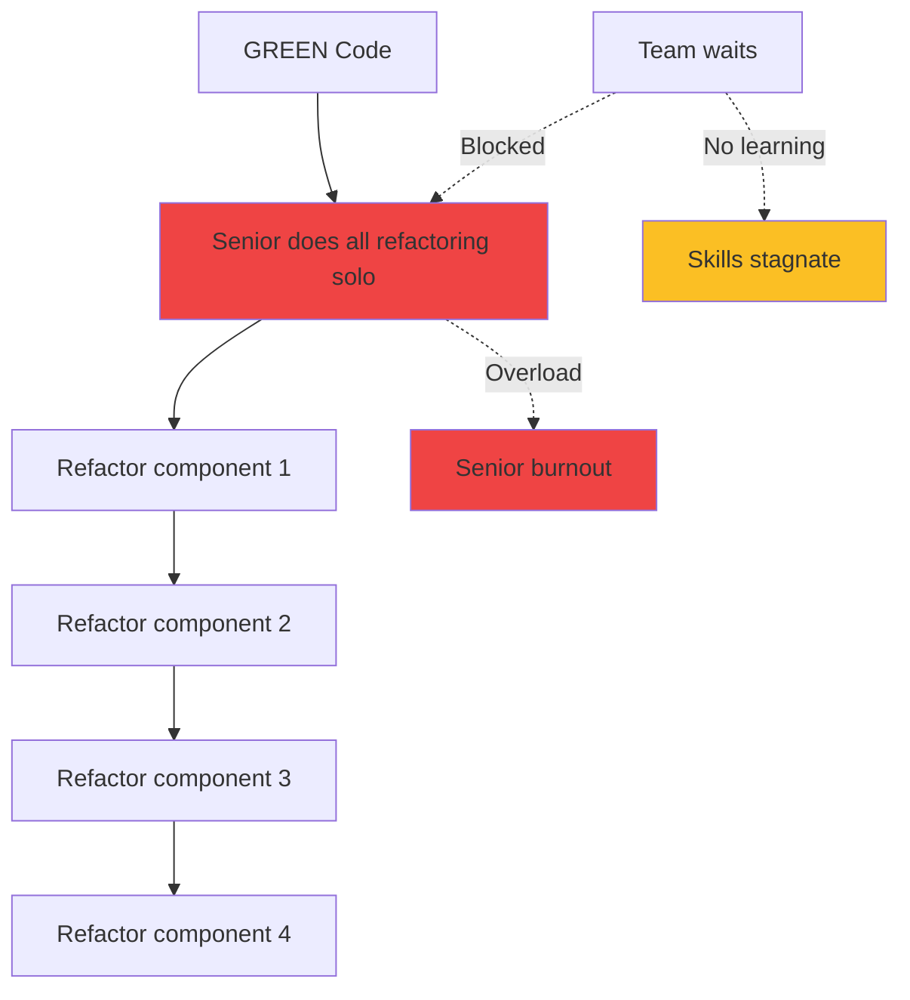
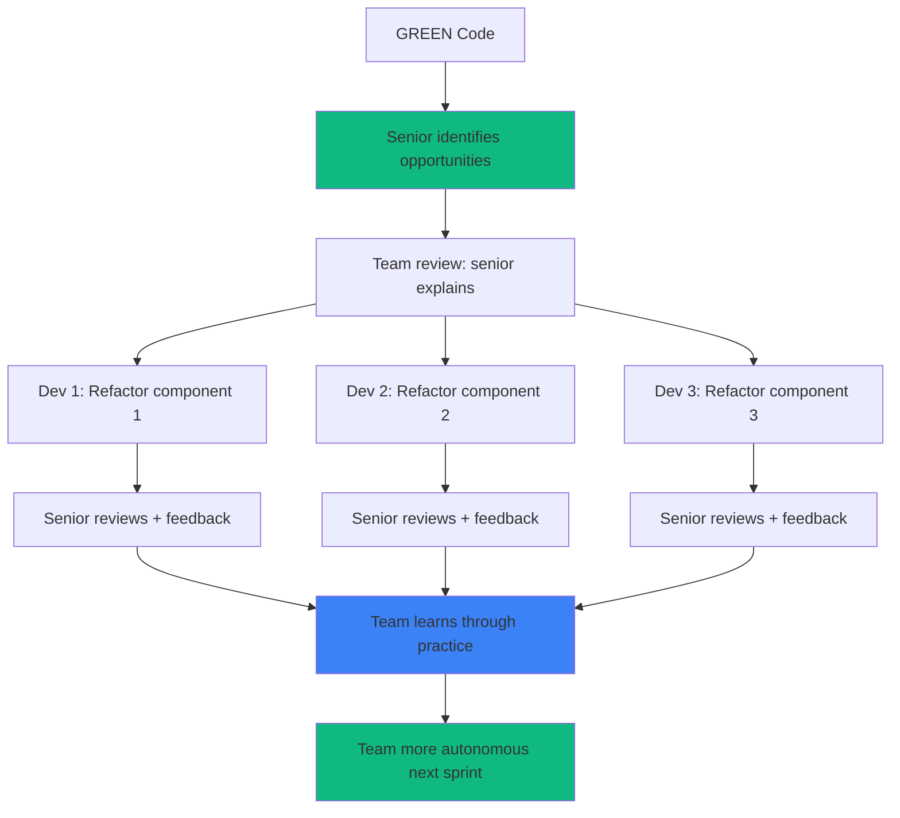

# Phase 5: TDD REFACTOR - Collaborative Improvement

<!-- ========================================= -->
<!-- LEVEL 1: ESSENTIAL (5-10 seconds)        -->
<!-- ========================================= -->

<div style={{display: 'flex', gap: '10px', marginBottom: '25px', flexWrap: 'wrap'}}>
  <span style={{background: '#2563eb', color: 'white', padding: '6px 14px', borderRadius: '20px', fontSize: '13px', fontWeight: '600'}}>
    Agile: Quality Improvement
  </span>
  <span style={{background: '#8b5cf6', color: 'white', padding: '6px 14px', borderRadius: '20px', fontSize: '13px', fontWeight: '600'}}>
    Roles: Dev Team + Senior Dev
  </span>
  <span style={{background: '#2563eb', color: 'white', padding: '6px 14px', borderRadius: '20px', fontSize: '13px', fontWeight: '600'}}>
    Human: 70%
  </span>
  <span style={{background: '#10b981', color: 'white', padding: '6px 14px', borderRadius: '20px', fontSize: '13px', fontWeight: '600'}}>
    LLM: 30%
  </span>
</div>

---

**In brief**: Team transforms GREEN code (functional) into production code (elegant) under senior dev guidance. Team EXECUTES refactorings, senior GUIDES. Learning investment transforms team into force multiplier, not bottleneck.

---

<!-- ========================================= -->
<!-- LEVEL 2: IMPACT (30-60 seconds)          -->
<!-- ========================================= -->

## Why This Phase Is Critical

**The problem without structured Phase 5**:
GREEN code remains functional but basic (duplication, O(n²) algorithms, magic numbers). Technical debt accumulates silently. Discovery 6-12 months later → major rewrite. OR senior does all refactoring solo → bottleneck, team stagnates, burnout.

**The solution provided**:
Systematic refactoring BEFORE merge eliminates nearly all technical debt. Production code = maintainable, performant, documented. CRITICAL: Team executes under senior guidance (not senior solo). Senior becomes multiplier: guides 3-4 devs simultaneously who grow through practice.

**LLM limitations addressed**:
- **No judgment on architectural elegance**: Senior identifies refactoring opportunities (code smells, applicable patterns), LLM assists mechanical transformations
- **No deep performance optimization**: Senior profiles code, identifies bottlenecks, selects algorithms. LLM generates optimized code under direction

### Team That Learns vs Senior That Burns Out

**Anti-Pattern (Senior Solo)**:



**Problems**:
- Senior = bottleneck (1 component at a time)
- Team passive (waits, doesn't learn)
- Not scalable (senior exhausted, team dependent)
- Velocity plateaus (senior capacity limited)

---

**DC² Pattern (Guided Team)**:



**Advantages**:
- Refactorings PARALLEL (3-4 simultaneous)
- Team ACTIVE (executes, learns)
- Scalable (senior guides, not executes)
- Growing velocity (team autonomous)

---

<!-- ========================================= -->
<!-- LEVEL 3: HOW TO DO IT (2-5 minutes)      -->
<!-- ========================================= -->

## Workflow

**Inputs**:
- Implementation in GREEN state (Phase 4)
- Passing test suite (100%)
- Quality standards (complexity < 10, coupling metrics)
- Performance requirements (latency, throughput, memory)

### 1. Identify Refactoring Opportunities ⏱️⏱️

**Senior Dev 90%, LLM 10%**

**Senior reviews GREEN code and identifies**:
- Code smells (duplication, long functions, deep nesting)
- Potential performance bottlenecks (inefficient algorithms)
- Architectural improvements (applicable patterns)
- Maintainability issues (magic numbers, vague names)

**LLM assists**:
- Suggests additional opportunities via static analysis
- Generates quality metrics report (cyclomatic complexity)

**Output**: Prioritized refactoring list (critical → nice-to-have)

### 2. Team Review Session ⏱️

**Senior Dev 80%, Team 20%**

- Senior presents identified opportunities
- Explains WHY refactoring necessary (not just WHAT)
- Demonstrates 1-2 refactorings live (pedagogy)
- Team asks questions, clarifies understanding
- **Work assignment**: Each dev takes 1-2 refactorings

**Objective**: Team understands quality vision before executing

### 3. Execute Parallel Refactorings ⏱️⏱️⏱️

**Team 60%, Senior Dev 30%, LLM 10%**

**Team executes assigned refactorings**:
- Extract functions (Single Responsibility)
- Apply design patterns (Strategy, Factory if relevant)
- Optimize algorithms (O(n²) → O(n log n))
- Improve variable/function names
- Add logging, robust error handling

**LLM assists**:
- Generates refactored code under dev direction
- Mechanical transformations (renaming, extractions)

**Senior available**:
- Team questions (clarifications, decisions)
- Intermediate review (avoid false path)

**CRITICAL**: Refactorings in PARALLEL (3-4 devs simultaneous)

### 4. Documentation Improvement ⏱️⏱️

**Team 40%, LLM 60%**

- Senior defines what needs documentation
- LLM generates detailed docstrings
- Team adds inline comments for complex logic
- LLM updates README, architecture docs

**Focus**: Why code works this way (not just what)

### 5. Senior Review + Validation ⏱️⏱️

**Senior Dev 70%, Team 30%**

**For each refactoring**:
- Senior reviews refactored code
- Constructive feedback (not "redo", but "improve X because Y")
- Team adjusts per feedback
- Tests executed (must ALWAYS pass 100%)

**Quality metrics validated**:
- Cyclomatic complexity < 10
- Code duplication eliminated
- Performance benchmarks met

**Output**: Production code approved by senior

## Definition of Done

This phase is considered complete when:

1. All tests still pass (100% - no regressions)
2. Cyclomatic complexity reduced (< 10 per function)
3. Code duplication eliminated (DRY principle applied)
4. Performance benchmarks met or exceeded
5. SOLID principles applied where appropriate
6. Complete and accurate documentation (docstrings + comments)
7. Senior dev approves production quality
8. **Team has learned**: Can explain refactorings performed

---

<!-- ========================================= -->
<!-- LEVEL 4: MASTER (5-15 minutes)           -->
<!-- Detailed content hidden by default        -->
<!-- ========================================= -->

## Go Further

<details>
<summary><strong>See complete GREEN → REFACTOR transformation + patterns</strong></summary>

### Complete Example: confidence_calculator Transformation

#### GREEN Code (Phase 4) - Functional But Basic

```python
def calculate_confidence(
    weighted_presence: float,
    total_similarity: float,
    n_contributors: int,
    top_k_similar: int
) -> float:
    """
    Calculate prediction confidence score with sample size penalties.
    """
    # Validate top_k (avoid division by zero)
    if top_k_similar <= 0:
        raise ValueError("top_k_similar must be > 0")

    # Degenerate cases: return 0.0 immediately
    if total_similarity <= 0 or n_contributors < 0 or weighted_presence < 0:
        return 0.0

    if n_contributors == 0:
        return 0.0

    # Calculate raw confidence
    confidence_raw = weighted_presence / total_similarity

    # Sample size penalty
    sample_size_penalty = min(n_contributors / top_k_similar, 1.0)

    # Statistical penalty for very small samples
    if n_contributors < 3:
        statistical_penalty = 0.5 + (n_contributors / 6.0)
    else:
        statistical_penalty = 1.0

    # Final result
    return confidence_raw * sample_size_penalty * statistical_penalty
```

**Problems identified by Senior**:

1. **Monolithic**: Everything in one function (60 lines)
2. **Scattered validations**: 4 separate if statements
3. **No logging**: Difficult to debug if 0.0 returned
4. **Magic numbers**: 3, 6.0, 0.5 unexplained
5. **Minimal documentation**: Formulas not explained
6. **Improvable naming**: `confidence_raw` → `base_confidence`

#### Team Review Session (Senior Explains)

**Senior**: "We'll refactor this module together. Here's what we'll do and WHY:"

**Refactoring 1: Extract Penalty Calculation Functions**

```
WHY? Single Responsibility Principle (SOLID).
Each function = one clear responsibility.

calculate_confidence() becomes coordinator
_calculate_sample_penalty() = sample size responsibility
_calculate_statistical_penalty() = statistical reliability responsibility

BENEFIT:
- Testable independently (unit tests per function)
- Reusable (penalties usable elsewhere)
- Understandable (function name = documentation)
```

**Refactoring 2: Add Debug Logging**

```
WHY? Support production debugging.
If confidence = 0.0, we want to know WHY:
- total_similarity = 0?
- n_contributors = 0?
- Intermediate calculation values?

BENEFIT:
- Faster debugging (logs show what's happening)
- Production monitoring (alerts if anomalies)
```

**Refactoring 3: Named Constants**

```
WHY? Magic numbers = obscure code.
Reader doesn't understand where 0.5, 6.0, 3 come from.

MIN_SAMPLE_FOR_STATISTICS = 3  # Statistical reliability threshold
STAT_PENALTY_BASE = 0.5        # Minimum penalty n=0
STAT_PENALTY_SCALE = 6.0       # Linear scale

BENEFIT:
- Inline documentation (name = explanation)
- Easily adjustable (change constant, not hunt through code)
```

**Assignment**:
- Dev 1: Extract penalty functions
- Dev 2: Add logging + constants
- Dev 3: Improve docstrings + formula comments

#### REFACTOR Code (Production) - Elegant and Maintainable

```python
"""
Module confidence_calculator - Calculate nutrition prediction confidence scores.

Implements multi-penalty algorithm to avoid overconfidence
when data is limited or sample is statistically weak.
"""

import logging
from typing import Final

logger = logging.getLogger(__name__)

# Algorithm configuration constants
MIN_SAMPLE_FOR_STATISTICS: Final[int] = 3
"""Minimum contributors threshold for acceptable statistical reliability."""

STAT_PENALTY_BASE: Final[float] = 0.5
"""Base penalty for zero sample (n=0)."""

STAT_PENALTY_SCALE: Final[float] = 6.0
"""Linear scale for statistical penalty [0.5, 0.833] for n ∈ [0, 2]."""


def calculate_confidence(
    weighted_presence: float,
    total_similarity: float,
    n_contributors: int,
    top_k_similar: int
) -> float:
    """
    Calculate prediction confidence score with sample size penalties.

    Applies two multiplicative penalties to reduce overconfidence:

    1. **Sample coverage penalty**: Reduces confidence proportionally
       to ratio of effective contributors / target contributors.
       - If n_contributors >= top_k: No penalty (factor 1.0)
       - If n_contributors < top_k: Linear penalty (n/top_k)

    2. **Statistical reliability penalty**: Reduces confidence additionally
       for very small samples (n < 3) judged statistically unstable.
       - If n >= 3: No penalty (factor 1.0)
       - If n < 3: Penalty 0.5 + (n / 6.0) ∈ [0.5, 0.833]

    Final formula:
        confidence = (weighted_presence / total_similarity)
                     × min(n/top_k, 1.0)
                     × [1.0 if n>=3 else 0.5 + n/6.0]

    Args:
        weighted_presence: Sum of (similarity × ingredient_presence) for all contributors.
                          Expected value ∈ [0, total_similarity].
        total_similarity: Sum of similarity scores for all contributors.
                         Must be > 0 (otherwise returns 0.0).
        n_contributors: Number of effective food item contributors to prediction.
                       Expected value ≥ 0.
        top_k_similar: Target number of similar foods (typically 5).
                      Must be > 0 (otherwise ValueError).

    Returns:
        Final confidence score ∈ [0.0, 1.0], penalized by sample size/quality.

    Raises:
        ValueError: If top_k_similar <= 0 (division by zero impossible).

    Examples:
        >>> # Complete sample (5/5), good confidence
        >>> calculate_confidence(0.8, 1.0, 5, 5)
        0.8  # No penalty

        >>> # Small sample (2/5), double penalty
        >>> calculate_confidence(1.0, 1.0, 2, 5)
        0.33  # Coverage penalty (2/5) + stats penalty (0.833)

        >>> # Zero sample
        >>> calculate_confidence(1.0, 1.0, 0, 5)
        0.0  # Degenerate case

    Notes:
        - Pure function (no side effects)
        - O(1) constant performance
        - Thread-safe
    """
    # Validate critical parameter (avoid division by zero)
    if top_k_similar <= 0:
        raise ValueError(
            f"top_k_similar must be > 0 (received: {top_k_similar})"
        )

    # Validate inputs and handle degenerate cases
    if not _validate_inputs(weighted_presence, total_similarity, n_contributors):
        logger.warning(
            "Invalid inputs detected: weighted_presence=%.3f, "
            "total_similarity=%.3f, n_contributors=%d. Returning confidence 0.0",
            weighted_presence, total_similarity, n_contributors
        )
        return 0.0

    # Calculate base confidence (before penalties)
    base_confidence = weighted_presence / total_similarity

    # Apply penalties
    coverage_factor = _calculate_sample_coverage_penalty(n_contributors, top_k_similar)
    reliability_factor = _calculate_statistical_penalty(n_contributors)

    # Final confidence
    final_confidence = base_confidence * coverage_factor * reliability_factor

    # Debug logging for traceability
    logger.debug(
        "Confidence calculated: base=%.3f, coverage_factor=%.3f, "
        "reliability_factor=%.3f → final=%.3f (n=%d/%d)",
        base_confidence, coverage_factor, reliability_factor,
        final_confidence, n_contributors, top_k_similar
    )

    return final_confidence


def _validate_inputs(
    weighted_presence: float,
    total_similarity: float,
    n_contributors: int
) -> bool:
    """
    Validate confidence calculation inputs.

    Returns:
        True if inputs valid, False if degenerate case (return 0.0).
    """
    # Total similarity must be positive (avoid division zero)
    if total_similarity <= 0:
        return False

    # Number of contributors must be non-negative
    if n_contributors < 0:
        return False

    # Weighted presence cannot be negative
    if weighted_presence < 0:
        return False

    # Zero contributors = no prediction
    if n_contributors == 0:
        return False

    return True


def _calculate_sample_coverage_penalty(
    n_contributors: int,
    top_k_similar: int
) -> float:
    """
    Calculate penalty based on sample coverage ratio.

    Penalizes confidence proportionally to contributor deficit
    relative to optimal target (top_k_similar).

    Args:
        n_contributors: Number of effective contributors.
        top_k_similar: Target number of contributors.

    Returns:
        Penalty factor ∈ [0.0, 1.0]:
        - 1.0 if n_contributors >= top_k_similar (complete sample)
        - n_contributors / top_k_similar otherwise (linear penalty)

    Examples:
        >>> _calculate_sample_coverage_penalty(5, 5)
        1.0  # No penalty
        >>> _calculate_sample_coverage_penalty(3, 5)
        0.6  # 40% penalty
        >>> _calculate_sample_coverage_penalty(10, 5)
        1.0  # Capped at 1.0 (no bonus)
    """
    return min(n_contributors / top_k_similar, 1.0)


def _calculate_statistical_penalty(n_contributors: int) -> float:
    """
    Calculate additional penalty for statistically weak samples.

    Applies extra penalty when number of contributors < statistical
    reliability threshold (MIN_SAMPLE_FOR_STATISTICS = 3).

    Justification: With < 3 data points, variance estimation is high,
    prediction is statistically unstable.

    Args:
        n_contributors: Number of effective contributors.

    Returns:
        Penalty factor ∈ [0.5, 1.0]:
        - 1.0 if n_contributors >= 3 (acceptable reliability)
        - 0.5 + (n_contributors / 6.0) otherwise (progressive penalty)
          - n=0 → 0.5   (maximum penalty)
          - n=1 → 0.67
          - n=2 → 0.83

    Examples:
        >>> _calculate_statistical_penalty(5)
        1.0  # No penalty
        >>> _calculate_statistical_penalty(2)
        0.83  # Moderate penalty
        >>> _calculate_statistical_penalty(0)
        0.5  # Maximum penalty
    """
    if n_contributors < MIN_SAMPLE_FOR_STATISTICS:
        return STAT_PENALTY_BASE + (n_contributors / STAT_PENALTY_SCALE)
    return 1.0
```

#### REFACTOR Improvements Analysis

**Transformations Applied**:

1. **Function Extraction (SRP - Single Responsibility Principle)**:
   - `_validate_inputs()`: Validation responsibility
   - `_calculate_sample_coverage_penalty()`: Coverage responsibility
   - `_calculate_statistical_penalty()`: Reliability responsibility
   - **Impact**: Independently testable, reusable, understandable

2. **Named Constants**:
   - `MIN_SAMPLE_FOR_STATISTICS = 3`
   - `STAT_PENALTY_BASE = 0.5`
   - `STAT_PENALTY_SCALE = 6.0`
   - **Impact**: Inline documentation, centrally adjustable

3. **Debug Logging**:
   - Warning if invalid inputs (with values)
   - Debug intermediate calculations (traceability)
   - **Impact**: Production debugging easier, monitoring enabled

4. **Comprehensive Documentation**:
   - Main docstring: 50 lines (formulas, examples, notes)
   - Private function docstrings: Mathematical justifications
   - Inline comments: Complex logic explained
   - **Impact**: Rapid onboarding for new devs

5. **Robust Error Handling**:
   - Centralized `_validate_inputs()` function
   - Explicit error messages (received values displayed)
   - **Impact**: Understandable errors, rapid debugging

6. **Improved Naming**:
   - `confidence_raw` → `base_confidence` (clearer)
   - `sample_size_penalty` → `coverage_factor` (semantic)
   - `statistical_penalty` → `reliability_factor` (intent)
   - **Impact**: Self-documenting code

**Quality Metrics**:

| Metric | GREEN | REFACTOR | Improvement |
|--------|-------|----------|-------------|
| **Lines of code** | 35 | 180 | +414% |
| **Functions** | 1 | 4 | +300% |
| **Cyclomatic complexity** | 8 | 3 (avg) | -63% |
| **Comments** | 10 lines | 80 lines | +700% |
| **Testability** | Medium | High | ↑↑ |
| **Maintainability** | Low | High | ↑↑↑ |

**Apparent Paradox**:
REFACTOR code = 5x more lines, BUT 3x more maintainable.

**Why?**
- Documentation ≠ complexity
- Short functions > long function
- Explicit > implicit

### Common Refactoring Patterns

#### Pattern 1: Extract Function

**When to use**:
- Function > 50 lines
- Code blocks with comments "// Step 1: ..."
- Reusable logic elsewhere
- Multiple abstraction levels in same function

**Example**:

```python
# BEFORE (GREEN)
def process_order(order):
    # Validate order
    if not order.items:
        raise ValueError("Order empty")
    if order.total < 0:
        raise ValueError("Negative total")

    # Calculate taxes
    subtotal = sum(item.price for item in order.items)
    tax_rate = 0.15 if order.province == "QC" else 0.13
    tax = subtotal * tax_rate

    # Apply discount
    discount = 0
    if order.customer.is_premium:
        discount = subtotal * 0.1

    # Charge payment
    final_total = subtotal + tax - discount
    payment_service.charge(order.customer.card, final_total)

    # Send confirmation
    email_service.send(order.customer.email, f"Order #{order.id}")

# AFTER (REFACTOR)
def process_order(order):
    """Entry point for order processing."""
    _validate_order(order)

    subtotal = _calculate_subtotal(order)
    tax = _calculate_tax(subtotal, order.province)
    discount = _calculate_discount(subtotal, order.customer)

    final_total = subtotal + tax - discount

    _charge_payment(order.customer, final_total)
    _send_confirmation(order)

def _validate_order(order):
    """Validate order before processing."""
    if not order.items:
        raise ValueError("Order empty")
    if order.total < 0:
        raise ValueError("Negative total")

def _calculate_subtotal(order):
    """Calculate order subtotal."""
    return sum(item.price for item in order.items)

def _calculate_tax(subtotal, province):
    """Calculate tax by province."""
    tax_rate = 0.15 if province == "QC" else 0.13
    return subtotal * tax_rate

def _calculate_discount(subtotal, customer):
    """Calculate premium customer discount."""
    return subtotal * 0.1 if customer.is_premium else 0

def _charge_payment(customer, amount):
    """Charge customer card payment."""
    payment_service.charge(customer.card, amount)

def _send_confirmation(order):
    """Send confirmation email."""
    email_service.send(
        order.customer.email,
        f"Order #{order.id} confirmed"
    )
```

**Benefits**:
- Main function = table of contents (reads like prose)
- Each step = independently testable function
- Cyclomatic complexity reduced (8 → 2)

---

#### Pattern 2: Replace Magic Number with Constant

**When to use**:
- "Magic" numbers without explanation
- Same value repeated in multiple places
- Configurable thresholds/limits

**Example**:

```python
# BEFORE (GREEN)
def is_valid_password(password):
    if len(password) < 8:
        return False
    if len(password) > 128:
        return False
    # ... other validations

def check_username(username):
    if len(username) < 3:
        return False
    if len(username) > 20:
        return False

# AFTER (REFACTOR)
# Centralized configuration
MIN_PASSWORD_LENGTH: Final[int] = 8
MAX_PASSWORD_LENGTH: Final[int] = 128
MIN_USERNAME_LENGTH: Final[int] = 3
MAX_USERNAME_LENGTH: Final[int] = 20

def is_valid_password(password: str) -> bool:
    """Validate password length."""
    return MIN_PASSWORD_LENGTH <= len(password) <= MAX_PASSWORD_LENGTH

def is_valid_username(username: str) -> bool:
    """Validate username length."""
    return MIN_USERNAME_LENGTH <= len(username) <= MAX_USERNAME_LENGTH
```

**Benefits**:
- Values self-documenting (name = explanation)
- Centrally adjustable (change constant, not 10 places)
- Prevents copy-paste bugs (8 vs 80 typo impossible)

---

#### Pattern 3: Introduce Explaining Variable

**When to use**:
- Complex expression difficult to understand
- Same calculation repeated multiple times
- Nested if conditions obscure

**Example**:

```python
# BEFORE (GREEN)
if (user.age >= 18 and user.country == "CA" and
    user.account_balance > 1000 and not user.is_suspended):
    approve_loan()

# AFTER (REFACTOR)
is_adult = user.age >= 18
is_canadian = user.country == "CA"
has_sufficient_funds = user.account_balance > 1000
is_active_account = not user.is_suspended

is_eligible_for_loan = (
    is_adult and
    is_canadian and
    has_sufficient_funds and
    is_active_account
)

if is_eligible_for_loan:
    approve_loan()
```

**Benefits**:
- Clear intent (variable = documentation)
- Debuggable (can inspect each variable)
- Testable (can test criteria separately)

---

#### Pattern 4: Consolidate Conditional Expression

**When to use**:
- Multiple if statements return same result
- Validation logic scattered
- Condition duplication

**Example**:

```python
# BEFORE (GREEN)
def calculate_shipping(order):
    if order.total <= 0:
        return 0
    if order.items_count == 0:
        return 0
    if order.customer is None:
        return 0
    if order.shipping_address is None:
        return 0

    # Actual shipping calculation...

# AFTER (REFACTOR)
def calculate_shipping(order):
    """Calculate shipping fees."""
    if not _is_valid_order(order):
        return 0

    # Actual shipping calculation...

def _is_valid_order(order):
    """Validate order for shipping calculation."""
    return all([
        order.total > 0,
        order.items_count > 0,
        order.customer is not None,
        order.shipping_address is not None
    ])
```

**Benefits**:
- Centralized validation logic
- Explicit intent (named function)
- Easy to add/modify validations

### Senior Review Checklist

Before approving REFACTOR code, senior verifies:

**Architecture & Design**:
- [ ] Single Responsibility Principle respected (focused functions)
- [ ] No code duplication (DRY applied)
- [ ] Appropriate design patterns (no over-engineering)
- [ ] Relevant abstractions (not premature)

**Code Quality**:
- [ ] Cyclomatic complexity < 10 per function
- [ ] Descriptive naming (variables, functions, classes)
- [ ] No magic numbers (named constants)
- [ ] Robust error handling (no silent failures)

**Performance**:
- [ ] Optimal algorithms (no O(n²) if O(n log n) trivial)
- [ ] No obvious memory waste
- [ ] Performance benchmarks met

**Documentation**:
- [ ] Complete docstrings (Args, Returns, Raises, Examples)
- [ ] Inline comments for complex logic only
- [ ] README updated
- [ ] No obsolete comments

**Tests**:
- [ ] All tests pass (100%)
- [ ] Coverage maintained ≥95%
- [ ] Tests refactored if necessary (not fragile)

**Logging & Monitoring**:
- [ ] Appropriate log levels (DEBUG/INFO/WARNING/ERROR)
- [ ] Contextual log messages (variable values included)
- [ ] No logs with secrets/sensitive data

**Security**:
- [ ] No injection (SQL, commands, XSS)
- [ ] Validate external inputs
- [ ] No hardcoded secrets

**Team Learning**:
- [ ] Dev can explain refactorings performed
- [ ] Dev understands WHY (not just WHAT)
- [ ] Constructive feedback given

### Phase 5 Pitfalls

#### Pitfall 1: Over-Refactoring (Over-Engineering)

**Problem**:
Too abstract, loses clarity. Code becomes a maze of design patterns.

**Bad example**:
```python
# Over-engineered - 200 lines for simple function
class ConfidenceCalculationStrategy(ABC):
    @abstractmethod
    def calculate(self, context: CalculationContext) -> ConfidenceScore:
        pass

class SampleSizePenaltyStrategy(ConfidenceCalculationStrategy):
    def __init__(self, penalty_factory: PenaltyFactoryInterface):
        self.factory = penalty_factory

    def calculate(self, context):
        penalty = self.factory.create_penalty(context.sample_size)
        return penalty.apply(context.base_confidence)

# 5 classes, 3 interfaces, 200 lines
# Just to calculate a penalty!
```

**Solution**:
YAGNI rule: "You Aren't Gonna Need It"

```python
# Just enough - 30 lines, clear
def calculate_confidence(...):
    base = weighted / total
    penalty = _calculate_penalty(n, top_k)
    return base * penalty

def _calculate_penalty(n, top_k):
    return min(n / top_k, 1.0)
```

**Golden rule**: If a reader doesn't understand after 30 seconds, it's too abstract.

---

#### Pitfall 2: Breaking Tests During Refactor

**Problem**:
Refactoring changes behavior instead of structure. Tests fail.

**Why dangerous**:
```
GREEN: Tests 100% pass
REFACTOR: Accidentally changes logic
Tests fail

vs

GREEN: Tests 100% pass
REFACTOR: Changes structure only
Tests pass: Refactor safe ✓
```

**Solution**:
**Execute tests after EACH mini-refactor** (not at end)

```
1. Extract _calculate_penalty() function
   → Run tests → ✓ Pass

2. Add MIN_SAMPLE constant
   → Run tests → ✓ Pass

3. Rename confidence_raw → base_confidence
   → Run tests → ✓ Pass

4. Add logging
   → Run tests → ✓ Pass
```

If test fails, you KNOW EXACTLY which refactor broke it (the last one).

**Rule**: Refactor = behavior-preserving transformation. Tests must ALWAYS pass.

---

#### Pitfall 3: Premature Abstraction

**Problem**:
"I'll create this interface now, in case we need it later."

**Example**:
```python
# Interface created "just in case"
class PaymentProcessorInterface(ABC):
    @abstractmethod
    def process_payment(self, amount): pass

class StripePaymentProcessor(PaymentProcessorInterface):
    def process_payment(self, amount):
        # Stripe implementation

# But we'll NEVER use another payment processor!
# Useless interface, gratuitous complexity
```

**Solution**:
Rule of 3: Create abstraction AFTER 3 use cases, not before.

```
Use case 1: Concrete Stripe code
Use case 2: Concrete PayPal code → Ah, similar pattern
Use case 3: Concrete Square code → OK, abstract now

→ 3 cases = real pattern confirmed, abstraction justified
```

**Rule**: "Duplication > bad abstraction" (Sandi Metz)

---

#### Pitfall 4: Losing Business Logic in Refactor

**Problem**:
Code becomes elegant but obscures WHAT IT DOES business-wise.

**Example**:
```python
# BEFORE GREEN - Clear but verbose
def calculate_price(item):
    base_price = item.price
    if item.category == "food":
        tax = base_price * 0.05  # HST 5%
    else:
        tax = base_price * 0.15  # HST + PST 15%

    if customer.is_premium:
        discount = base_price * 0.1  # 10% discount
    else:
        discount = 0

    return base_price + tax - discount

# AFTER REFACTOR - Elegant but obscure
def calculate_price(item):
    return pipe(
        item.price,
        apply_tax_strategy(item.category),
        apply_discount_policy(customer.tier),
        round_to_cents
    )

# Business logic is hidden!
```

**Solution**:
Keep business logic VISIBLE with descriptive names.

```python
# GOOD REFACTOR - Elegant AND clear
def calculate_price(item):
    """Calculate price with Canadian taxes and premium discount."""
    base_price = item.price
    tax = _calculate_canadian_tax(base_price, item.category)
    discount = _calculate_premium_discount(base_price, customer)
    return base_price + tax - discount

def _calculate_canadian_tax(price, category):
    """HST 5% (food) or HST+PST 15% (other)."""
    return price * (0.05 if category == "food" else 0.15)

def _calculate_premium_discount(price, customer):
    """10% discount for premium customers."""
    return price * 0.1 if customer.is_premium else 0
```

**Rule**: Business logic must be readable by the Product Owner, not just devs.

---

#### Pitfall 5: Refactoring Paralysis (Infinite Perfection)

**Problem**:
"I could still extract this sub-function... and add this pattern..."
→ 3 days of refactor, never shipped.

**Solution**:
Strict timeboxing + Definition of Done.

```
Phase 5 allocation: 12h max
- Identification: 2h
- Execution: 6h
- Review: 2h
- Buffer: 2h

If 12h elapsed and DoD met → STOP, ship
If 12h elapsed and DoD not met → Escalate, don't continue
```

**Rule**: "Better done than perfect."

Production code ≠ perfect code
Production code = maintainable code that works

**80% quality in 12h >> 95% quality in 40h**

</details>

---

**Next step**: [Phase 6: Triple Inspection (Optional) →](./phase6-triple-inspection)

**Need help?** Consult the [Roles and Responsibilities document](./roles-et-responsabilites) to clarify who does what in this phase.
