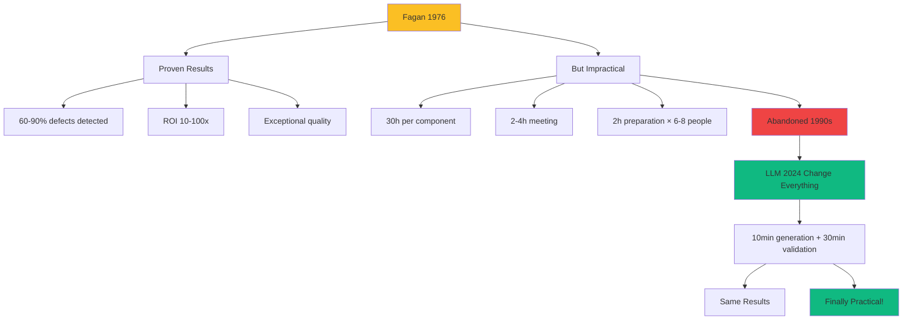

# Phase 6: Triple Inspection (Mandatory Graded)

<!-- ========================================= -->
<!-- LEVEL 1: ESSENTIAL (5-10 seconds)        -->
<!-- ========================================= -->

<div style={{display: 'flex', gap: '10px', marginBottom: '25px', flexWrap: 'wrap'}}>
  <span style={{background: '#10b981', color: 'white', padding: '6px 14px', borderRadius: '20px', fontSize: '13px', fontWeight: '600'}}>
    Status: MANDATORY (graded by risk)
  </span>
  <span style={{background: '#2563eb', color: 'white', padding: '6px 14px', borderRadius: '20px', fontSize: '13px', fontWeight: '600'}}>
    Agile: Quality Gates / DoD
  </span>
  <span style={{background: '#8b5cf6', color: 'white', padding: '6px 14px', borderRadius: '20px', fontSize: '13px', fontWeight: '600'}}>
    Roles: Team + LLM
  </span>
  <span style={{background: '#6366f1', color: 'white', padding: '6px 14px', borderRadius: '20px', fontSize: '13px', fontWeight: '600'}}>
    Human decides, LLM inspects
  </span>
</div>

---

**In brief**: 3 automated LLM inspections (Fagan/Tests/Security) detect latent defects before production. Philosophy "invest 4-6h avoids 40-80h refactoring + incidents". Fagan resurrection: 30h (1976) → 40min (2026). OPTIONAL but ROI 10-100x on critical systems.

---

<!-- ========================================= -->
<!-- LEVEL 2: IMPACT (30-60 seconds)          -->
<!-- ========================================= -->

## Why This Phase Is Critical

**The problem without Phase 6**:
Code enters production with invisible latent defects. Technical debt accumulates silently over 6-12 months. Weak tests (95% coverage but empty assertions) create false sense of security. Vulnerabilities detected in production = catastrophe (30-100x cost vs development). Unexpected major refactoring + expensive incidents.

**The solution provided**:
3 specialized LLM inspections detect at-risk patterns BEFORE merge. **Fagan** reveals architectural debt, **Tests** distinguishes code coverage vs semantic coverage, **Security** detects 6 OWASP attack vectors (injection, authentication, data, infrastructure, logic, monitoring). This is preventive quality assurance that transforms unpredictable future costs into controlled investment.

**LLM advantages over human inspection**:
- **Exhaustiveness without fatigue**: The LLM verifies 100% of cases with identical rigor. Humans fatigue, skim, forget items
- **No cognitive bias**: The LLM evaluates objectively. Humans may have confirmation bias, hesitate to criticize seniors
- **Perfect memory of standards**: The LLM applies 100% of rules, even obscure ones. Humans tend to forget critical obscure rules
- **Expertise scalability**: LLMs can inspect 10 components in parallel. Humans cannot, alone
- **Continuous improvement**: New rule added → all future inspections automatic. Training the team can take days

### The Resurrection of Fagan

**Historical context**: Michael Fagan (IBM, 1976) develops a revolutionary code inspection methodology.



**The best practices from 1970 were CORRECT - just impossible to apply without AI.**

### Phase 6 Graduation by Impact

Phase 6 always executes all three complete inspections (Fagan + Tests + Security). What varies is the acceptance threshold for detected issues, based on the estimated impact of a production bug.

**Decision principle**: Assess the impact of a bug in your specific context. The examples below help you position yourself. When in doubt, choose the strictest level.

#### Level 1: Limited Impact

**Context examples**:
- Internal tool used by your team (5-20 people)
- Bug = a few hours lost, easily recoverable
- Simple workaround exists (direct logs, manual process)
- No sensitive data, no external access

**Concrete examples**:
- Internal report automation script
- Non-critical monitoring dashboard
- Documentation generation tool

**Inspections executed**: Fagan + Tests + Security (complete, all three)

**Acceptance threshold**:
- ✅ CRITICAL items: Mandatory correction
- ⚠️ IMPROVEMENT items: Documented, consciously accepted

#### Level 2: Moderate Impact

**Context examples**:
- Internal application (50-500 users)
- Bug = department slowed down, measurable business impact
- Workaround processes exist but costly
- Non-sensitive data or limited PII

**Concrete examples**:
- Internal management system (HR, inventory, reporting)
- Internal API between services
- Non-public business application

**Inspections executed**: Fagan + Tests + Security (complete, all three)

**Acceptance threshold**:
- ✅ CRITICAL items: Mandatory correction
- ✅ High-priority IMPROVEMENT items: Mandatory correction
- ⚠️ Low-priority IMPROVEMENT items: Documented, justified

#### Level 3: Severe Impact

**Context examples**:
- Client-facing application (> 500 users)
- Bug = revenue loss, reputation compromised, customers blocked
- No acceptable workaround
- Sensitive data or regulatory compliance

**Concrete examples**:
- Payment system / e-commerce
- Public consumer application
- Healthcare/finance systems
- Critical infrastructure

**Inspections executed**: Fagan + Tests + Security (complete, all three)

**Acceptance threshold**:
- ✅ CRITICAL items: Mandatory correction, no exceptions
- ✅ IMPROVEMENT items: Mandatory correction OR approved formal justification

#### Absolute Rule

**Phase 6 is always executed with all three complete inspections.** The gradient applies to the acceptance threshold for detected issues, not to the inspection itself. Issues exist whether we fix them or not—the conscious decision to accept them is documented and traceable.

---

<!-- ========================================= -->
<!-- LEVEL 3: HOW TO DO (2-5 minutes)         -->
<!-- ========================================= -->

## Process

**Inputs**:
- Code in REFACTOR state (Phase 5)
- Complete test suite with results
- Requirements documents (architecture, tactical plan)
- Quality standards and benchmarks

### The 3 Specialized Inspections

#### 1. Fagan Inspection - Code & Maintainability

**Objective**: Detect future technical debt and maintainability risk patterns

**LLM inspects, Humain decides**

- LLM generates inspection report
- Human reviews report
- Team prioritizes corrections
- Retained corrections are applied or added to backlog

**5 Dimensions evaluated (/20 each, target ≥80/100)**:
1. **Simplicity**: No over-engineering, complexity <10, appropriate abstractions
2. **Business Logic**: Domain names, clear rules, contextual error handling
3. **Robustness**: Edge cases, input validation, graceful recovery
4. **Maintainability**: Ease of evolution, minimal coupling, documentation
5. **Performance**: Scalability, appropriate optimizations, no bottlenecks

**Output**: Detailed report containing strengths, weaknesses, and items marked CRITICAL or IMPROVEMENT.

#### 2. Tests Inspection - Test Suite Quality

**Objective**: Distinguish "code coverage" vs "semantic coverage"

**LLM inspects, Humain decides**

- LLM analyzes test quality
- Human reviews
- Team strengthens weak tests
- Re-validation

**Detects**:
- Empty assertions (`assert result is not None` vs actual values)
- Fragile tests (coupled to implementation)
- Missing critical edge cases
- False sense of security (95% coverage but weak tests)

**Output**: Strengthened tests, confidence in test quality

#### 3. Security Inspection - Vulnerabilities

**Objective**: Detect 6 attack vectors before production (OWASP)

**LLM inspects, Humain decides**

- LLM conducts multi-vector audit
- Human reviews vulnerabilities
- Team prioritizes corrections
- Retained corrections are applied or added to backlog
- Re-validation following corrections

**6 OWASP Attack Vectors**:
1. **Injection**: SQL, commands, XSS, LDAP
2. **Authentication**: Sessions, tokens, MFA, passwords
3. **Sensitive Data**: Encryption, logs, exposure
4. **Infrastructure**: HTTPS, CORS, security headers
5. **Business Logic**: Authorization, validation, transactions
6. **Monitoring**: Logs, alerts, audit trail

**Output**: CRITICAL vulnerabilities corrected, IMPROVEMENT items documented

### Integrated Workflow

```
1. LLM executes 3 inspections in parallel
   ├─ Fagan
   ├─ Tests
   └─ Security

2. Team reviews 3 reports
   ├─ Prioritizes findings (CRITICAL vs IMPROVEMENT)
   └─ Decides action plan

3. Corrections applied
   ├─ CRITICAL: Mandatory before merge
   ├─ IMPROVEMENT: Backlog or accept
   └─ Tests still pass

4. Senior validates
   └─ Approves final production quality
```

## Definition of Done

This phase is considered complete when:

1. **Impact level assessed**: Bug impact evaluated, level determined (Limited/Moderate/Severe)
2. **Three inspections executed**: Fagan + Tests + Security (complete, all three)
3. **For all levels**:
   - All CRITICAL items corrected
   - Complete report of 3 inspections generated
4. **For Level 1 (Limited Impact)**:
   - IMPROVEMENT items documented with explicit acceptance decision
5. **For Level 2 (Moderate Impact)**:
   - High-priority IMPROVEMENT items corrected
   - Low-priority IMPROVEMENT items: documented with justification or corrected
6. **For Level 3 (Severe Impact)**:
   - IMPROVEMENT items: 90%+ corrected OR formal justification documented and signed
7. **Final decision**: Senior validates that level was appropriate and acceptance threshold met

---

<!-- ========================================= -->
<!-- LEVEL 4: MASTER (5-15 minutes)           -->
<!-- Detailed content hidden by default        -->
<!-- ========================================= -->

## Going Further

<details>
<summary><strong>See detailed inspection reports + complete prompts</strong></summary>

### Inspection 1: Fagan - Complete Example

#### Code Inspected: confidence_calculator (Post-REFACTOR)

```python
# [Code REFACTOR Phase 5 - 180 lines with extracted functions]
# See Phase 5 for complete code
```

#### Fagan Inspection Prompt

```
Perform a systematic Fagan inspection of this code across 5 perspectives.

CODE TO INSPECT:
[paste complete code in REFACTOR state]

SPECIFICATIONS:
[paste tactical spec Phase 2]

EVALUATE EACH DIMENSION ON 20 POINTS:

1. SIMPLICITY (/20)
   Questions:
   - Code clear and straightforward? No over-engineering?
   - Abstractions appropriate to the problem?
   - Cyclomatic complexity acceptable (<10/function)?
   - Logic easy to follow without debugger?

   For each question:
   - YES: +5 points
   - PARTIALLY: +2-3 points
   - NO: 0 points

   Identify ALL overly complex patterns.

2. BUSINESS LOGIC (/20)
   Questions:
   - Variable/function names reflect business domain?
   - Business rules clear and documented?
   - Contextual error handling (explicit messages)?
   - Code readable by Product Owner?

   Identify ALL obscure logic.

3. ROBUSTNESS (/20)
   Questions:
   - All edge cases handled (null, empty, limits)?
   - Exhaustive input validation?
   - Graceful error recovery (no crashes)?
   - Defined behavior for ALL scenarios?

   Identify ALL missing edge cases.

4. MAINTAINABILITY (/20)
   Questions:
   - Code easy to modify without breaking?
   - Minimal coupling between components?
   - Documentation helps new developers?
   - Tests enable safe refactoring?

   Identify ALL maintainability-at-risk patterns.

5. PERFORMANCE (/20)
   Questions:
   - Performant algorithms (no avoidable O(n²))?
   - Scalability validated (large volumes)?
   - No obvious bottlenecks (I/O, nested loops)?
   - Optimizations appropriate (not premature)?

   Identify ALL potential bottlenecks.

REPORT FORMAT:

## Global Score: XX/100

### 1. Simplicity: XX/20
**Strengths**:
- [List]

**Weaknesses**:
- [List with precise code line]

**CRITICAL Items**:
- [Complexity >10, severe over-engineering]

**IMPROVEMENT Items**:
- [Possible improvements non-blocking]

[Repeat for 5 dimensions]

## Decision Summary

**CRITICAL Items (block merge)**:
1. [Item with impact justification]

**IMPROVEMENT Items (backlog)**:
2. [Item nice-to-have]

**Recommendation**: APPROVE / FIX CRITICAL / REDO
```

#### Generated Report

```markdown
## Global Fagan Score: 88/100

### 1. Simplicity: 18/20

**Strengths**:
- Short functions (10-30 lines each)
- Single Responsibility applied (4 focused functions)
- Average cyclomatic complexity 3 (excellent, <10)
- Direct logic, no excessive abstractions

**Weaknesses**:
- Input validation scattered (_validate_inputs + checks in calculate_confidence)
  Lines 145-155: Duplicate validation logic

**CRITICAL Items**: None

**IMPROVEMENT Items**:
- Consolidate validation into _validate_inputs only (eliminate duplication)

---

### 2. Business Logic: 20/20

**Strengths**:
- Named constants (MIN_SAMPLE_FOR_STATISTICS = 3)
- Descriptive function names (_calculate_sample_coverage_penalty)
- Docstrings explain business formulas
- Contextual error messages ("top_k_similar must be > 0")

**Weaknesses**: None

**CRITICAL Items**: None
**IMPROVEMENT Items**: None

---

### 3. Robustness: 16/20

**Strengths**:
- Input validation (total_similarity ≤ 0, n_contributors < 0)
- ValueError exception if top_k ≤ 0
- Zero contributor case handled (return 0.0)
- Warning logging for invalid inputs

**Weaknesses**:
- No handling of weighted_presence > total_similarity (mathematically invalid)
  Line 133: Should validate weighted_presence ≤ total_similarity
- No handling of extreme values (overflow if weighted_presence = 1e308)

**CRITICAL Items**:
- Add validation weighted_presence ≤ total_similarity (mathematical consistency)

**IMPROVEMENT Items**:
- Add sanity check for overflow (extreme values)

---

### 4. Maintainability: 18/20

**Strengths**:
- Extracted functions testable in isolation
- Zero coupling (no external dependencies)
- Exhaustive documentation (formulas, examples, notes)
- Tunable constants centralized

**Weaknesses**:
- Statistical penalty formula (0.5 + n/6.0) undocumented origin
  Line 234: Where does formula come from? Missing scientific reference

**CRITICAL Items**: None

**IMPROVEMENT Items**:
- Add scientific reference for penalty formula (decision traceability)

---

### 5. Performance: 16/20

**Strengths**:
- Constant O(1) complexity
- No I/O, no side effects (pure function)
- Performance test <1ms passes
- No unnecessary memory allocations

**Weaknesses**:
- Debug logging can impact production performance if enabled
  Lines 159-163: logger.debug() with string formatting
  → Use lazy evaluation: logger.debug("...", value) not f-strings

**CRITICAL Items**: None

**IMPROVEMENT Items**:
- Lazy logging evaluation (marginal performance but best practice)

---

## Decision Summary

**CRITICAL Items (block merge until corrected)**:
1. **Missing validation weighted_presence ≤ total_similarity** (Line 133)
   - Impact: Allows mathematically invalid states (confidence >1.0 possible)
   - Effort: 5 min (add if weighted_presence > total_similarity: return 0.0)
   - Priority: HIGH

**IMPROVEMENT Items (backlog, non-blocking)**:
2. Consolidate input validation (eliminate duplication)
3. Sanity check for overflow extreme values
4. Scientific reference for penalty formula
5. Lazy logging evaluation

**Final Recommendation**: **FIX CRITICAL #1 then APPROVE**

Score 88/100 excellent. Single blocking item (mathematical validation).
After correction: production quality validated.
```

#### Team Actions

```
1. Dev applies CRITICAL fix #1
2. Tests executed → Always 100% pass
3. Senior validates correction
4. IMPROVEMENT items added to backlog
5. Merge approved ✓
```

---

### Inspection 2: Tests - Example

#### Test Suite Analyzed

```python
# Suite 19 tests Phase 3 (see Phase 3 for complete code)
```

#### Tests Inspection Prompt

```
Analyze QUALITY of this test suite. Distinguish "code coverage" vs "semantic coverage".

TEST SUITE:
[paste 19 complete tests]

CODE TESTED:
[paste implementation]

EVALUATE QUALITY ON 5 CRITERIA:

1. MEANINGFUL ASSERTIONS
   - Assertions verify PRECISE VALUES (not just `is not None`)?
   - Each assertion has EXPLICIT MESSAGE and context?
   - Assertions cover business behavior (not just technical)?

   Identify ALL tests with weak assertions.

2. TEST ROBUSTNESS
   - Tests not fragile (coupled to implementation details)?
   - Tests survive refactoring without modifications?
   - Tests isolated (no order-of-execution dependencies)?

   Identify ALL fragile tests.

3. CRITICAL EDGE CASES
   - All business edge cases tested?
   - Error scenarios covered?
   - Boundary values (min/max/zero) tested?

   Identify ALL missing edge cases.

4. SEMANTIC COVERAGE
   - Tests validate BUSINESS BEHAVIORS (not just executed code)?
   - Each business rule has dedicated test?
   - Tests are executable documentation of business logic?

   Identify semantic coverage gaps.

5. TEST MAINTAINABILITY
   - Descriptive test names (behavior + expected result)?
   - Fixtures eliminate duplication?
   - Tests readable without debugger?

   Identify maintainability problems.

REPORT FORMAT:

## Test Suite Quality: SCORE/5

### Analysis by Criterion

[5 sections with Strengths / Weaknesses / CRITICAL / IMPROVEMENT]

### Weak Tests Identified

**Test #X: [name]**
- Problem: [empty assertion, fragile, etc.]
- Impact: [false positive, maintenance, etc.]
- Suggested correction: [improved code]

### Recommendation

APPROVE / STRENGTHEN TESTS
```

#### Generated Report (Key Findings)

```markdown
## Test Suite Quality: 4.5/5 (Excellent)

### 1. Meaningful Assertions: 5/5
All assertions verify precise values
Explicit context messages
No vague assertions (`is not None` alone)

### 2. Test Robustness: 5/5
Tests not coupled to implementation
Test behavior, not internal structure
Isolated, order-independent

### 3. Critical Edge Cases: 4/5
Zero contributors: ✓
n < 3 statistics penalty: ✓
top_k = 0 exception: ✓
**MISSING**: weighted_presence > total_similarity (mathematically invalid)

### 4. Semantic Coverage: 5/5
Each business rule tested
Tests = behavior documentation
Concrete examples in docstrings

### 5. Test Maintainability: 4/5
Descriptive naming
Reusable fixtures
Some tests > 20 lines (extract helpers)

---

## Weak Tests Identified

**No "weak" tests detected**

But 1 missing edge case:

### Missing Edge Case: Weighted > Total (Invalid)

**Test to add**:
```python
def test_calculate_confidence_weighted_exceeds_total_returns_zero():
    """
    Invalid edge case: weighted_presence > total_similarity.
    Mathematically inconsistent, should return 0.0 defensively.
    """
    result = calculate_confidence(
        weighted_presence=2.0,  # > total!
        total_similarity=1.0,
        n_contributors=5,
        top_k_similar=5
    )
    assert result == 0.0, \
        "weighted > total mathematically invalid, return 0"
```

**Justification**:
- Mathematical consistency: weighted cannot exceed total
- Defense: Protects against corrupted data
- Aligns with Fagan Inspection finding #1

---

## Recommendation

**STRENGTHEN**: Add test for weighted > total edge case, then APPROVE.

Test suite already excellent (4.5/5). Single missing edge case identified
(consistent with Fagan finding). After adding test: quality 5/5.


---

### Inspection 3: Security - Example

#### Security Inspection Prompt

```
Perform exhaustive OWASP security audit across 6 attack vectors.

CODE TO AUDIT:
[paste complete code]

APPLICATION CONTEXT:
[description: web API, nutritional data, authenticated users]

AUDIT 6 VECTORS:

1. INJECTION (SQL, Commands, XSS, LDAP)
   - External inputs sanitized?
   - Parameterized queries (not string concat)?
   - Strict type/format validation?

2. AUTHENTICATION & SESSIONS
   - Secure tokens (JWT, OAuth)?
   - MFA supported?
   - Passwords hashed (bcrypt, argon2)?
   - Session timeout?

3. SENSITIVE DATA
   - Encryption at rest (DB)?
   - Encryption in transit (HTTPS)?
   - No logs/debug of sensitive data?
   - PII anonymized?

4. INFRASTRUCTURE
   - HTTPS mandatory?
   - Security headers (CSP, HSTS, X-Frame)?
   - CORS strictly configured?
   - Dependencies current (no CVEs)?

5. BUSINESS LOGIC
   - Authorization verified (not just auth)?
   - Business rules validated server-side?
   - Atomic transactions (no race conditions)?
   - API rate limiting?

6. MONITORING & LOGGING
   - Security events logged?
   - Intrusion attempt alerts?
   - Audit trail of sensitive activities?
   - No logs of secrets/tokens?

For EACH vector, identify:
- CRITICAL vulnerabilities (easily exploitable)
- IMPROVEMENT vulnerabilities (defense in depth)

REPORT FORMAT:

## Security Audit: CRITICAL / IMPROVEMENT / PASS

[6 sections by vector]

### CRITICAL Vulnerabilities (block merge)
[List with CVSS score, exploit scenario, fix]

### IMPROVEMENT Vulnerabilities (backlog)
[List to improve defense in depth]

Recommendation: BLOCK / FIX / APPROVE
```

#### Generated Report (Critical System Example)

```markdown
## Security Audit: PASS (with 2 IMPROVEMENT)

### 1. Injection: PASS
**Analysis**:
- confidence_calculator module = pure mathematical function
- No DB access, no external requests
- Inputs validated (types, limits)
- No injection vector applicable

**Vulnerabilities**: None

---

### 2. Authentication & Sessions: N/A
**Analysis**:
- Low-level module (calculation), no auth handling
- Auth managed at API layer (out of scope for this module)

**Vulnerabilities**: N/A for this module

---

### 3. Sensitive Data: IMPROVEMENT
**Analysis**:
- Function logs intermediate values (lines 159-163)
- If nutritional data = PII in some jurisdictions

**IMPROVEMENT Vulnerabilities**:
1. **Logging Potentially Sensitive Data**
   - Line 159: `logger.debug(f"... n_contributors={n}")`
   - Risk: Logs may contain user data
   - CVSS: 3.1 (Low) - Information Disclosure
   - Fix: Add LOG_SENSITIVE_DATA flag (default False)
   - Effort: 15 min

---

### 4. Infrastructure: IMPROVEMENT
**Analysis**:
- Standard Python module, no external dependencies
- No known CVEs

**IMPROVEMENT Vulnerabilities**:
2. **Input Bounds Validation (DoS prevention)**
   - No upper limit on weighted_presence/total_similarity
   - Risk: Extreme values (1e308) → float overflow
   - CVSS: 2.5 (Low) - Potential DoS
   - Fix: Add MAX_VALID_VALUE = 1e6, reject if exceeded
   - Effort: 10 min

---

### 5. Business Logic: PASS
**Analysis**:
- Business rule validation (n >= 0, top_k > 0)
- No race conditions (pure function)
- Deterministic logic

**Vulnerabilities**: None

---

### 6. Monitoring & Logging: PASS
**Analysis**:
- Appropriate logging (warnings for invalid inputs)
- No logs of secrets/tokens (not applicable here)
- Debug logs disableable in production

**Vulnerabilities**: None

---

## Security Audit Summary

### CRITICAL Vulnerabilities: None

Pure mathematical module, minimal attack surface.

### IMPROVEMENT Vulnerabilities (Defense in Depth):
1. LOG_SENSITIVE_DATA flag to control PII logging
2. MAX_VALID_VALUE validation to prevent DoS overflow

**Total Correction Effort**: 25 minutes

**Recommendation**: **APPROVE**

Module secure for production deployment. The 2 suggested improvements
are defense in depth (nice-to-have), not security blockers.

If system VERY critical (healthcare, finance) → Apply 2 improvements.
Otherwise → Backlog acceptable.
```

---

### Phase 6 ROI - Calculation Examples

#### Scenario 1: Standard Module

```
Phase 6 Investment: 5h × $100/h = $500

Expected Benefits:
- Probability of production bug: 15%
- Average bug cost: $5,000 (debugging, patch, tests)
- Expected value: 0.15 × $5,000 = $750

ROI = ($750 - $500) / $500 = 50%
```

**Conclusion**: Positive but marginal ROI. Phase 6 optional.

---

#### Scenario 2: Critical Finance Module

```
Phase 6 Investment: 5h × $100/h = $500

Expected Benefits:
- Probability of vulnerability: 10%
- Cost of security incident:
  - Incident response: $20,000
  - Full audit: $30,000
  - Customer notification: $10,000
  - Reputation: $50,000
  - Total: $110,000
- Expected value: 0.10 × $110,000 = $11,000

ROI = ($11,000 - $500) / $500 = 2,100%
```

**Conclusion**: 21x ROI. Phase 6 MANDATORY.

---

#### Scenario 3: Infrastructure Module (1M users)

```
Phase 6 Investment: 6h × $100/h = $600

Expected Benefits:
- Probability of major defect: 20%
- Cost of production defect:
  - 2h downtime: $50,000
  - Incident response: $10,000
  - Emergency refactoring: $40,000
  - Total: $100,000
- Expected value: 0.20 × $100,000 = $20,000

ROI = ($20,000 - $600) / $600 = 3,233%
```

**Conclusion**: 32x ROI. Phase 6 CRITICAL.

---

### Phase 6 Decision Checklist

**Do Phase 6 IF at least 2 criteria met**:

- [ ] Code critical (finance, healthcare, infrastructure)
- [ ] >10,000 affected users
- [ ] Lifespan >2 years
- [ ] Production bug cost >$10,000
- [ ] Regulatory compliance (HIPAA, PCI-DSS, SOC2)
- [ ] Junior/intermediate team (not all seniors)

**Skip Phase 6 IF all criteria met**:

- [ ] Prototype/POC (< 3 months lifespan)
- [ ] < 100 users
- [ ] Simple isolated component
- [ ] 100% experienced senior team
- [ ] Bug cost < $1,000

**If gray area**: Do Phase 6 at least once to learn. Decide later based on observed ROI.

</details>

---

**Final phase completed!**

**Congratulations**: You now have the complete DC² methodology in 6 phases for production-quality software development with AI!
