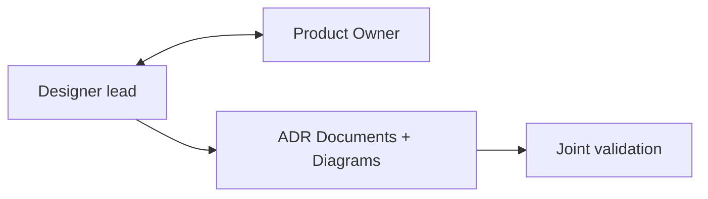
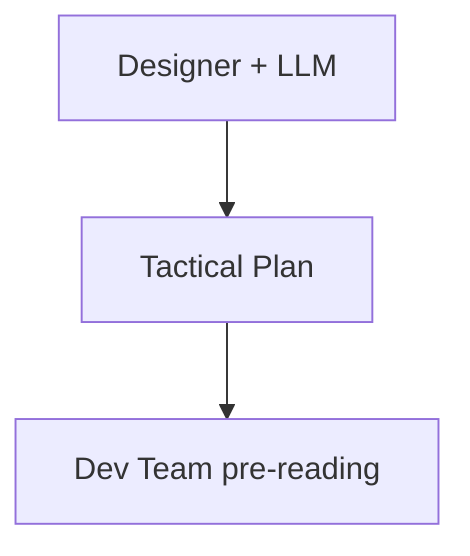
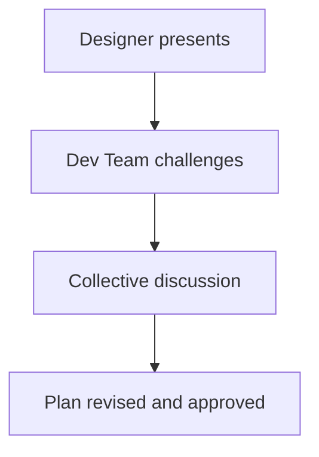
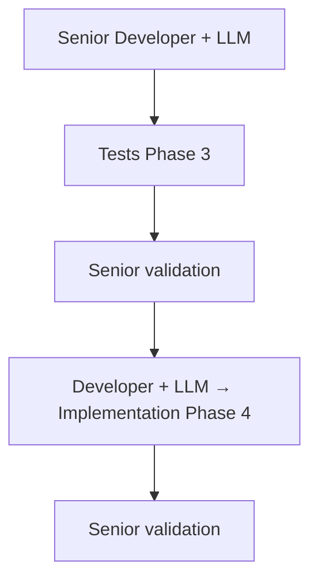
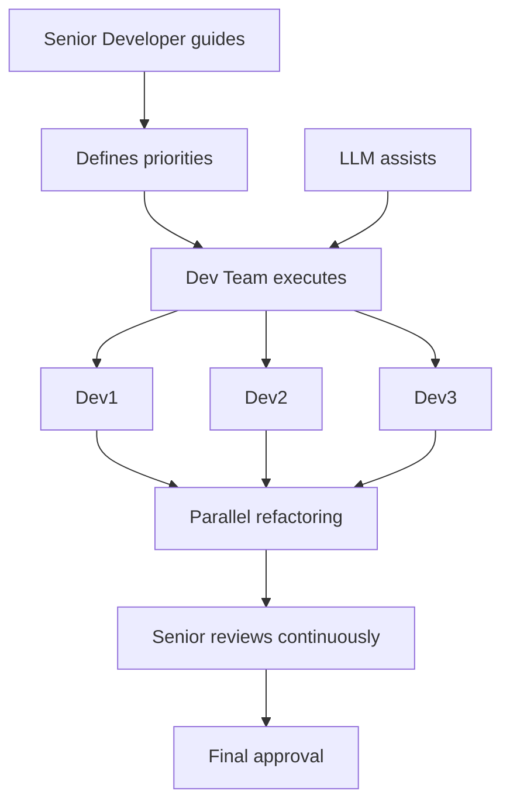
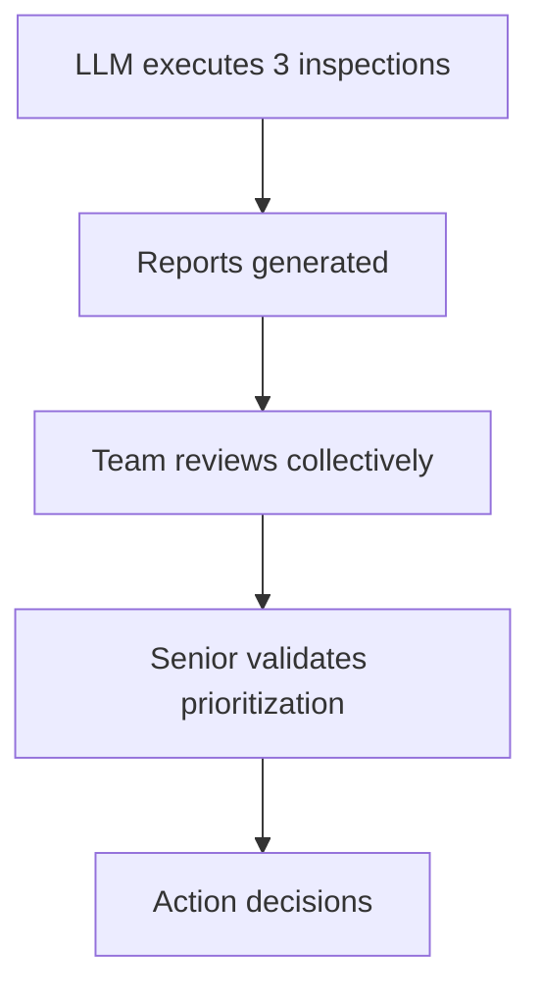

# Roles and Responsibilities

This document defines the key roles in the DC² methodology and their specific responsibilities across the 6 phases. DC² is designed to adapt to different team structures, from startups to large enterprises.

## Philosophy of Roles

**DC² prioritizes organizational flexibility**: The roles described here are **responsibilities**, not rigid job titles. One person can hold multiple roles, and a role can be shared among several people depending on your team's size and structure.

**Key principle**: What matters is not *who* holds the title, but *who* assumes the responsibility at each phase.

## Overview of Roles

### Note on Work Distribution

The descriptions "Human decides, LLM generates" in the table below indicate the **dominant role** of each party in the phase. **They are not metrics to measure.**

The goal is to produce the required quality deliverables for each phase, regardless of the time each party contributes. A team that spends 80% of its time guiding the LLM in Phase 2A is not failing—it's simply adapting its approach to its context and maturity.

**What matters**: Phase deliverables meet the Definition of Done.
**What doesn't matter**: The exact time spent by human vs LLM.

### Primary Role by Phase

| Phase | Primary Role | Support Roles | Work distribution |
|-------|--------------|---------------|-----------------|
| Phase 1 | Designer | Product Owner | Human decides, LLM explores |
| Phase 2A | Designer + LLM | Dev Team (review) | Human guides, LLM generates |
| Phase 2B | Designer + Dev Team | - | Human challenges (Human alone) |
| Phase 3 | Senior Developer + LLM | - | Human validates, LLM generates |
| Phase 4 | Developer + LLM | Senior Developer (validation) | Human validates, LLM implements |
| Phase 5 | Dev Team | Senior (guidance) | Human transforms, LLM assists |
| Phase 6 | Team + LLM | Senior (validation) | Human decides, LLM inspects |

## Role Definitions

### 1. Designer

**Who can play this role**:
- Software Architect (ideal)
- Senior Technical Analyst
- Experienced Tech Lead
- Senior Developer with design talent

**Primary Responsibilities**:
- Translate business needs into architectural decisions
- Identify technical constraints and trade-offs
- Create and document ADRs (Architecture Decision Records)
- Validate that proposed solutions meet strategic objectives
- Guide the team in understanding the architectural vision

**Required Skills**:
- Systems thinking (understanding how components interconnect)
- Experience with architectural patterns and trade-offs
- Ability to articulate technical decisions for business audiences
- Judgment on scalability, performance, and maintainability

**Time Commitment**:
- Phase 1: ⏱️⏱️⏱️ - Primary role
- Phase 2: ⏱️⏱️ - Generation + critical handoff
- Phases 3-6: ⏱️ - Consultation availability

### 2. Product Owner

**Who can play this role**:
- Scrum/Agile Product Owner
- Product Manager
- Senior Business Analyst
- Product Lead

**Primary Responsibilities**:
- Define business success criteria
- Prioritize features and arbitrate trade-offs
- Validate that the solution meets business needs
- Represent end-users and stakeholders
- Approve the tactical plan before development

**Required Skills**:
- Deep knowledge of the business domain
- Prioritization and arbitration capability
- Communication between technical and business sides
- Product vision and roadmap perspective

**Time Commitment**:
- Phase 1: ⏱️⏱️ - Continuous validation
- Phase 2B: ⏱️ - Critical Handoff
- Phase 6: ⏱️ - Optional final validation

### 3. Senior Developer

**Who can play this role**:
- Developer with 5+ years experience
- Technical Tech Lead
- Senior Software Engineer
- Developer with specific domain expertise

**Primary Responsibilities**:
- Validate test quality and completeness (Phase 3)
- Validate implementation correctness (Phase 4)
- **Guide the team in refactoring** (Phase 5)
- Validate inspection results (Phase 6)
- Technical mentor for less experienced developers

**Required Skills**:
- Deep technical expertise in the technology stack
- TDD and code quality experience
- Mentoring capability and knowledge transfer
- Judgment on maintainability and long-term evolution

**Time Commitment**:
- Phase 3: ⏱️ - Test validation
- Phase 4: ⏱️ - Implementation validation
- Phase 5: ⏱️⏱️⏱️ - Continuous refactoring guidance
- Phase 6: ⏱️ - Inspection validation

### 4. Development Team

**Who can play this role**:
- Developers of all levels (junior to senior)
- The complete team assigned to the project
- Can include specialists (frontend, backend, data, etc.)

**Primary Responsibilities**:
- **Review and challenge the tactical plan** (Phase 2B)
- Identify technical risks and dependencies
- **Execute refactoring under senior guidance** (Phase 5)
- Review and approve inspections (Phase 6)
- Develop collective code ownership

**Required Skills**:
- Technical skills in the project's stack
- Collaborative working ability
- Willingness to learn and improve
- Critical thinking (challenging assumptions)

**Time Commitment**:
- Phase 2: ⏱️⏱️ - Pre-reading tactical plan and Critical Handoff
- Phase 4: ⏱️ - Generation
- Phase 5: ⏱️⏱️⏱️ - Active refactoring work
- Phase 6: ⏱️ - Inspection review

## Collaboration Dynamics

### Phase 1: Strategic Architecture

**Dynamic**: Iterative dialogue between technical vision and business needs. The Designer proposes solutions, the Product Owner validates business alignment.

### Phase 2A-2B: Tactical Plan + Critical Handoff

**Phase 2A: Plan Generation**

**Phase 2B: Critical Handoff**

**Key dynamic**: The Critical Handoff (Phase 2B) is where the Designer's vision meets team reality. The team MUST actively challenge—a passive team signals a problem.

**Red flags**:
- Silent team (no questions/concerns)
- Rubber-stamp approval without discussion
- Estimation divergence > 50% between Designer and Team

### Phase 3-4: TDD RED-GREEN

**Dynamic**: Fast phases, heavily automated. Senior validates but does not code directly. Focus on speed with quality guaranteed by tests.

### Phase 5: Refactoring (Central Dynamic)

**Key dynamic**:
- **Senior does NOT do all the work alone**
- Senior identifies opportunities: "This module has duplication, who wants to extract it?"
- Team proposes approaches: "We could use the Strategy pattern here?"
- Senior guides: "Good idea, but watch out for over-engineering."
- Team implements under guidance
- Senior reviews and adjusts continuously

**Benefits**:
- Learning through practice (team develops skills)
- Scalability (multiple refactorings in parallel)
- Ownership (team proud of the result)
- Senior force multiplier (guides 3-4 people simultaneously)

**Anti-patterns to avoid**:
- Senior does everything, team watches → No learning, bottleneck
- Team alone without guidance → Risk of over-engineering or under-refactoring

### Phase 6: Triple Inspection

**Dynamic**: Automated inspections, human decisions. The team learns to read and interpret inspection reports. The senior validates that prioritization is appropriate.

## Example: Collaborative Mode for Phase 5

Some teams organize Phase 5 using a collaborative mode that combines scalability and learning. Here is how this mode works:

### Principle

- Senior identifies refactoring opportunities
- Team executes refactorings (in parallel if multiple developers)
- Senior remains available for questions and continuous review
- Focus on learning through practice

### Advantages of this mode

- **Scalability**: Multiple refactorings in parallel instead of sequential
- **Learning**: Team develops skills through practice
- **Ownership**: Team proud of the result, not just executing
- **Senior as multiplier**: Guides multiple people simultaneously instead of doing everything alone

### Typical progression

Sprints 1-2: Senior invests time (intensive guidance)
Sprints 3-4: Breakeven (comparable time to solo senior)
Sprints 10+: Positive ROI (autonomous team, senior freed for architecture)

### When to consider this mode

- Team of 3+ developers
- Goal of learning and skill development
- Projects with long lifespan (>1 year)
- Senior available for continuous guidance

### Alternatives

This mode is not mandatory. Other approaches work:
- **Senior solo**: Fast for teams <3 people or simple refactorings
- **Pairing**: Senior + 1 dev, intensive knowledge transfer
- **Async review**: Team proposes, senior reviews, iteration

Choose the approach that fits your organizational context.

---

## Adaptation by Team Size

### Startup / Small Team (2-4 people)

**Typical mapping**:
- **Tech Founder**: Designer + Senior Developer
- **Dev 1-2**: Dev Team
- **Founder/PM**: Product Owner

**Adjustments**:
- Same person plays multiple roles
- Critical Handoff less formal (team discussion)
- Phase 5: Tech Founder guides but also participates in refactoring
- Faster decisions, less formal documentation

**Concrete example**:
- **Phase 1**: Tech Founder (2h) defines architecture with PM
- **Phase 2B**: Team discussion 60min around table
- **Phase 5**: Tech Founder + Dev1 refactor together, pairing

### Medium Team (5-10 people)

**Typical mapping**:
- **Architect/Tech Lead**: Designer
- **Senior Dev (2-3)**: Senior Developer (can be shared)
- **Dev (3-5)**: Dev Team
- **Product Owner**: Product Owner

**Adjustments**:
- More specialized roles but still flexible
- Critical Handoff formal with structured agenda
- Phase 5: 2-3 parallel refactorings under Senior guidance
- Complete but pragmatic documentation

**Concrete example**:
- **Phase 2B**: Formal 90-minute meeting, all present
- **Phase 5**:
  - Senior1 guides Dev1+Dev2 on Module A
  - Senior2 guides Dev3+Dev4 on Module B
  - Common review end of day

### Large Team (10+ people)

**Typical mapping**:
- **Principal Architect**: Designer
- **Tech Leads (2-3)**: Assistant Designers
- **Senior Dev (4-6)**: Senior Developer
- **Dev (10+)**: Dev Team
- **Product Manager + BAs**: Product Owner (collective)

**Adjustments**:
- More formal hierarchy necessary
- Critical Handoff by sub-teams with synthesis
- Phase 5: Multiple parallel refactorings, coordination essential
- Extensive documentation, formalized processes

**Concrete example**:
- **Phase 1**: Principal Architect + 2 Tech Leads co-create
- **Phase 2B**:
  - 3 Critical Handoff sessions (one per sub-team)
  - Final consolidation session
- **Phase 5**:
  - 4 parallel groups (Senior + 2-3 Devs each)
  - Daily 30-minute sync with all Seniors

## Skills Matrix

### Skills by Role

| Skill | Designer | Product Owner | Senior Developer | Dev Team |
|-------|----------|---------------|------------------|----------|
| **Systems thinking** | Expert | Intermediate | Advanced | Foundational |
| **Architectural patterns** | Expert | - | Advanced | Intermediate |
| **Business domain** | Intermediate | Expert | Intermediate | Foundational |
| **TDD/Testing** | Intermediate | - | Expert | Advanced |
| **Refactoring** | Advanced | - | Expert | Intermediate+ |
| **Technical communication** | Expert | Expert | Advanced | Intermediate |
| **Mentoring** | Advanced | - | Expert | Variable |
| **Business trade-offs** | Advanced | Expert | Intermediate | Foundational |

## Common Pitfalls

### 1. Isolated Designer
**Problem**: Designer decides alone, team executes blindly
**Solution**: Mandatory Critical Handoff (Phase 2B), team actively challenges

### 2. Senior Does Everything
**Problem**: Senior codes all refactoring, team passive
**Solution**: Senior guides, team executes. Learning > short-term speed

### 3. Rigid Roles
**Problem**: "I'm a Dev, not a Senior, so I can't comment on architecture"
**Solution**: Encourage contribution from all levels. Juniors can have valuable insights.

### 4. Absent Product Owner
**Problem**: PO not involved Phase 1-2, discovers result Phase 6
**Solution**: PO validates at Phase 1 and Phase 2B minimum. No late surprises.

### 5. Non-Challenging Team
**Problem**: Team approves everything at Critical Handoff without questions
**Solution**: Create psychological safety culture. Questions = strength, not weakness.

## Role Health Indicators

### Positive Signals
- Team asks multiple questions during Critical Handoff
- Designer vs Team estimation divergence < 20%
- Juniors contribute refactoring ideas Phase 5
- Product Owner validates without surprises Phase 2B

### Negative Signals
- Team silent during Critical Handoff
- Estimation divergence > 50%
- Senior codes majority of refactoring alone
- Product Owner discovers solution in Phase 6
- "That's not my role" repeated frequently

## Final Recommendations

1. **Flexibility > Rigidity**: Adapt roles to your organizational context
2. **Responsibility > Title**: What matters is who does what, not business cards
3. **Collaboration > Hierarchy**: Encourage contribution from all levels
4. **Learning > Speed**: Phase 5 as a team slower initially but better long-term ROI
5. **Collective Ownership**: Entire team responsible for quality, not just Senior/Designer

**DC² works best when roles are shared responsibilities with clear leadership, not airtight silos.**
