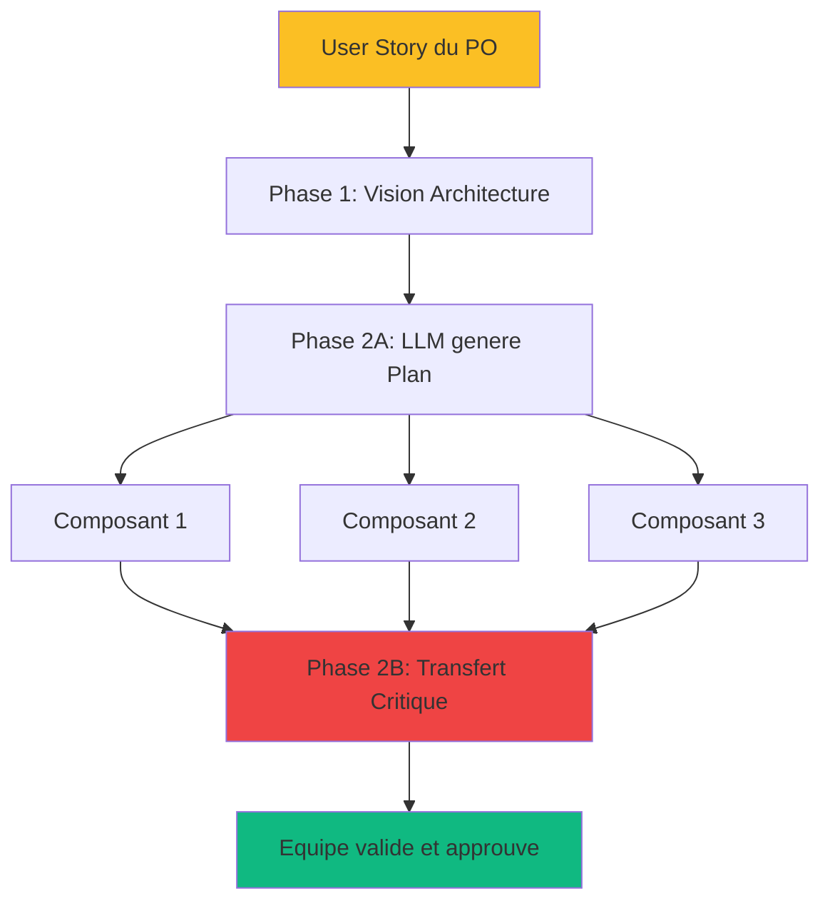

# Phase 2 : Planification Tactique + Transfert Critique

<!-- ========================================= -->
<!-- NIVEAU 1 : ESSENTIEL (5-10 secondes)     -->
<!-- ========================================= -->

<div style={{display: 'flex', gap: '10px', marginBottom: '25px', flexWrap: 'wrap'}}>
  <span style={{background: '#2563eb', color: 'white', padding: '6px 14px', borderRadius: '20px', fontSize: '13px', fontWeight: '600'}}>
    Agile : Story Refinement + Sprint Planning
  </span>
  <span style={{background: '#8b5cf6', color: 'white', padding: '6px 14px', borderRadius: '20px', fontSize: '13px', fontWeight: '600'}}>
    Rôles : Concepteur + Équipe Dev
  </span>
  <span style={{background: '#2563eb', color: 'white', padding: '6px 14px', borderRadius: '20px', fontSize: '13px', fontWeight: '600'}}>
    Humain : 45%
  </span>
  <span style={{background: '#10b981', color: 'white', padding: '6px 14px', borderRadius: '20px', fontSize: '13px', fontWeight: '600'}}>
    LLM : 55%
  </span>
</div>

---

**En bref** : Transforme User Stories en plans d'implémentation techniques exhaustifs via LLM. L'équipe valide lors du Transfert Critique - la réunion la plus importante de DC².

---

<!-- ========================================= -->
<!-- NIVEAU 2 : IMPACT (30-60 secondes)       -->
<!-- ========================================= -->

## Pourquoi Cette Phase Est Critique

**Le problème sans Phase 2** :  
L'équipe commence le codage avec une compréhension fragmentaire de la vision architecturale. Les malentendus se révèlent tardivement (Phase 4-5), nécessitant des refontes coûteuses et imprévues.

**La solution apportée** :  
Le Transfert Critique détecte et résout les incompréhensions AVANT le premier coup de code. Vision architecturale partagée et validée par toute l'équipe. Alignement concepteur-équipe vérifié.

**Limites LLM adressées** :
- **Dépendances sémantiques complexes** : LLM force l'explicitation complète des interfaces, séquences d'implémentation, et relations entre composants
- **Pas de mémoire opérationnelle** : Plan tactique devient la "mémoire externe" persistante consultée dans phases suivantes


### Lien avec Agile

**Phase 2 = Story Refinement + Sprint Planning.**  

Au lieu de décomposer les User Stories de zéro lors du refinement, l'équipe part d'un plan technique détaillé pré-généré par le LLM qu'elle peut critiquer, améliorer et valider. Même qualité de décomposition, beaucoup moins de temps, plan plus exhaustif.



**Exemple d'intégration dans un Sprint typique** :
- Semaine avant : PO présente User Stories, Concepteur fait Phase 1
- Jour 1 Sprint : Phase 2A (matin) + Équipe pré-lit (après-midi)
- Jour 2 Sprint : Phase 2B (Transfert Critique) = Sprint Planning technique

---

<!-- ========================================= -->
<!-- NIVEAU 3 : COMMENT FAIRE (2-5 minutes)   -->
<!-- ========================================= -->

## Déroulement

**Entrées** :
- Document Architecture Stratégique (Phase 1)
- User Stories prioritaires du Product Backlog
- Standards pile technologique et préférences équipe
- Exigences chronologie et dépendances externes
- Standards qualité et test

### Partie A : Génération Plan Tactique ⏱️

**1. Génération par LLM** (LLM 90%, Concepteur 10%)
- LLM lit document architecture stratégique
- Génère feuille de route d'implémentation détaillée
- Décompose solution en plus ou moins 3-5 composants avec spécifications
- Concepteur valide alignement avec décisions Phase 1

**2. Pré-lecture par Équipe** 
- Équipe reçoit plan tactique généré
- Chaque membre lit individuellement
- Note questions, préoccupations, risques identifiés
- Prépare estimations préliminaires

### Partie B : Transfert Critique ⏱️⏱️⏱️

**3. Présentation** (~20 min - Concepteur)
- Concepteur présente vision architecturale
- Explique décomposition en composants
- Justifie choix techniques majeurs

**4. Challenge Actif** (~40-60 min - Équipe)
- Équipe pose questions, challenge hypothèses
- Identifie lacunes, dépendances manquantes, risques
- Validation estimations d'effort
- Discussion faisabilité technique

**5. Révision Collaborative** (~20 min - Équipe + LLM)
- LLM Incorpore feedback dans plan révisé
- Génère résumé des décisions

**6. Validation Finale** (~10 min - Concepteur + Équipe)
- Révision plan révisé
- Approbation formelle pour passage Phase 3
- Plan enregistré au contrôle de version

**Sorties** :
- Plan tactique approuvé par Concepteur et Équipe
- Spécifications détaillées par composant (I/O, responsabilités, dépendances)
- Pile technique définie et justifiée
- Estimations d'effort alignées
- Risques et dépendances documentés

## Definition of Done

Cette phase est considérée terminée quand :

1. Le plan tactique décompose la solution en ~3-5 phases d'implémentation avec jalons clairs
2. Chaque composant a une spécification détaillée (entrées, sorties, responsabilités, dépendances)
3. La pile technique est définie avec justification des choix de frameworks et bibliothèques
4. L'équipe dev a révisé le plan, et toutes les préoccupations sont documentées et résolues
5. Les estimations d'effort sont alignées entre concepteur et équipe (écart < 20%)
6. Toutes les dépendances externes sont identifiées (APIs, sources de données, systèmes tiers)
7. Le concepteur et le Product Owner approuvent le plan final avant Phase 3

---

<!-- ========================================= -->
<!-- NIVEAU 4 : MAÎTRISER (5-15 minutes)      -->
<!-- Contenu détaillé caché par défaut        -->
<!-- ========================================= -->

## Pour Aller Plus Loin

<details>
<summary><strong>Voir exemples concrets, prompts et templates détaillés</strong></summary>

### Exemple Complet : User Story → Plan Tactique

#### User Story Initiale (Product Owner)

```
En tant qu'utilisateur,
Je veux voir la confiance de prédiction avec chaque résultat
Afin d'évaluer la fiabilité des recommandations

Critères d'acceptation :
- Score de confiance 0-100% affiché clairement
- Explication des facteurs influençant la confiance
- Indicateur visuel (vert/jaune/rouge) selon niveau
```

#### Phase 1 : Vision Architecture (Concepteur)

Décision : Placer logique confiance dans couche business, intégrer au pipeline recommandation existant. ADR : Pénalité taille échantillon pour éviter surconfiance.

#### Phase 2A : Plan Tactique Généré (LLM)

**Décomposition en 3 composants** :

**Composant 1 : `confidence_calculator`**
- **Responsabilité** : Calculer score confiance brut avec pénalités
- **Entrées** :
  - `weighted_presence: float` - Somme (similarité × présence)
  - `total_similarity: float` - Somme scores similarité
  - `n_contributors: int` - Nombre d'aliments contributeurs
  - `top_k_similar: int` - Nombre cible (typiquement 5)
- **Sorties** :
  - `confidence_score: float` - Score [0, 1]
- **Dépendances** : Aucune (module pur, testable isolément)
- **Algorithme** :
  1. Calcul confiance brute : weighted_presence / total_similarity
  2. Pénalité taille échantillon : min(n_contributors / top_k, 1.0)
  3. Pénalité statistique si n < 3 : 0.5 + (n / 6.0)
  4. Retour : confiance × pénalités

**Composant 2 : `confidence_explainer`**
- **Responsabilité** : Générer explication facteurs confiance
- **Entrées** :
  - `confidence_score: float`
  - `n_contributors: int`
  - `top_k_similar: int`
- **Sorties** :
  - `explanation: str` - Texte explicatif
  - `factors: List[str]` - Liste facteurs clés
- **Dépendances** : Aucune
- **Logique** :
  - Si n < 3 : "Échantillon très petit, confiance réduite"
  - Si n < top_k : "Données limitées, \{n\}/\{top_k\} sources"
  - Si score > 0.8 : "Forte confiance, nombreuses sources concordantes"

**Composant 3 : `confidence_presenter`**
- **Responsabilité** : Formatter pour UI (couleur, texte)
- **Entrées** :
  - `confidence_score: float`
  - `explanation: str`
- **Sorties** :
  - `display_data: Dict` - \{score_percent, color, label, explanation\}
- **Dépendances** : Aucune
- **Mapping couleurs** :
  - score ≥ 0.8 : Vert (#10b981)
  - score 0.5-0.8 : Jaune (#fbbf24)
  - score < 0.5 : Rouge (#ef4444)

**Séquence d'intégration** :
```python
# Dans pipeline recommandation existant
score = confidence_calculator.calculate(...)
explanation = confidence_explainer.explain(score, ...)
display = confidence_presenter.format(score, explanation)
```

#### Phase 2B : Transfert Critique - Exemple de Discussion

**Question Équipe (Dev Backend)** :  
"Le calcul pénalité sera-t-il assez rapide en production ? On génère 1000+ recommandations par requête."

**Réponse Concepteur** :  
"Bonne question. Le calcul est O(1) - juste arithmétique simple. Pas d'I/O, pas de boucles. Devrait être < 1ms par calcul. On peut profiler en Phase 4 pour confirmer."

**Révision Plan** : Ajouter benchmark performance dans tests Phase 3.

---

**Question Équipe (Dev Frontend)** :  
"Pour utilisateurs gratuits, doit-on cacher le score confiance ? Ça pourrait être feature premium."

**Discussion Product Owner** :  
"Intéressant. Pour MVP, affichons à tous. On peut A/B tester premium plus tard."

**Révision Plan** : Aucune. Pris en note pour backlog futur.

---

**Question Équipe (Dev Senior)** :  
"Que se passe-t-il si l'API externe qui calcule similarité est down ? Le score confiance sera 0 ?"

**Réponse Concepteur** :  
"Exact. Si API down, pas de similarité → confidence_calculator retourne 0. On doit gérer ça upstream avec fallback ou cache."

**Révision Plan** : Ajouter gestion erreur dans spec `confidence_calculator` - retourner 0.0 explicitement si total_similarity ≤ 0, avec logging warning.

---

**Estimations Finales** :
- Concepteur : "3 modules simples, 6-8h total"
- Équipe : "Avec tests et refactor, plutôt 8-10h"
- **Alignement** : 8-10h retenu (écart 11%, < 20% ✓)

### Prompts Recommandés

#### Génération Plan Tactique (Phase 2A)

```
Génère un plan tactique d'implémentation détaillé pour cette User Story :

USER STORY :
[coller User Story complète avec critères acceptation]

ARCHITECTURE STRATÉGIQUE (contexte) :
[coller ADR et décisions Phase 1 pertinentes]

CONTRAINTES TECHNIQUES :
- Stack : Python 3.11+, FastAPI
- Standards : Type hints obligatoires, 90%+ couverture tests
- Performance : <100ms latence API endpoint

DÉCOMPOSE en 3-5 composants avec pour CHAQUE composant :

1. **Nom du composant** (snake_case)
2. **Responsabilité** : Une phrase claire du rôle
3. **Entrées** : Types précis, signification, contraintes
4. **Sorties** : Types précis, format, contraintes
5. **Dépendances** : Quels autres composants/services requis
6. **Algorithme/Logique** : Étapes principales (pas code, description)
7. **Critères qualité** : Complexité, performance, testabilité

PUIS :
- **Séquence d'intégration** : Comment composants s'assemblent
- **Interfaces critiques** : Points d'intégration avec système existant
- **Risques identifiés** : Techniques, performance, dépendances

Format : Markdown structuré, clair, sans ambiguïté.
```

#### Révision Post-Transfert Critique

```
Révise ce plan tactique en incorporant le feedback du Transfert Critique :

PLAN TACTIQUE ORIGINAL :
[coller plan généré en Phase 2A]

FEEDBACK ÉQUIPE (Transfert Critique) :
[coller notes discussion - questions, préoccupations, révisions proposées]

DÉCISIONS PRISES :
[coller décisions - ce qui est accepté, rejeté, modifié]

GÉNÈRE plan tactique RÉVISÉ avec :
1. Modifications intégrées explicitement marquées
2. Réponses aux préoccupations documentées
3. Risques additionnels identifiés ajoutés
4. Estimations mises à jour si applicable

Format : Même structure que plan original, avec sections "RÉVISÉ :" pour changements.
```

### Standards de Qualité

#### Bon Plan Tactique

**Caractéristiques** :
- **Composants découplés** : Chaque module testable isolément, dépendances minimales
- **Interfaces claires** : Entrées/sorties explicites, contrats bien définis
- **Séquence logique** : Ordre implémentation évident (dépendances → composants utilisant)
- **Spécifications non ambiguës** : Pas de "gérer les erreurs" vague, mais "lever ValueError si x < 0"
- **Estimable** : Équipe peut estimer effort de chaque composant

**Exemple** :
```
Module : user_validator
Entrées : email: str, age: int
Sorties : ValidationResult(valid: bool, errors: List[str])
Logique :
  1. Vérifier format email (regex RFC 5322)
  2. Vérifier age dans [13, 120]
  3. Retourner résultat avec erreurs spécifiques
```

#### Mauvais Plan Tactique

**Problèmes** :
- **Couplage fort** : Module A appelle directement méthodes privées module B
- **Dépendances circulaires** : A dépend de B, B dépend de A
- **Specs vagues** : "Valider l'utilisateur" sans détails, "Gérer les cas limites"
- **Ordre incohérent** : Composants ordonnés aléatoirement, pas par dépendances
- **Impossible à estimer** : "Module de gestion des utilisateurs" trop gros/vague

**Exemple** :
```
Module : user_manager
Entrées : user_data (format non spécifié)
Sorties : Résultat (type non spécifié)
Logique : Gérer les utilisateurs et leurs données
```
→ Trop vague, impossible à implémenter

### Pièges Courants

#### 1. Équipe Passive au Transfert Critique

**Problème** :  
Équipe approuve tout sans questions. Silence = approbation tacite. Concepteur pense "tout est clair", mais équipe a juste peur de questionner.

**Solution** :
- **Créer sécurité psychologique** : Concepteur dit explicitement "Je VEUX vos questions, même 'bêtes'"
- **Poser questions directes** : "Dev Backend, que penses-tu de la gestion erreur API externe ?"
- **Red flag si zéro questions** : Équipe silencieuse = problème. Creuser pourquoi.

---

#### 2. Plan Trop Détaillé (Over-Engineering)

**Problème** :  
LLM génère plan avec 15 composants micro-services, design patterns complexes, abstractions prématurées. Équipe submergée.

**Solution** :
- **Règle 3-5 composants** : Maximum 5 modules pour user story typique
- **YAGNI strict** : "You Aren't Gonna Need It" - uniquement ce qui sert story actuelle
- **Concepteur filtre** : Valide complexité appropriée au problème

**Prompt ajustement** :
```
Décompose en 3-5 composants SIMPLES. 
Principe YAGNI : ne générer QUE ce qui sert cette story.
Pas d'abstractions prématurées, pas de patterns complexes.
Code simple > code clever.
```

---

#### 3. Estimations Divergentes Non Réconciliées

**Problème** :  
Concepteur estime 6h, Équipe estime 15h (écart 150%). Passe en Phase 3 sans résoudre divergence. Sprint planning échoue.

**Solution** :
- **Seuil tolérance : 20%** : Si écart > 20%, STOP et creuser
- **Comprendre pourquoi** : 
  - Concepteur a-t-il oublié complexité ?
  - Équipe a-t-elle mal compris approche ?
  - Risques techniques sous-estimés ?
- **Réviser plan** : Simplifier OU augmenter scope temps
- **Ne jamais ignorer divergence** : Symptôme incompréhension profonde

**Check Definition of Done #5** : "Estimations alignées (écart < 20%)"

---

#### 4. Dépendances Externes Non Identifiées

**Problème** :  
Plan parfait mais oublie que module dépend d'API externe pas encore déployée, ou données qui n'existent pas en base.

**Solution** :
- **Checklist dépendances** :
  - APIs externes (disponibilité, SLA, auth)
  - Sources de données (tables DB, schemas)
  - Services internes (autres équipes)
  - Bibliothèques tierces (version, license)
- **Valider AVANT Phase 3** : Blocker identifiés = pause jusqu'à résolution
- **Fallbacks** : Si dépendance incertaine, prévoir mock/stub

**Check Definition of Done #6** : "Toutes dépendances externes identifiées"

---

#### 5. Product Owner Absent du Transfert Critique

**Problème** :  
PO pas présent. Équipe valide plan technique qui ne répond pas vraiment au besoin business.

**Solution** :
- **PO présent minimum 30 min** : Au début (présentation) et fin (validation)
- **Validation business explicite** : PO confirme "Ce plan répond à la story"
- **Décisions business rapides** : Si question business surgit, PO décide sur place

**Check Definition of Done #7** : "Concepteur ET Product Owner approuvent"

### Relation avec Agile - Détails

#### Mapping Précis Concepts Agile → DC²

| Concept Agile | Équivalent DC² | Différence Clé |
|---------------|---------------------|----------------|
| **User Story** | Input Phase 1-2 | Story reste niveau fonctionnel utilisateur |
| **Story Refinement** | Phase 2B (Transfert Critique) | Équipe révise plan pré-généré vs crée de zéro |
| **Sprint Planning** | Phase 2B + début Phase 3 | Planning technique déjà fait, reste validation + tests |
| **Tasks** | Composants Phase 2 | Composants = tasks avec specs exhaustives |
| **Acceptance Criteria** | Tests Phase 3 | Critères deviennent tests exécutables automatisés |
| **Definition of Done** | DoD par Phase | DoD granulaire par phase, pas juste fin story |
| **Story Points** | Estimations heures Phase 2 | Estimations plus précises grâce plan détaillé |

#### Intégration Sprint 2 Semaines Typique

**Sprint N-1 (Préparation)** :
- PO présente User Stories au Product Backlog Refinement
- Concepteur fait Phase 1 pour stories prioritaires (architecture)

**Sprint N - Jour 1 (Lundi)** :
- Matin : Phase 2A (LLM génère plans tactiques - 30-40 min)
- Après-midi : Équipe lit plans, prépare questions (30-60 min chacun)

**Sprint N - Jour 2 (Mardi)** :
- Matin : Phase 2B (Transfert Critique - 90-120 min) = Sprint Planning technique
- Après-midi : Phase 3 (Génération tests - 1.5h)
- Fin journée : Estimations finales, commitment

**Sprint N - Jours 3-10** :
- Phases 4-5 : Implémentation + Refactor
- Daily standup comme d'habitude
- Phase 6 (optionnelle) si composant critique

**Sprint N - Derniers jours** :
- Démo PO
- Rétrospective

#### Compatibilité Outils Agile

**Jira / Azure DevOps** :
- User Story reste dans backlog
- Composants Phase 2 = Sub-tasks de la story
- Plan tactique = attaché comme document
- Tests Phase 3 = Test Cases liés à story

**Exemple Jira** :
```
User Story: PROJ-123 "Afficher confiance prédiction"
├─ Sub-task: PROJ-124 "Implémenter confidence_calculator"
├─ Sub-task: PROJ-125 "Implémenter confidence_explainer"
└─ Sub-task: PROJ-126 "Implémenter confidence_presenter"

Attachments:
├─ Plan_Tactique_PROJ-123.md (Phase 2)
├─ Architecture_Decision_Confidence.md (Phase 1)
└─ Tests_PROJ-123.py (Phase 3)
```

</details>

---

**Prochaine étape** : [Phase 3 : TDD RED - Génération de Tests →](./phase3-tdd-red)

**Besoin d'aide ?** Consultez le [document Rôles et Responsabilités](./roles-et-responsabilites) pour clarifier qui fait quoi dans cette phase.
