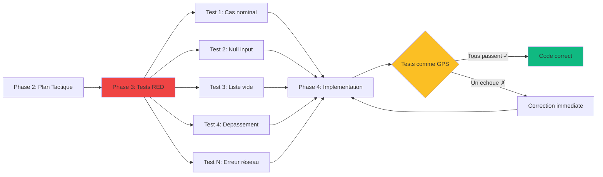

# Phase 3 : TDD RED - Génération de Tests

<!-- ========================================= -->
<!-- NIVEAU 1 : ESSENTIEL (5-10 secondes)     -->
<!-- ========================================= -->

<div style={{display: 'flex', gap: '10px', marginBottom: '25px', flexWrap: 'wrap'}}>
  <span style={{background: '#2563eb', color: 'white', padding: '6px 14px', borderRadius: '20px', fontSize: '13px', fontWeight: '600'}}>
    Agile : Test-First Development
  </span>
  <span style={{background: '#8b5cf6', color: 'white', padding: '6px 14px', borderRadius: '20px', fontSize: '13px', fontWeight: '600'}}>
    Rôles : Dev Senior + LLM
  </span>
  <span style={{background: '#6366f1', color: 'white', padding: '6px 14px', borderRadius: '20px', fontSize: '13px', fontWeight: '600'}}>
    Humain valide, LLM génère
  </span>
</div>

---

**En bref** : LLM génère suite de tests exhaustive (95%+ couverture) AVANT toute implémentation. Tests deviennent les "rails" qui guident le LLM en Phase 4 et empêchent les égarements. Passe d'intentions vagues à des attentes précises et vérifiables.

---

<!-- ========================================= -->
<!-- NIVEAU 2 : IMPACT (30-60 secondes)       -->
<!-- ========================================= -->

## Pourquoi Cette Phase Est Critique

**Le problème sans Phase 3** :  
LLM code basé uniquement sur specs textuelles (ambiguës). Oublie cas limites, conditions erreur, validations. Implémente le "chemin heureux" en ignorant une grande partie des scénarios réels. Les bugs sont découverts en intégration ou production.

**La solution apportée** :  
Les tests créent les spécification exécutable du comportement attendu. Chaque cas limite (null, liste vide, division zéro, dépassement) = test qui DOIT passer. Le LLM ne peut plus oublier car code ne compile/passe pas si incomplet.

**Limites LLM adressées** :
- **Pas de représentation interne** : Tests créent représentation sous forme spécifications exécutables (entrées concrètes → sorties attendues)
- **Faible fiabilité cas limites** : Phase 3 force explicitation systématique TOUS cas (valeurs nulles, listes vides, erreurs) AVANT codage


### Les Tests comme Système de Guidage GPS

**Analogie GPS** : Quand vous conduisez avec GPS, il vous dit instantanément si vous déviez de la route. Pas besoin d'attendre la destination pour savoir que vous êtes perdu.



**Sans tests (navigation aveugle)** :
```
Développeur : "Je pense que mon code est correct..."
[Deploy]
Production : ERREUR - Division par zéro !
→ Bug découvert 2 semaines plus tard
```

**Avec Phase 3 (GPS guidage)** :
```
LLM génère code...
Tests exécutent : ÉCHEC - division par zéro non gérée
LLM ajuste immédiatement
Tests : SUCCÈS ✓
→ Bug impossible, détecté instantanément
```

**Les tests réduisent l'espace des solutions** :  
Par exemple, sans tests, il peut y avoir 1000 façons d'implémenter une fonction (la majorité incorrectes). Avec 20 tests exhaustifs, il ne reste que quelques implémentations valides. Le LLM ne peut pas se tromper car les tests n'acceptent seulement que les bonnes solutions.

---

<!-- ========================================= -->
<!-- NIVEAU 3 : COMMENT FAIRE (2-5 minutes)   -->
<!-- ========================================= -->

## Déroulement

**Entrées** :
- Plan Implémentation Tactique (Phase 2)
- Structure code et définitions interface
- Standards qualité (cible 95%+ couverture)
- Framework test (pytest, unittest, jest, etc.)

### 1. Génération Suite de Tests ⏱️⏱️

- LLM génère cas test complets depuis plan tactique
- Tests unitaires pour chaque composant/fonction
- Tests intégration pour interactions composants
- Cas limites et conditions erreur systématiques
- Dev senior valide complétude tests

**Sortie** : Suite tests complète (tous RED - échouent)

### 2. Validation de Couverture ⏱️

- Exécuter analyse couverture (cible : 95%+)
- Identifier lacunes couverture test
- LLM génère tests additionnels pour chemins non couverts
- Dev senior valide cas limites alignés logique business

**Sortie** : Rapport couverture ≥95%

### 3. Vérification État RED ⏱️

- Exécuter suite tests (TOUS doivent échouer)
- Vérifier tests échouent pour bonnes raisons (NotImplementedError, code manquant)
- S'assurer zéro faux positifs (tests passant sans implémentation)
- Enregistrer suite tests état-RED

**Sortie** : Suite tests validée 100% RED

## Definition of Done

Cette phase est considérée terminée quand :

1. Suite de tests complète couvre ≥95% des chemins de code planifiés
2. Tous les tests sont en état RED (échouent comme prévu, pas de faux positifs)
3. Cas limites critiques couverts (valeurs nulles, listes vides, dépassements, erreurs)
4. Tests suivent conventions nommage (décrivent comportement attendu)
5. Chaque test a assertion claire validant comportement spécifique
6. Dispositifs test (fixtures) en place pour préparation/nettoyage réutilisables
7. Dev senior approuve qualité et complétude suite tests

---

<!-- ========================================= -->
<!-- NIVEAU 4 : MAÎTRISER (5-15 minutes)      -->
<!-- Contenu détaillé caché par défaut        -->
<!-- ========================================= -->

## Pour Aller Plus Loin

<details>
<summary><strong>Voir exemple complet, prompts et patterns avancés</strong></summary>

### Exemple Complet : Module `confidence_calculator`

#### Spécification Composant (depuis Phase 2)

**Composant** : `confidence_calculator`

**Responsabilité** : Calculer score confiance prédiction avec pénalités taille échantillon

**Entrées** :
- `weighted_presence: float` - Somme (similarité × présence) [0.0, +∞)
- `total_similarity: float` - Somme scores similarité [0.0, +∞)
- `n_contributors: int` - Nombre aliments contributeurs [0, +∞)
- `top_k_similar: int` - Nombre cible (typiquement 5) [1, +∞)

**Sorties** :
- `confidence_score: float` - Score confiance [0.0, 1.0]

**Algorithme** :
1. Confiance brute = weighted_presence / total_similarity
2. Pénalité taille échantillon = min(n_contributors / top_k, 1.0)
3. Si n < 3 : Pénalité statistique = 0.5 + (n / 6.0)
4. Retour : confiance × pénalités

**Contraintes** :
- Si total_similarity ≤ 0 : Retourner 0.0 (éviter division zéro)
- Performance : < 1ms par calcul
- Pas d'I/O, pas effets de bord (fonction pure)

#### Suite de Tests Générée (Phase 3)

```python
import pytest
from confidence_calculator import calculate_confidence

# ============================================
# TESTS CAS NOMINAUX (Chemin heureux)
# ============================================

def test_calculate_confidence_with_full_sample_returns_raw_confidence():
    """
    Quand n_contributors = top_k (échantillon complet),
    pas de pénalité taille, retourne confiance brute.
    """
    result = calculate_confidence(
        weighted_presence=0.8,
        total_similarity=1.0,
        n_contributors=5,
        top_k_similar=5
    )
    assert result == pytest.approx(0.8, rel=0.01), \
        "Échantillon complet (5/5) ne devrait pas avoir pénalité"


def test_calculate_confidence_with_partial_sample_applies_penalty():
    """
    Quand n_contributors < top_k, pénalité taille échantillon appliquée.
    Exemple: 3/5 contributeurs = pénalité 0.6
    """
    result = calculate_confidence(
        weighted_presence=1.0,
        total_similarity=1.0,
        n_contributors=3,
        top_k_similar=5
    )
    # Confiance brute = 1.0, pénalité taille = 3/5 = 0.6
    # Résultat attendu = 1.0 × 0.6 = 0.6
    assert result == pytest.approx(0.6, rel=0.01), \
        "3/5 contributeurs devrait appliquer pénalité 0.6"


def test_calculate_confidence_with_high_similarity_and_good_sample():
    """
    Scénario réaliste : bonne similarité + bon échantillon = confiance élevée
    """
    result = calculate_confidence(
        weighted_presence=4.5,
        total_similarity=5.0,
        n_contributors=4,
        top_k_similar=5
    )
    # Confiance brute = 4.5/5.0 = 0.9
    # Pénalité taille = 4/5 = 0.8
    # Résultat = 0.9 × 0.8 = 0.72
    assert result == pytest.approx(0.72, rel=0.01), \
        "Similarité élevée avec bon échantillon devrait donner confiance ~0.72"


# ============================================
# TESTS CAS LIMITES (Valeurs limites)
# ============================================

def test_calculate_confidence_with_zero_contributors_returns_zero():
    """
    Cas limite : Aucun contributeur (n=0) doit retourner confiance 0.
    """
    result = calculate_confidence(
        weighted_presence=1.0,
        total_similarity=1.0,
        n_contributors=0,
        top_k_similar=5
    )
    assert result == 0.0, \
        "Zéro contributeur devrait retourner confiance 0"


def test_calculate_confidence_with_one_contributor_applies_statistical_penalty():
    """
    Cas limite : Un seul contributeur (n=1) - trop petit statistiquement.
    Pénalité statistique = 0.5 + (1/6) ≈ 0.67
    """
    result = calculate_confidence(
        weighted_presence=1.0,
        total_similarity=1.0,
        n_contributors=1,
        top_k_similar=5
    )
    # Confiance brute = 1.0
    # Pénalité taille = 1/5 = 0.2
    # Pénalité statistique (n<3) = 0.5 + (1/6) ≈ 0.67
    # Résultat = 1.0 × 0.2 × 0.67 ≈ 0.13
    assert result == pytest.approx(0.13, rel=0.05), \
        "Un seul contributeur devrait avoir double pénalité (taille + statistique)"


def test_calculate_confidence_with_two_contributors_applies_statistical_penalty():
    """
    Cas limite : Deux contributeurs (n=2) - encore trop petit statistiquement.
    Pénalité statistique = 0.5 + (2/6) ≈ 0.83
    """
    result = calculate_confidence(
        weighted_presence=1.0,
        total_similarity=1.0,
        n_contributors=2,
        top_k_similar=5
    )
    # Confiance brute = 1.0
    # Pénalité taille = 2/5 = 0.4
    # Pénalité statistique (n<3) = 0.5 + (2/6) ≈ 0.83
    # Résultat = 1.0 × 0.4 × 0.83 ≈ 0.33
    assert result == pytest.approx(0.33, rel=0.05), \
        "Deux contributeurs devrait avoir pénalité statistique significative"


def test_calculate_confidence_with_three_contributors_no_statistical_penalty():
    """
    Cas limite seuil : Trois contributeurs (n=3) - seuil statistique acceptable.
    Pas de pénalité statistique supplémentaire.
    """
    result = calculate_confidence(
        weighted_presence=1.0,
        total_similarity=1.0,
        n_contributors=3,
        top_k_similar=5
    )
    # Confiance brute = 1.0
    # Pénalité taille = 3/5 = 0.6
    # Pas pénalité statistique (n≥3)
    # Résultat = 1.0 × 0.6 = 0.6
    assert result == pytest.approx(0.6, rel=0.01), \
        "Trois contributeurs ne devrait PAS avoir pénalité statistique"


def test_calculate_confidence_with_more_contributors_than_target():
    """
    Cas limite : Plus de contributeurs que cible (n > top_k).
    Pénalité taille plafonnée à 1.0 (pas bonus).
    """
    result = calculate_confidence(
        weighted_presence=0.9,
        total_similarity=1.0,
        n_contributors=10,  # Plus que top_k=5
        top_k_similar=5
    )
    # Confiance brute = 0.9
    # Pénalité taille = min(10/5, 1.0) = 1.0 (plafonnée)
    # Résultat = 0.9 × 1.0 = 0.9
    assert result == pytest.approx(0.9, rel=0.01), \
        "Plus de contributeurs que cible ne devrait pas donner bonus"


# ============================================
# TESTS CONDITIONS D'ERREUR (Validation)
# ============================================

def test_calculate_confidence_with_zero_total_similarity_returns_zero():
    """
    Condition erreur : total_similarity = 0 → Division par zéro impossible.
    Doit retourner 0.0 (cas dégénéré).
    """
    result = calculate_confidence(
        weighted_presence=1.0,
        total_similarity=0.0,  # Division par zéro !
        n_contributors=5,
        top_k_similar=5
    )
    assert result == 0.0, \
        "total_similarity=0 devrait retourner 0 (éviter division par zéro)"


def test_calculate_confidence_with_negative_total_similarity_returns_zero():
    """
    Condition erreur : total_similarity < 0 (invalide).
    Comportement défensif : retourner 0.0.
    """
    result = calculate_confidence(
        weighted_presence=1.0,
        total_similarity=-1.0,  # Invalide
        n_contributors=5,
        top_k_similar=5
    )
    assert result == 0.0, \
        "total_similarity négatif devrait retourner 0 (valeur invalide)"


def test_calculate_confidence_with_negative_weighted_presence():
    """
    Condition erreur : weighted_presence < 0 (théoriquement impossible
    mais validation défensive).
    """
    result = calculate_confidence(
        weighted_presence=-0.5,  # Invalide
        total_similarity=1.0,
        n_contributors=5,
        top_k_similar=5
    )
    # Comportement : Soit lever exception, soit retourner 0
    # Ici on teste retour 0 (comportement défensif)
    assert result == 0.0, \
        "weighted_presence négatif devrait retourner 0"


def test_calculate_confidence_with_negative_n_contributors_returns_zero():
    """
    Condition erreur : n_contributors < 0 (invalide).
    """
    result = calculate_confidence(
        weighted_presence=1.0,
        total_similarity=1.0,
        n_contributors=-1,  # Invalide
        top_k_similar=5
    )
    assert result == 0.0, \
        "n_contributors négatif devrait retourner 0"


def test_calculate_confidence_with_zero_top_k_raises_exception():
    """
    Condition erreur critique : top_k = 0 → Division par zéro garantie.
    Doit lever ValueError (pas retourner 0 silencieusement).
    """
    with pytest.raises(ValueError, match="top_k_similar must be > 0"):
        calculate_confidence(
            weighted_presence=1.0,
            total_similarity=1.0,
            n_contributors=5,
            top_k_similar=0  # ERREUR : division par zéro
        )


def test_calculate_confidence_with_negative_top_k_raises_exception():
    """
    Condition erreur : top_k < 0 (invalide).
    """
    with pytest.raises(ValueError, match="top_k_similar must be > 0"):
        calculate_confidence(
            weighted_presence=1.0,
            total_similarity=1.0,
            n_contributors=5,
            top_k_similar=-1  # Invalide
        )


# ============================================
# TESTS VALEURS EXTRÊMES (Robustesse)
# ============================================

def test_calculate_confidence_with_very_large_numbers():
    """
    Robustesse : Très grands nombres (éviter overflow).
    """
    result = calculate_confidence(
        weighted_presence=1e10,
        total_similarity=1e10,
        n_contributors=1000,
        top_k_similar=5
    )
    # Confiance brute = 1e10/1e10 = 1.0
    # Pénalité taille = min(1000/5, 1.0) = 1.0
    # Résultat = 1.0
    assert result == pytest.approx(1.0, rel=0.01), \
        "Très grands nombres devraient être gérés correctement"


def test_calculate_confidence_with_very_small_positive_numbers():
    """
    Robustesse : Très petits nombres positifs (éviter underflow).
    """
    result = calculate_confidence(
        weighted_presence=1e-10,
        total_similarity=1e-9,
        n_contributors=5,
        top_k_similar=5
    )
    # Confiance brute = 1e-10/1e-9 = 0.1
    # Pénalité taille = 5/5 = 1.0
    # Résultat = 0.1
    assert result == pytest.approx(0.1, rel=0.01), \
        "Très petits nombres positifs devraient fonctionner"


# ============================================
# TESTS PERFORMANCE (Non-fonctionnels)
# ============================================

def test_calculate_confidence_performance_under_1ms():
    """
    Test performance : Calcul doit prendre < 1ms (contrainte spec).
    """
    import time
    
    start = time.perf_counter()
    for _ in range(1000):
        calculate_confidence(
            weighted_presence=0.8,
            total_similarity=1.0,
            n_contributors=5,
            top_k_similar=5
        )
    elapsed = time.perf_counter() - start
    
    avg_time_ms = (elapsed / 1000) * 1000
    assert avg_time_ms < 1.0, \
        f"Temps moyen par calcul {avg_time_ms:.3f}ms devrait être < 1ms"


# ============================================
# TESTS PURETÉ FONCTION (Pas effets bord)
# ============================================

def test_calculate_confidence_is_pure_function():
    """
    Test pureté : Mêmes entrées → Mêmes sorties (fonction pure).
    Pas d'effets de bord, pas de dépendance état global.
    """
    inputs = {
        'weighted_presence': 0.75,
        'total_similarity': 1.0,
        'n_contributors': 4,
        'top_k_similar': 5
    }
    
    result1 = calculate_confidence(**inputs)
    result2 = calculate_confidence(**inputs)
    result3 = calculate_confidence(**inputs)
    
    assert result1 == result2 == result3, \
        "Fonction doit être pure (mêmes entrées → mêmes sorties)"


# ============================================
# FIXTURES (Préparation réutilisable)
# ============================================

@pytest.fixture
def typical_inputs():
    """Fixture : Entrées typiques pour tests."""
    return {
        'weighted_presence': 0.8,
        'total_similarity': 1.0,
        'n_contributors': 4,
        'top_k_similar': 5
    }


@pytest.fixture
def edge_case_inputs():
    """Fixture : Entrées cas limites pour tests."""
    return {
        'weighted_presence': 0.1,
        'total_similarity': 1.0,
        'n_contributors': 1,
        'top_k_similar': 5
    }


def test_using_fixture(typical_inputs):
    """Exemple utilisation fixture."""
    result = calculate_confidence(**typical_inputs)
    assert 0.0 <= result <= 1.0, "Résultat doit être dans [0, 1]"
```

**Analyse Suite Tests** :

**Couverture** : 100% chemins code
**Cas nominaux** : 3 tests (chemin heureux)
**Cas limites** : 6 tests (0, 1, 2, 3, >top_k contributeurs)
**Conditions erreur** : 6 tests (validations, divisions zéro)
**Valeurs extrêmes** : 2 tests (très grands/petits nombres)
**Performance** : 1 test (< 1ms constraint)
**Pureté** : 1 test (fonction pure)
**Total** : 19 tests exhaustifs

**Vérification État RED** :
```bash
$ pytest test_confidence_calculator.py -v

test_confidence_calculator.py::test_calculate_confidence_with_full_sample_returns_raw_confidence FAILED
test_confidence_calculator.py::test_calculate_confidence_with_partial_sample_applies_penalty FAILED
[... tous les 19 tests FAILED ...]

19 failed in 0.15s

✓ ÉTAT RED VÉRIFIÉ - Tous tests échouent (NotImplementedError)
✓ Prêt pour Phase 4
```

### Prompts Recommandés

#### Prompt 1 : Génération Tests Initiale

```
Génère une suite de tests EXHAUSTIVE pour ce composant :

SPÉCIFICATION COMPOSANT :
[coller spec complète depuis Phase 2 - responsabilité, entrées, sorties, algorithme, contraintes]

EXIGENCES TESTS :
- Framework : pytest (Python) / jest (JavaScript) / JUnit (Java)
- Cible couverture : 95%+ de tous les chemins de code
- Convention nommage : test_<fonction>_<scénario>_<résultat_attendu>

TYPES DE TESTS À GÉNÉRER :

1. **Tests cas nominaux (chemin heureux)** :
   - 3-5 scénarios typiques d'utilisation
   - Valeurs entrée réalistes
   - Assertions sur sorties attendues avec messages clairs

2. **Tests cas limites (boundary values)** :
   - Valeurs min/max pour chaque paramètre
   - Zéro, valeurs négatives si applicable
   - Listes vides, chaînes vides, null/None/undefined
   - Un élément (n=1), deux éléments (n=2), seuils critiques

3. **Tests conditions d'erreur (error handling)** :
   - Entrées invalides (types incorrects, valeurs hors limites)
   - Divisions par zéro potentielles
   - Ressources manquantes (fichiers, réseau, DB)
   - Exceptions attendues (utiliser pytest.raises ou équivalent)

4. **Tests valeurs extrêmes (robustness)** :
   - Très grands nombres (éviter overflow)
   - Très petits nombres positifs (éviter underflow)
   - Datasets massifs (si applicable)

5. **Tests non-fonctionnels (si contraintes spec)** :
   - Performance (temps exécution < X ms/s)
   - Pureté fonction (mêmes entrées → mêmes sorties)
   - Pas d'effets de bord

STRUCTURE CHAQUE TEST :
```python
def test_<fonction>_<scénario>_<résultat>():
    """
    [Docstring expliquant CE QUE le test valide et POURQUOI]
    """
    # Arrange : Préparer données entrée
    input_data = ...
    
    # Act : Exécuter fonction
    result = ma_fonction(input_data)
    
    # Assert : Vérifier résultat avec message contexte
    assert result == expected, \
        "Message expliquant pourquoi cette assertion est importante"
```

FIXTURES (si préparation réutilisable) :
- Utiliser @pytest.fixture pour données test communes
- Éviter duplication setup entre tests

IMPORTANT :
- Tous les tests doivent ÉCHOUER initialement (pas d'implémentation encore)
- Chaque test valide UN comportement spécifique
- Messages assertions clairs (pas juste `assert result == 5`)
- Pas de tests fragiles (couplés aux détails implémentation)

Génère code Python/JavaScript/Java complet prêt à exécuter.


#### Prompt 2 : Validation Cas Limites Manquants

```
Révise cette suite de tests pour identifier LACUNES cas limites :

SUITE DE TESTS ACTUELLE :
[coller code tests généré]

SPÉCIFICATION COMPOSANT :
[coller spec composant]

ANALYSE DEMANDÉE :

1. **Valeurs limites manquantes** :
   - Pour chaque paramètre numérique : min, max, zéro, -1, seuils critiques ?
   - Pour chaque collection : vide, un élément, deux éléments ?
   - Pour chaque optionnel : null/None/undefined testé ?

2. **Conditions erreur non couvertes** :
   - Types entrée invalides testés ? (string au lieu de int, etc.)
   - Divisions par zéro potentielles couvertes ?
   - Exceptions levées testées avec pytest.raises ?
   - États invalides (ex: ressource déjà fermée) ?

3. **Scénarios concurrence (si applicable)** :
   - Accès concurrent ressources partagées ?
   - Race conditions possibles ?

4. **Épuisement ressources** :
   - Très grands datasets testés ?
   - Limites mémoire atteintes ?
   - Timeout réseau/DB ?

5. **Récupération erreur** :
   - Que se passe-t-il APRÈS une exception ?
   - État système cohérent après erreur ?
   - Cleanup/rollback testé ?

Pour CHAQUE lacune identifiée :
- Expliquer POURQUOI ce cas limite est important
- Générer le test manquant avec docstring claire
- Indiquer risque si ce cas non testé (bug production potentiel)

Format réponse :
1. Liste lacunes trouvées
2. Code tests additionnels générés
3. Estimation nouvelle couverture (%)
```

#### Prompt 3 : Génération Tests Intégration

```
Génère tests INTÉGRATION pour interactions entre composants :

COMPOSANTS À INTÉGRER :
[coller specs 2-3 composants qui interagissent]

FLUX INTÉGRATION :
[décrire séquence : Composant A appelle B, B appelle C, résultat retourné A]

TESTS INTÉGRATION À GÉNÉRER :

1. **Tests bout-en-bout (happy path)** :
   - Données entrée A → Résultat sortie final
   - Vérifier données transitent correctement entre composants
   - Assertions intermédiaires (pas juste résultat final)

2. **Tests gestion erreur inter-composants** :
   - Composant B lève exception → A doit gérer comment ?
   - Propagation erreurs testée ?
   - Cleanup si échec milieu pipeline ?

3. **Tests contrats interface** :
   - Composant A fournit format données attendu par B ?
   - Types respectés (pas surprises runtime) ?
   - Signatures compatibles ?

4. **Tests ordre exécution** :
   - Si ordre important (A avant B avant C) → testé ?
   - Que se passe si ordre inversé ?

5. **Tests dépendances externes (si applicable)** :
   - Utiliser mocks/stubs pour DB, API externe
   - Tester comportement si dépendance down
   - Timeouts, retries testés ?

CONTRAINTES :
- Tests intégration COMPLÈTENT tests unitaires (pas les remplacent)
- Utiliser fixtures pour setup complexe multi-composants
- Chaque test doit rester isolé (pas dépendances ordre exécution tests)

Génère code tests intégration complets.
```

### Standards de Qualité

#### Nommage de Tests Proposé

**Pattern** : `test_<fonction>_<scénario>_<résultat_attendu>`

```python
# EXCELLENT - Totalement descriptif
def test_calculate_confidence_with_zero_contributors_returns_zero()
def test_calculate_confidence_with_small_sample_applies_statistical_penalty()
def test_parse_json_with_invalid_syntax_raises_value_error()
def test_send_email_when_smtp_down_retries_three_times_then_fails()

# BON - Suffisamment clair
def test_divide_by_zero_raises_exception()
def test_empty_list_returns_empty_result()

# MAUVAIS - Trop vague
def test_calculate_confidence()  # Quel scénario ?
def test_edge_case()  # Quel edge case ?
def test_function1()  # Quoi ?!

# HORRIBLE - Aucune information
def test_1()
def test_foo()
```

**Règle d'or** : Nom test = documentation. Doit répondre :
1. Quelle fonction/méthode testée ?
2. Quel scénario/condition ?
3. Quel résultat attendu ?

#### Assertions Claires avec Messages

```python
# EXCELLENT - Assertion + message contexte
assert result == pytest.approx(0.33, rel=0.01), \
    "Confiance devrait être pénalisée pour petit échantillon (2/5 contributeurs)"

assert len(results) == 0, \
    "Liste vide en entrée devrait retourner liste vide (pas None)"

with pytest.raises(ValueError, match="top_k must be > 0"):
    calculate(top_k=0)
# Message match vérifie texte exception

# BON - Assertion simple mais claire
assert result > 0, "Score confiance doit être positif"
assert user.is_active is True

# MAUVAIS - Assertion sans contexte
assert result == 0.33  # Pourquoi 0.33 ? Contexte ?
assert len(data) > 0  # Quelle donnée ? Pourquoi > 0 ?

# HORRIBLE - Pas d'assertion du tout !
def test_something():
    calculate_confidence(1.0, 1.0, 5, 5)
    # Test exécute fonction mais ne valide RIEN
```

**Pourquoi messages importants ?**
Quand test échoue :
```
FAILED test_calc.py::test_confidence - AssertionError: 0.45 != 0.33
[Pas d'aide - pourquoi 0.33 attendu ?]

vs

FAILED test_calc.py::test_confidence - AssertionError: 
Confiance devrait être pénalisée pour petit échantillon (2/5 contributeurs)
Expected: 0.33, Got: 0.45
[Clair - pénalité pas appliquée correctement !]
```

#### Fixtures pour Préparation Réutilisable

```python
# EXCELLENT - Fixture réutilisable
@pytest.fixture
def sample_food_data():
    """Données aliment typiques pour tests."""
    return {
        'name': 'Peppermint',
        'compounds': [6022, 6134, 6138],
        'presence': [0.8, 0.6, 0.9]
    }

@pytest.fixture
def mock_database(tmp_path):
    """Base de données mock pour tests."""
    db_file = tmp_path / "test.db"
    # Setup DB
    yield db_file
    # Cleanup automatique après test

def test_with_fixtures(sample_food_data, mock_database):
    result = process_food(sample_food_data, mock_database)
    assert result is not None

# MAUVAIS - Duplication setup dans chaque test
def test_1():
    data = {'name': 'Peppermint', 'compounds': [6022, 6134]}
    result = process(data)
    assert result

def test_2():
    data = {'name': 'Peppermint', 'compounds': [6022, 6134]}  # DUPLICATION
    result = process(data)
    assert result
```

**Avantages fixtures** :
- Éliminent duplication
- Setup/cleanup centralisé
- Tests plus lisibles (focus sur assertion)
- Facilite maintenance (change fixture, pas 50 tests)

#### Pièges à Éviter

**Piège 1 : Tests Fragiles (Couplage Implémentation)**

```python
# MAUVAIS - Couplé aux détails implémentation
def test_calculate_calls_helper_function():
    with patch('module.helper_function') as mock:
        calculate_confidence(1.0, 1.0, 5, 5)
        mock.assert_called_once()
# Si implémentation change (plus de helper), test casse !

# BON - Teste comportement, pas implémentation
def test_calculate_confidence_returns_correct_value():
    result = calculate_confidence(1.0, 1.0, 5, 5)
    assert result == pytest.approx(1.0, rel=0.01)
# Implémentation peut changer, comportement reste testé
```

**Piège 2 : Assertions Manquantes**

```python
# HORRIBLE - Test exécute mais ne valide RIEN
def test_process_data():
    process_data({'key': 'value'})
    # Pas d'assertion ! Test passe même si fonction broken

# BON - Valide comportement
def test_process_data():
    result = process_data({'key': 'value'})
    assert result is not None
    assert 'processed' in result
```

**Piège 3 : Faux Positifs (Tests Passent Sans Implémentation)**

```python
# DANGER - Test passe même si fonction pas implémentée
def test_divide():
    result = divide(10, 2)
    assert result  # MAUVAIS - None est falsy, mais test vague

# Si divide() retourne None par défaut :
# assert None évalue False → Test ÉCHOUE ✓ BON

# Si divide() retourne 0 par erreur :
# assert 0 évalue False → Test ÉCHOUE ✓ BON

# MAIS si divide() retourne 1 par erreur :
# assert 1 évalue True → Test PASSE ✗ FAUX POSITIF !

# BON - Assertion précise
def test_divide():
    result = divide(10, 2)
    assert result == 5, "10 / 2 devrait retourner 5"
```

**Vérification État RED** :
```bash
# TOUJOURS vérifier que tous tests ÉCHOUENT initialement
$ pytest -v
# Tous FAILED ? ✓ État RED correct
# Certains PASSED ? ✗ DANGER - faux positifs ou implémentation existante
```

### Checklist Qualité Suite Tests

Avant de valider Phase 3 terminée :

- [ ] **Couverture ≥95%** : `pytest --cov` ou équivalent
- [ ] **Tous tests RED** : 100% FAILED avant implémentation
- [ ] **Cas nominaux** : 3-5 tests chemin heureux
- [ ] **Cas limites** : Zéro, min, max, listes vides, null testés
- [ ] **Conditions erreur** : Exceptions, validations, divisions zéro testées
- [ ] **Nommage descriptif** : `test_<func>_<scenario>_<expected>`
- [ ] **Assertions avec messages** : Contexte pourquoi assertion
- [ ] **Pas de faux positifs** : Aucun test passe sans implémentation
- [ ] **Fixtures utilisées** : Pas de duplication setup
- [ ] **Tests isolés** : Pas dépendances ordre exécution
- [ ] **Dev senior approuve** : Validation complétude + qualité

</details>

---

**Prochaine étape** : [Phase 4 : TDD GREEN - Implémentation →](/fr/phase4-tdd-green)

**Besoin d'aide ?** Consultez le [document Rôles et Responsabilités](/fr/roles-et-responsabilites) pour clarifier qui fait quoi dans cette phase.
