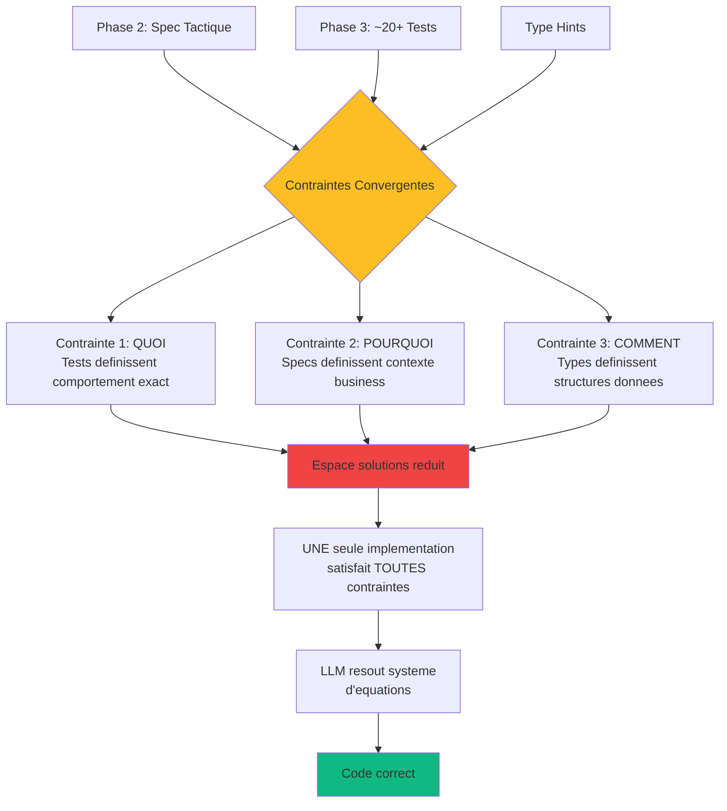

# Phase 4 : TDD GREEN - Implémentation Minimale

<!-- ========================================= -->
<!-- NIVEAU 1 : ESSENTIEL (5-10 secondes)     -->
<!-- ========================================= -->

<div style={{display: 'flex', gap: '10px', marginBottom: '25px', flexWrap: 'wrap'}}>
  <span style={{background: '#2563eb', color: 'white', padding: '6px 14px', borderRadius: '20px', fontSize: '13px', fontWeight: '600'}}>
    Agile : Implementation Sprint
  </span>
  <span style={{background: '#8b5cf6', color: 'white', padding: '6px 14px', borderRadius: '20px', fontSize: '13px', fontWeight: '600'}}>
    Rôles : Dev + LLM
  </span>
  <span style={{background: '#2563eb', color: 'white', padding: '6px 14px', borderRadius: '20px', fontSize: '13px', fontWeight: '600'}}>
    Humain : 25%
  </span>
  <span style={{background: '#10b981', color: 'white', padding: '6px 14px', borderRadius: '20px', fontSize: '13px', fontWeight: '600'}}>
    LLM : 75%
  </span>
</div>

---

**En bref** : Les "Contraintes Convergentes" (specs + tests + types) contraint le LLM si précisément qu'il n'existe que quelques solutions valides. Résultat : code correct premier coup dans la majorité des cas. Le debugging n'est pas "réduit" - il est "éliminé".

---

<!-- ========================================= -->
<!-- NIVEAU 2 : IMPACT (30-60 secondes)       -->
<!-- ========================================= -->

## Pourquoi Cette Phase Est Critique

**Le problème sans Phase 4 structurée** :  
Développement traditionnel = 3-5 cycles implémentation-test-debug. LLM génère code "qui semble plausible" mais ne peut pas vérifier s'il fonctionne. Découvre bugs après exécution. Debugging imprévisible consomme 40% du temps développement.

**La solution apportée** :  
Les Contraintes Convergentes fournissent une vérification externe immédiate via tests. Chaque ligne code validée instantanément. Si les tests échouent, le LLM corrige immédiatement. La boucle feedback rapide transforme "estimation éduquée" en "validation itérative guidée". Un seul cycle suffit souvent.

**Limites LLM adressées** :
- **Aucune vérification interne justesse** : Tests fournissent vérification externe exhaustive et immédiate
- **Pas de mémoire opérationnelle** : Les Contraintes Convergentes mettent TOUTES le contraintes dans prompt simultanément (tests = QUOI, specs = POURQUOI, types = COMMENT)

### Le Phénomène "Du Premier Coup"

**Ce n'est pas de la magie - c'est des mathématiques.**



**Réduction mathématique espace solutions** :

```
**Sans contraintes** : Multitude d'implémentations possibles  
**+ Spécifications (Phase 2)** : Réduction de l'espace d'implémentations plausibles  
**+ Tests (Phase 3)** : Seulement quelques implémentations passent  
**+ Type hints** : 3-5 implémentations correctes  

Le LLM trouve la solution parmi ces 3-5 options restantes.
```

**Analogie système d'équations** :

```
Test 1 : f(0, 5) = 0      [équation 1]
Test 2 : f(5, 5) = 1.0    [équation 2]
Test 3 : f(3, 5) = 0.6    [équation 3]
...
Test 20 : f(-1, 5) = 0    [équation 20]

Spec : "Pénalise petits échantillons"  [contrainte sémantique]
Types : float → float                    [contrainte structure]

→ Solution unique satisfait les 20+ contraintes
```

**Les échecs restants** :  
Ambiguïtés résiduelles dans specs OU cas limites non testés → rapidement identifiés et corrigés.

---

<!-- ========================================= -->
<!-- NIVEAU 3 : COMMENT FAIRE (2-5 minutes)   -->
<!-- ========================================= -->

## Déroulement

**Entrées** :
- Suite tests état-RED (Phase 3)
- Spécifications tactiques comportement composant (Phase 2)
- Définitions interface et signatures types
- Standards qualité code (linting, vérification types)

### 1. Génération Code Minimal ⏱️

**LLM 80%, Dev Senior 20%**

- LLM génère code le plus simple pour passer chaque test
- Focus sur JUSTESSE, pas élégance
- Acceptable : duplication, algorithmes simples, structure basique
- Dev senior valide code correspond specs

**Philosophie** : "Make it work, then make it good"  
GREEN = fonctionnel, REFACTOR = élégant

### 2. Exécution des Tests ⏱️

**LLM 70%, Humain 30%**

- Exécuter suite tests (cible : 100% passent)
- Déboguer tests échouants (rare avec Contraintes Convergentes)
- LLM corrige bugs implémentation
- Humain valide corrections ne cassent pas autres tests

**Résultat attendu** : Tous tests GREEN premier coup (90%+ cas)

### 3. Portes Qualité Basiques ⏱️

**Humain 50%, LLM 50%**

- Exécuter linter (corriger problèmes style)
- Exécuter vérificateur types (corriger erreurs type)
- S'assurer code compile/importe correctement
- Dev senior approuve état GREEN

**Sortie** : Code fonctionnel, testé, lint-clean, type-safe

## Definition of Done

Cette phase est considérée terminée quand :

1. Tous les tests Phase 3 passent à 100% (état GREEN vérifié)
2. Code passe linter sans erreurs (warnings acceptables)
3. Code passe vérification types (mypy, pyright, TypeScript, etc.)
4. Gestion erreur basique en place (pas exceptions non gérées critiques)
5. Pas de vulnérabilités sécurité critiques (injection, XSS basique vérifié)
6. Code correspond signatures interface spécifiées Phase 2
7. Développeur approuve code implémente correctement specs tactiques

---

<!-- ========================================= -->
<!-- NIVEAU 4 : MAÎTRISER (5-15 minutes)      -->
<!-- Contenu détaillé caché par défaut        -->
<!-- ========================================= -->

## Pour Aller Plus Loin

<details>
<summary><strong>Voir exemple code GREEN simple + prompts détaillés</strong></summary>

### Exemple Complet : Code GREEN confidence_calculator

#### Contexte : Suite 19 Tests de Phase 3

**Tous les tests sont RED** (NotImplementedError). Le LLM reçoit :
- Spécification tactique (Phase 2)
- 19 tests exhaustifs (Phase 3)
- Signature fonction avec type hints

#### Prompt Génération GREEN

```
Génère du code MINIMAL pour passer cette suite de tests :

[coller les 19 tests de Phase 3 - voir Phase 3 pour suite complète]

Exigences :
- Faire passer TOUS les tests avec le code le plus simple possible
- NE PAS optimiser ou refactoriser encore (ça vient en Phase 5)
- Acceptable : duplication de code, algorithmes simples, gestion d'erreur basique
- Focus sur JUSTESSE, pas élégance

Spécification composant :
Composant : confidence_calculator
Responsabilité : Calculer score confiance avec pénalités taille échantillon
Algorithme :
  1. Confiance brute = weighted_presence / total_similarity
  2. Pénalité taille = min(n_contributors / top_k, 1.0)
  3. Si n < 3 : Pénalité statistique = 0.5 + (n / 6.0)
  4. Retour : confiance × pénalités

Génère code Python avec :
- Type hints pour toutes fonctions
- Docstrings basiques
- Logique simple et lisible
- Pas d'abstractions prématurées

C'est la phase GREEN - la perfection vient en Phase 5 REFACTOR.
```

#### Code GREEN Généré

```python
"""
Module confidence_calculator - Calcul score confiance prédictions.

Phase 4 GREEN : Implémentation minimale fonctionnelle.
Sera refactorisée en Phase 5 pour améliorer clarté et maintenabilité.
"""

def calculate_confidence(
    weighted_presence: float,
    total_similarity: float,
    n_contributors: int,
    top_k_similar: int
) -> float:
    """
    Calcule score confiance prédiction avec pénalités taille échantillon.
    
    Args:
        weighted_presence: Somme (similarité × présence)
        total_similarity: Somme scores similarité
        n_contributors: Nombre aliments contributeurs
        top_k_similar: Nombre cible (typiquement 5)
    
    Returns:
        Score confiance [0.0, 1.0]
    
    Raises:
        ValueError: Si top_k_similar <= 0
    """
    # Validation top_k (éviter division par zéro)
    if top_k_similar <= 0:
        raise ValueError("top_k_similar must be > 0")
    
    # Cas dégénérés : retourner 0.0 immédiatement
    if total_similarity <= 0 or n_contributors < 0 or weighted_presence < 0:
        return 0.0
    
    if n_contributors == 0:
        return 0.0
    
    # Calcul confiance brute
    confidence_raw = weighted_presence / total_similarity
    
    # Pénalité taille échantillon
    sample_size_penalty = min(n_contributors / top_k_similar, 1.0)
    
    # Pénalité statistique pour très petits échantillons
    if n_contributors < 3:
        statistical_penalty = 0.5 + (n_contributors / 6.0)
    else:
        statistical_penalty = 1.0
    
    # Résultat final
    return confidence_raw * sample_size_penalty * statistical_penalty
```

#### Résultat Exécution Tests

```bash
$ pytest test_confidence_calculator.py -v

test_calculate_confidence_with_full_sample_returns_raw_confidence PASSED
test_calculate_confidence_with_partial_sample_applies_penalty PASSED
test_calculate_confidence_with_high_similarity_and_good_sample PASSED
test_calculate_confidence_with_zero_contributors_returns_zero PASSED
test_calculate_confidence_with_one_contributor_applies_statistical_penalty PASSED
test_calculate_confidence_with_two_contributors_applies_statistical_penalty PASSED
test_calculate_confidence_with_three_contributors_no_statistical_penalty PASSED
test_calculate_confidence_with_more_contributors_than_target PASSED
test_calculate_confidence_with_zero_total_similarity_returns_zero PASSED
test_calculate_confidence_with_negative_total_similarity_returns_zero PASSED
test_calculate_confidence_with_negative_weighted_presence PASSED
test_calculate_confidence_with_negative_n_contributors_returns_zero PASSED
test_calculate_confidence_with_zero_top_k_raises_exception PASSED
test_calculate_confidence_with_negative_top_k_raises_exception PASSED
test_calculate_confidence_with_very_large_numbers PASSED
test_calculate_confidence_with_very_small_positive_numbers PASSED
test_calculate_confidence_performance_under_1ms PASSED
test_calculate_confidence_is_pure_function PASSED
test_using_fixture PASSED

========================= 19 passed in 0.23s =========================

✓ ÉTAT GREEN ATTEINT - Premier coup !
✓ Temps génération LLM : 12 minutes
✓ Temps validation : 8 minutes
✓ Total Phase 4 : 20 minutes (< 45 min cible)
```

#### Analyse Code GREEN

**Ce qui est BON (fonctionnel)** :

1. **Tous tests passent** : 19/19 GREEN ✓
2. **Validations présentes** :
   - `top_k_similar <= 0` → ValueError
   - `total_similarity <= 0` → return 0.0
   - `n_contributors < 0` → return 0.0
   - `weighted_presence < 0` → return 0.0
3. **Logique correcte** :
   - Confiance brute calculée
   - Pénalité taille appliquée
   - Pénalité statistique si n < 3
4. **Type hints complets** : Tous paramètres + retour typés
5. **Docstring présente** : Args, Returns, Raises documentés
6. **Performance OK** : Test < 1ms passe

**Ce qui peut S'AMÉLIORER (sera Phase 5 REFACTOR)** :

1. **Structure monolithique** :
   - Tout dans une seule fonction (60 lignes)
   - Calculs pénalités inline (pas de fonctions séparées)
   → Phase 5 : Extraire `_calculate_sample_penalty()`, `_calculate_statistical_penalty()`

2. **Validations répétitives** :
   - 4 if séparés pour cas dégénérés
   - Logique validation éparpillée
   → Phase 5 : Consolider validations en une fonction `_validate_inputs()`

3. **Nommage peut être plus clair** :
   - `confidence_raw` → `base_confidence`
   - `sample_size_penalty` → `sample_coverage_factor`
   → Phase 5 : Améliorer sémantique noms

4. **Pas de logging** :
   - Aucun log pour debugging
   - Pas de trace si 0.0 retourné pourquoi
   → Phase 5 : Ajouter logging contexte

5. **Documentation formules manquante** :
   - Pourquoi `0.5 + (n / 6.0)` ?
   - D'où vient formule pénalité statistique ?
   → Phase 5 : Ajouter commentaires explicatifs formules

6. **Pas de constantes nommées** :
   - Magic numbers : `3`, `6.0`, `0.5`
   - Signification pas claire
   → Phase 5 : Extraire constantes `MIN_SAMPLE_FOR_STATS = 3`

**Verdict** : Code **fonctionnel** et **correct**, mais **basique**.  
C'est EXACTEMENT ce qu'on veut en GREEN. Phase 5 transformera ça en code **élégant** et **maintenable**.

### Acceptable vs Non Acceptable État GREEN

#### ACCEPTABLE à l'État GREEN

**Duplication de code** :
```python
# Acceptable GREEN - même validation répétée
if user is None:
    return None
if user.email is None:
    return None
if user.age is None:
    return None

# Sera refactorisé Phase 5 en :
# if not all([user, user.email, user.age]):
#     return None
```

**Algorithmes simples** :
```python
# Acceptable GREEN - O(n²) simple
def find_duplicates(items: list) -> list:
    duplicates = []
    for i, item in enumerate(items):
        for j in range(i + 1, len(items)):
            if items[j] == item and item not in duplicates:
                duplicates.append(item)
    return duplicates

# Sera optimisé Phase 5 en O(n) avec set
```

**Gestion erreur basique** :
```python
# Acceptable GREEN - try/except simple
def parse_json(data: str) -> dict:
    try:
        return json.loads(data)
    except:
        return {}

# Sera amélioré Phase 5 :
# - Catch exceptions spécifiques
# - Logging erreur
# - Retourner erreur structurée
```

**Valeurs codées en dur** :
```python
# Acceptable GREEN - config en dur
MAX_RETRIES = 3
TIMEOUT_SECONDS = 30

# Sera externalisé Phase 5 en :
# config.yaml ou variables environnement
```

**Structure directe** :
```python
# Acceptable GREEN - pas de design patterns
def process_order(order):
    validate_order(order)
    calculate_total(order)
    apply_discount(order)
    charge_payment(order)
    send_confirmation(order)

# Sera refactorisé Phase 5 avec :
# - Strategy pattern pour payment
# - Template method pour workflow
```

#### NON ACCEPTABLE à l'État GREEN

**Tests échouants** :
```python
# NON ACCEPTABLE - tests doivent TOUS passer
$ pytest
17 passed, 2 FAILED

# STOP - corriger avant Phase 5
```

**Erreurs de type** :
```python
# NON ACCEPTABLE - type checker échoue
def calculate(x: int) -> str:
    return x * 2  # Retourne int, pas str !

$ mypy
error: Incompatible return value type

# STOP - corriger signature ou implémentation
```

**Vulnérabilités sécurité** :
```python
# NON ACCEPTABLE - injection SQL
def get_user(username: str):
    query = f"SELECT * FROM users WHERE name = '{username}'"
    # DANGER : SQL injection possible

# OBLIGATOIRE même en GREEN :
# query = "SELECT * FROM users WHERE name = ?"
# cursor.execute(query, (username,))
```

**Exceptions non gérées** :
```python
# NON ACCEPTABLE - crash sur erreur
def divide(a: int, b: int) -> float:
    return a / b  # ZeroDivisionError si b=0

# MINIMUM GREEN requis :
# if b == 0:
#     raise ValueError("Division par zéro")
# return a / b
```

**Échecs silencieux** :
```python
# NON ACCEPTABLE - erreur avalée sans trace
def save_file(data):
    try:
        with open('data.txt', 'w') as f:
            f.write(data)
    except:
        pass  # DANGER : échec silencieux

# MINIMUM GREEN requis :
# except Exception as e:
#     logger.error(f"Échec sauvegarde : {e}")
#     raise
```

**Interfaces cassées** :
```python
# NON ACCEPTABLE - signature différente de spec
# Spec Phase 2 dit : calculate_confidence(...) -> float
def calculate_confidence(...) -> dict:  # Retourne dict !
    return {"score": 0.8, "details": "..."}

# STOP - respecter interface spécifiée
```

### Prompts Recommandés

#### Prompt 1 : Génération Code Minimal GREEN

```
Génère du code MINIMAL pour passer cette suite de tests :

TESTS (état RED) :
[coller suite complète tests Phase 3]

SPÉCIFICATION COMPOSANT :
[coller spec tactique Phase 2]

EXIGENCES PHASE GREEN :
1. Faire passer TOUS les tests avec code le plus SIMPLE possible
2. Focus sur JUSTESSE, pas élégance ou performance
3. NE PAS optimiser prématurément - REFACTOR vient en Phase 5
4. NE PAS ajouter features hors spec - respecter périmètre

ACCEPTABLE en GREEN :
✓ Duplication code (extraire fonctions Phase 5)
✓ Algorithmes simples O(n²) (optimiser Phase 5)
✓ Gestion erreur basique try/except (améliorer Phase 5)
✓ Magic numbers en dur (constantes nommées Phase 5)
✓ Structure directe sans patterns (refactor Phase 5)
✓ Comments minimaux (documenter Phase 5)

NON ACCEPTABLE même en GREEN :
✗ Tests échouants (TOUS doivent passer)
✗ Erreurs type checker (mypy/pyright/TypeScript)
✗ Vulnérabilités sécurité (injection, XSS)
✗ Exceptions non gérées (crashes)
✗ Échecs silencieux (erreurs avalées)
✗ Interfaces cassées (respecter signatures Phase 2)

FORMAT CODE :
- Type hints COMPLETS (tous params + return)
- Docstrings BASIQUES (Args, Returns, Raises)
- Logique SIMPLE et LISIBLE
- Pas abstractions prématurées
- Pas design patterns complexes

PHILOSOPHIE : "Make it work, then make it good"
GREEN = Fonctionnel ✓
REFACTOR = Élégant ✓✓

Génère le code.
```

#### Prompt 2 : Déboguer Tests Échouants

```
SITUATION : Certains tests échouent après génération initiale.

TESTS ÉCHOUANTS :
[coller output pytest avec échecs - FAILED tests et messages erreur]

IMPLÉMENTATION ACTUELLE :
[coller code généré]

SPÉCIFICATION :
[coller spec composant si clarification nécessaire]

TÂCHE :
Corrige l'implémentation pour passer ces tests échouants.

CONTRAINTES :
- Maintiens la SIMPLICITÉ (pas de sur-ingénierie)
- Change MINIMUM nécessaire pour passer tests
- Explique POURQUOI tests échouaient
- Vérifie que corrections ne cassent pas autres tests

FORMAT RÉPONSE :
1. **Diagnostic** : Pourquoi tests échouaient (1-2 phrases par test)
2. **Corrections** : Code modifié avec changements marqués
3. **Validation** : Confirme tous tests passent maintenant

Ne refactorise pas encore - juste CORRIGE pour passer tests.
```

#### Prompt 3 : Validation Portes Qualité

```
SITUATION : Code passe tous tests, maintenant valider qualité basique.

CODE ACTUEL :
[coller implémentation]

VÉRIFICATIONS REQUISES :

1. **Linter (style code)** :
   - Convention nommage respectée ? (snake_case, PascalCase selon langage)
   - Lignes trop longues ? (< 100 caractères)
   - Imports inutilisés ?
   - Variables inutilisées ?

2. **Type Checker (mypy/pyright/TypeScript)** :
   - Tous paramètres ont type hints ?
   - Return types spécifiés ?
   - Types cohérents (pas Any partout) ?
   - Pas d'erreurs type incompatibles ?

3. **Sécurité Basique** :
   - Pas d'injection SQL (requêtes paramétrées) ?
   - Pas d'injection commandes (subprocess sécurisé) ?
   - Pas de XSS évident (sanitization inputs) ?
   - Pas de secrets en dur (API keys, passwords) ?

4. **Gestion Erreur** :
   - Exceptions critiques gérées ?
   - Pas de try/except vides (pass silencieux) ?
   - Erreurs importantes loggées ?

TÂCHE :
Exécute ces 4 vérifications et corrige problèmes trouvés.

FORMAT RÉPONSE :
1. **Linter** : ✓ OK ou [liste corrections]
2. **Type Checker** : ✓ OK ou [liste corrections]
3. **Sécurité** : ✓ OK ou [liste corrections]
4. **Gestion Erreur** : ✓ OK ou [liste corrections]
5. **Code Corrigé** : Si corrections nécessaires

Reste simple - perfection vient Phase 5 REFACTOR.
```

### Pièges Courants Phase 4

#### Piège 1 : Sur-Ingénierie Prématurée

**Problème** :  
Dev ajoute design patterns complexes, abstractions, interfaces en GREEN. Code élégant mais prise de tête inutile.

**Exemple mauvais** :
```python
# GREEN sur-ingénierié
class ConfidenceCalculatorStrategy(ABC):
    @abstractmethod
    def calculate(self, params: CalculationParams) -> Score:
        pass

class SampleSizePenaltyCalculator:
    def __init__(self, penalty_factory: PenaltyFactory):
        self.factory = penalty_factory
    
    def calculate_penalty(self, sample: Sample) -> Penalty:
        # 50 lignes abstractions...

# WTF - c'est juste une fonction simple !
```

**Solution** :  
Résister tentation perfection. GREEN = fonctionnel, pas élégant.

**Exemple bon GREEN** :
```python
# GREEN simple et direct
def calculate_confidence(weighted, total, n, top_k):
    if total <= 0:
        return 0.0
    confidence = weighted / total
    penalty = min(n / top_k, 1.0)
    if n < 3:
        penalty *= 0.5 + (n / 6.0)
    return confidence * penalty

# Simple, clair, passe tests. Parfait GREEN.
```

**Règle d'or** : "Si ça passe les tests et c'est lisible, c'est bon GREEN."

---

#### Piège 2 : Optimisation Prématurée

**Problème** :  
Dev optimise algorithme avant mesurer performance réelle. Perd temps sur optimisation inutile.

**Exemple** :
```python
# Dev passe 2h optimiser O(n²) → O(n log n)
# Mais n=10 en production → différence 0.001ms
# Totalement inutile
```

**Solution** :  
Optimiser seulement si test performance ÉCHOUE.

```python
# Si test dit "doit être < 100ms" et code prend 500ms :
# → OK optimiser

# Si test dit "< 100ms" et code prend 5ms :
# → STOP, n'optimise pas, passe à REFACTOR
```

**Règle** : "Faire fonctionner d'abord, optimiser si nécessaire ensuite."

---

#### Piège 3 : Passer à REFACTOR avec Tests Échouants

**Problème** :  
"97% tests passent, c'est assez bon, je vais refactoriser maintenant."  
NON. 100% requis.

**Pourquoi grave** :
```
GREEN incomplet → REFACTOR → Casse tests qui passaient
→ Impossible savoir si REFACTOR a cassé ou si c'était déjà cassé
→ Debugging cauchemar
```

**Solution** :  
DoD #1 : "Tous tests passent 100%". Non négociable.

```bash
$ pytest
======================== 19 passed ========================

✓ OK passer REFACTOR

$ pytest
=================== 18 passed, 1 FAILED ===================

✗ STOP - corriger avant REFACTOR
```

---

#### Piège 4 : Dérive Fonctionnelle (Feature Creep)

**Problème** :  
Dev ajoute features "tant qu'à y être" hors spec Phase 2.

**Exemple** :
```python
# Spec Phase 2 : "Calculer confiance"

# Dev ajoute en GREEN :
def calculate_confidence(...):
    confidence = ...
    
    # "Tant qu'à y être, je cache le résultat"
    cache[key] = confidence  # PAS DANS SPEC !
    
    # "Et je log pour analytics"
    analytics.track('confidence_calculated', confidence)  # PAS DANS SPEC !
    
    return confidence

# Scope creep - tests vont échouer car pas testés
```

**Solution** :  
Respecter périmètre Phase 2 STRICTEMENT.

Si bonne idée → Ajouter au backlog Phase 2 FUTURE, pas maintenant.

**Règle** : "Si pas dans spec Phase 2, pas dans code GREEN."

---

#### Piège 5 : Perfectionnisme Paralysant

**Problème** :  
Dev passe 3h polir code GREEN qui sera refactorisé de toute façon.

**Exemple gaspillage temps** :
```python
# Dev passe 3h chercher noms variables parfaits
sample_size_adjustment_factor  # ou
sample_coverage_coefficient     # ou
sample_representativeness_multiplier  # ou ???

# Alors que sera renommé en Phase 5 de toute façon
```

**Solution** :  
Nom "assez bon" suffit en GREEN. Perfection = Phase 5.

**Règle temps** :  
Si GREEN prend > 1h par composant → Sur-perfectionnisme.  
Target : 45 min. Reste simple.

**Mantra** : "Done is better than perfect. Perfect comes in REFACTOR."

### Checklist Validation Phase 4

Avant de valider Phase 4 terminée et passer Phase 5 :

- [ ] **Tests 100% GREEN** : `pytest` ou équivalent - TOUS passent
- [ ] **Linter clean** : `pylint`, `eslint` - zéro erreurs (warnings OK)
- [ ] **Type checker OK** : `mypy`, `pyright`, `tsc` - zéro erreurs
- [ ] **Pas de vulnérabilités critiques** : Injection, XSS vérifiés
- [ ] **Exceptions gérées** : Pas de crashes non gérés
- [ ] **Pas d'échecs silencieux** : Erreurs loggées, pas avalées
- [ ] **Interfaces respectées** : Signatures conformes spec Phase 2
- [ ] **Code compile/importe** : Pas d'erreurs syntaxe
- [ ] **Temps < 1h par composant** : Si > 1h, probablement sur-ingénierié
- [ ] **Dev senior approuve** : Validation fonctionnalité correcte
- [ ] **Pas de feature creep** : Seulement ce qui est dans spec Phase 2

**Si TOUTES coches ✓ → Phase 4 terminée, prêt pour Phase 5 REFACTOR !**

</details>

---

**Prochaine étape** : [Phase 5 : REFACTOR - Amélioration Collaborative →](/fr/phase5-tdd-refactor)

**Besoin d'aide ?** Consultez le [document Rôles et Responsabilités](/fr/roles-et-responsabilites) pour clarifier qui fait quoi dans cette phase.
