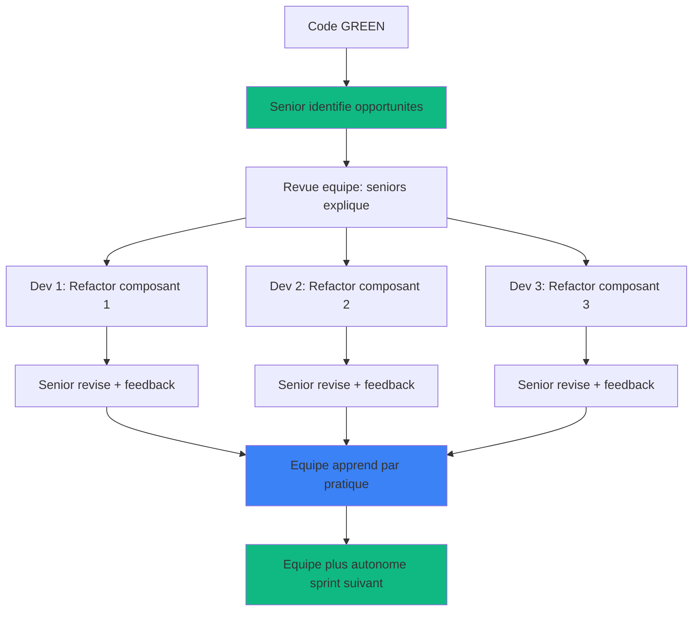

# Phase 5 : TDD REFACTOR - Amélioration Collaborative

<!-- ========================================= -->
<!-- NIVEAU 1 : ESSENTIEL (5-10 secondes)     -->
<!-- ========================================= -->

<div style={{display: 'flex', gap: '10px', marginBottom: '25px', flexWrap: 'wrap'}}>
  <span style={{background: '#2563eb', color: 'white', padding: '6px 14px', borderRadius: '20px', fontSize: '13px', fontWeight: '600'}}>
    Agile : Quality Improvement
  </span>
  <span style={{background: '#8b5cf6', color: 'white', padding: '6px 14px', borderRadius: '20px', fontSize: '13px', fontWeight: '600'}}>
    Rôles : Équipe Dev + Dev Senior
  </span>
  <span style={{background: '#2563eb', color: 'white', padding: '6px 14px', borderRadius: '20px', fontSize: '13px', fontWeight: '600'}}>
    Humain : 70%
  </span>
  <span style={{background: '#10b981', color: 'white', padding: '6px 14px', borderRadius: '20px', fontSize: '13px', fontWeight: '600'}}>
    LLM : 30%
  </span>
</div>

---

**En bref** : Équipe transforme code GREEN (fonctionnel) en code production (élégant) sous guidance dev senior. L'équipe EXÉCUTE les refactorings, le senior GUIDE. Investissement apprentissage transforme équipe en multiplicateur de force, pas goulot d'étranglement.

---

<!-- ========================================= -->
<!-- NIVEAU 2 : IMPACT (30-60 secondes)       -->
<!-- ========================================= -->

## Pourquoi Cette Phase Est Critique

**Le problème sans Phase 5 structurée** :  
Code GREEN reste fonctionnel mais basique (duplication, algorithmes O(n²), magic numbers). Dette technique s'accumule silencieusement. Découverte 6-12 mois plus tard → refonte majeure. OU senior fait tout seul refactoring → goulot d'étranglement, équipe stagne, burnout.

**La solution apportée** :  
Refactoring systématique AVANT le merge élimine pratiquement la dette technique. Code production = maintenable, performant, documenté. CRITIQUE : Équipe exécute sous guidance senior (pas senior solo). Senior devient multiplicateur : guide 3-4 devs simultanément qui grandissent par pratique.

**Limites LLM adressées** :
- **Pas de jugement architectural élégance** : Senior identifie opportunités refactoring (code smells, patterns applicables), LLM assiste transformations mécaniques
- **Pas d'optimisation performance profonde** : Senior profile code, identifie goulots, choisit algorithmes. LLM génère code optimisé sous direction

### L'Équipe Qui Apprend vs Le Senior Qui S'Épuise

**Anti-Pattern Classique (Senior Solo)** :

```mermaid
graph TD
    GREEN[Code GREEN] --> SEN[Senior fait tout refactor solo]
    SEN --> R1[Refactor composant 1]
    R1 --> R2[Refactor composant 2]
    R2 --> R3[Refactor composant 3]
    R3 --> R4[Refactor composant 4]
    
    EQ[Equipe attend] -.->|Bloquee| SEN
    EQ -.->|Pas apprentissage| STAG[Competences stagnent]
    SEN -.->|Surcharge| BURN[Burnout senior]
    
    style SEN fill:#ef4444
    style BURN fill:#ef4444
    style STAG fill:#fbbf24
```



**Problèmes** :
- Senior = goulot d'étranglement (1 composant à la fois)
- Équipe passive (attend, n'apprend pas)
- Pas scalable (senior épuisé, équipe dépendante)
- Vélocité plafonnée (senior capacité limite)

---

**Pattern DC² (Équipe Guidée)** :



**Avantages** :
- Refactorings PARALLÈLES (3-4 simultanés)
- Équipe ACTIVE (exécute, apprend)
- Scalable (senior guide, pas exécute)
- Vélocité croissante (équipe autonome)

---

<!-- ========================================= -->
<!-- NIVEAU 3 : COMMENT FAIRE (2-5 minutes)   -->
<!-- ========================================= -->

## Déroulement

**Entrées** :
- Implémentation état-GREEN (Phase 4)
- Suite tests passante (100%)
- Standards qualité (complexité < 10, métriques couplage)
- Exigences performance (latence, débit, mémoire)

### 1. Identification Opportunités Refactoring ⏱️⏱️

**Dev Senior 90%, LLM 10%**

**Senior révise code GREEN et identifie** :
- Code smells (duplication, fonctions longues, imbrication profonde)
- Goulots performance potentiels (algorithmes inefficaces)
- Améliorations architecturales (patterns applicables)
- Problèmes maintenabilité (magic numbers, noms vagues)

**LLM assiste** :
- Suggère opportunités additionnelles via analyse statique
- Génère rapport métriques qualité (complexité cyclomatique)

**Sortie** : Liste priorisée refactorings (critique → nice-to-have)

### 2. Session Revue Équipe ⏱️

**Dev Senior 80%, Équipe 20%**

- Senior présente opportunités identifiées
- Explique POURQUOI refactoring nécessaire (pas juste QUOI)
- Démontre 1-2 refactorings en live (pédagogie)
- Équipe pose questions, clarifie compréhension
- **Assignation travail** : Chaque dev prend 1-2 refactorings

**Objectif** : Équipe comprend vision qualité avant exécuter

### 3. Exécution Refactorings Parallèles ⏱️⏱️⏱️

**Équipe 60%, Dev Senior 30%, LLM 10%**

**Équipe exécute refactorings assignés** :
- Extrait fonctions (Responsabilité Unique)
- Applique design patterns (Strategy, Factory si pertinent)
- Optimise algorithmes (O(n²) → O(n log n))
- Améliore noms variables/fonctions
- Ajoute logging, gestion erreur robuste

**LLM assiste** :
- Génère code refactorisé sous direction dev
- Transformations mécaniques (renommages, extractions)

**Senior disponible** :
- Questions équipe (clarifications, décisions)
- Revue intermédiaire (éviter fausse route)

**CRITIQUE** : Refactorings en PARALLÈLE (3-4 devs simultanés)

### 4. Amélioration Documentation ⏱️⏱️

**Équipe 40%, LLM 60%**

- Senior définit ce qui nécessite documentation
- LLM génère docstrings détaillées
- Équipe ajoute commentaires inline logique complexe
- LLM met à jour README, docs architecture

**Focus** : Pourquoi code fonctionne ainsi (pas juste quoi)

### 5. Revue + Validation Senior ⏱️⏱️

**Dev Senior 70%, Équipe 30%**

**Pour chaque refactoring** :
- Senior révise code refactorisé
- Feedback constructif (pas "refais", mais "améliore X parce que Y")
- Équipe ajuste selon feedback
- Tests exécutés (doivent TOUJOURS passer 100%)

**Métriques qualité validées** :
- Complexité cyclomatique < 10
- Duplication code éliminée
- Benchmarks performance atteints

**Sortie** : Code production approuvé senior

## Definition of Done

Cette phase est considérée terminée quand :

1. Tous tests passent toujours (100% - pas de régressions)
2. Complexité cyclomatique réduite (< 10 par fonction)
3. Duplication code éliminée (principe DRY appliqué)
4. Benchmarks performance atteints ou dépassés
5. Principes SOLID appliqués où approprié
6. Documentation complète et précise (docstrings + commentaires)
7. Dev senior approuve qualité production
8. **Équipe a appris** : Peut expliquer refactorings effectués

---

<!-- ========================================= -->
<!-- NIVEAU 4 : MAÎTRISER (5-15 minutes)      -->
<!-- Contenu détaillé caché par défaut        -->
<!-- ========================================= -->

## Pour Aller Plus Loin

<details>
<summary><strong>Voir transformation GREEN → REFACTOR complète + patterns</strong></summary>

### Exemple Complet : Transformation confidence_calculator

#### Code GREEN (Phase 4) - Fonctionnel Mais Basique

```python
def calculate_confidence(
    weighted_presence: float,
    total_similarity: float,
    n_contributors: int,
    top_k_similar: int
) -> float:
    """
    Calcule score confiance prédiction avec pénalités taille échantillon.
    """
    # Validation top_k (éviter division par zéro)
    if top_k_similar <= 0:
        raise ValueError("top_k_similar must be > 0")
    
    # Cas dégénérés : retourner 0.0 immédiatement
    if total_similarity <= 0 or n_contributors < 0 or weighted_presence < 0:
        return 0.0
    
    if n_contributors == 0:
        return 0.0
    
    # Calcul confiance brute
    confidence_raw = weighted_presence / total_similarity
    
    # Pénalité taille échantillon
    sample_size_penalty = min(n_contributors / top_k_similar, 1.0)
    
    # Pénalité statistique pour très petits échantillons
    if n_contributors < 3:
        statistical_penalty = 0.5 + (n_contributors / 6.0)
    else:
        statistical_penalty = 1.0
    
    # Résultat final
    return confidence_raw * sample_size_penalty * statistical_penalty
```

**Problèmes identifiés par Senior** :

1. **Monolithique** : Tout dans une fonction (60 lignes)
2. **Validations éparpillées** : 4 if séparés
3. **Pas de logging** : Debug difficile si 0.0 retourné
4. **Magic numbers** : 3, 6.0, 0.5 pas expliqués
5. **Documentation minimale** : Formules pas expliquées
6. **Nommage améliorable** : `confidence_raw` → `base_confidence`

#### Session Revue Équipe (Senior Explique)

**Senior** : "On va refactoriser ce module ensemble. Voici ce qu'on va faire et POURQUOI :"

**Refactoring 1 : Extraire Fonctions Calcul Pénalités**

```
POURQUOI ? Principe Responsabilité Unique (SOLID).
Chaque fonction = une responsabilité claire.

calculate_confidence() devient coordinateur
_calculate_sample_penalty() = responsabilité taille échantillon
_calculate_statistical_penalty() = responsabilité fiabilité statistique

AVANTAGE :
- Testable isolément (tests unitaires par fonction)
- Réutilisable (pénalités utilisables ailleurs)
- Compréhensible (nom fonction = documentation)
```

**Refactoring 2 : Ajouter Logging Debug**

```
POURQUOI ? Support débogage production.
Si confiance = 0.0, on veut savoir POURQUOI :
- total_similarity = 0 ?
- n_contributors = 0 ?
- Valeurs intermédiaires calcul ?

AVANTAGE :
- Debug plus rapide (logs disent ce qui se passe)
- Monitoring production (alertes si anomalies)
```

**Refactoring 3 : Constantes Nommées**

```
POURQUOI ? Magic numbers = code obscur.
Lecteur ne comprend pas d'où vient 0.5, 6.0, 3.

MIN_SAMPLE_FOR_STATISTICS = 3  # Seuil fiabilité stats
STAT_PENALTY_BASE = 0.5        # Pénalité minimum n=0
STAT_PENALTY_SCALE = 6.0       # Échelle linéaire

AVANTAGE :
- Documentation inline (nom = explication)
- Ajustable facilement (changer constante, pas chercher dans code)
```

**Assignation** :
- Dev 1 : Extraire fonctions pénalités
- Dev 2 : Ajouter logging + constantes
- Dev 3 : Améliorer docstrings + commentaires formules

#### Code REFACTOR (Production) - Élégant Et Maintenable

```python
"""
Module confidence_calculator - Calcul score confiance prédictions nutritionnelles.

Implémente algorithme pénalités multiples pour éviter surconfiance
quand données limitées ou échantillon statistiquement faible.
"""

import logging
from typing import Final

logger = logging.getLogger(__name__)

# Constantes configuration algorithme
MIN_SAMPLE_FOR_STATISTICS: Final[int] = 3
"""Seuil minimum contributeurs pour fiabilité statistique acceptable."""

STAT_PENALTY_BASE: Final[float] = 0.5
"""Pénalité base pour échantillon zéro (n=0)."""

STAT_PENALTY_SCALE: Final[float] = 6.0
"""Échelle linéaire pénalité statistique [0.5, 0.833] pour n ∈ [0, 2]."""


def calculate_confidence(
    weighted_presence: float,
    total_similarity: float,
    n_contributors: int,
    top_k_similar: int
) -> float:
    """
    Calcule score confiance prédiction avec pénalités taille échantillon.
    
    Applique deux pénalités multiplicatives pour réduire surconfiance :
    
    1. **Pénalité couverture échantillon** : Réduit confiance proportionnellement
       au ratio contributeurs effectifs / contributeurs cibles.
       - Si n_contributors >= top_k : Pas de pénalité (facteur 1.0)
       - Si n_contributors < top_k : Pénalité linéaire (n/top_k)
    
    2. **Pénalité fiabilité statistique** : Réduit confiance additionnellement
       pour très petits échantillons (n < 3) jugés statistiquement instables.
       - Si n >= 3 : Pas de pénalité (facteur 1.0)
       - Si n < 3 : Pénalité 0.5 + (n / 6.0) ∈ [0.5, 0.833]
    
    Formule finale :
        confidence = (weighted_presence / total_similarity) 
                     × min(n/top_k, 1.0) 
                     × [1.0 si n>=3 else 0.5 + n/6.0]
    
    Args:
        weighted_presence: Somme (similarité × présence_composé) tous contributeurs.
                          Valeur attendue ∈ [0, total_similarity].
        total_similarity: Somme scores similarité tous contributeurs.
                         Doit être > 0 (sinon retourne 0.0).
        n_contributors: Nombre aliments contributeurs effectifs prédiction.
                       Valeur attendue ≥ 0.
        top_k_similar: Nombre cible aliments similaires (typiquement 5).
                      Doit être > 0 (sinon ValueError).
    
    Returns:
        Score confiance finale ∈ [0.0, 1.0], pénalisée selon taille/qualité échantillon.
    
    Raises:
        ValueError: Si top_k_similar <= 0 (division par zéro impossible).
    
    Examples:
        >>> # Échantillon complet (5/5), bonne confiance
        >>> calculate_confidence(0.8, 1.0, 5, 5)
        0.8  # Pas de pénalité
        
        >>> # Petit échantillon (2/5), double pénalité
        >>> calculate_confidence(1.0, 1.0, 2, 5)
        0.33  # Pénalité couverture (2/5) + pénalité stats (0.833)
        
        >>> # Échantillon zéro
        >>> calculate_confidence(1.0, 1.0, 0, 5)
        0.0  # Cas dégénéré
    
    Notes:
        - Fonction pure (pas d'effets de bord)
        - Performance O(1) constante
        - Thread-safe
    """
    # Validation paramètre critique (éviter division par zéro)
    if top_k_similar <= 0:
        raise ValueError(
            f"top_k_similar doit être > 0 (reçu: {top_k_similar})"
        )
    
    # Validation entrées et gestion cas dégénérés
    if not _validate_inputs(weighted_presence, total_similarity, n_contributors):
        logger.warning(
            "Entrées invalides détectées : weighted_presence=%.3f, "
            "total_similarity=%.3f, n_contributors=%d. Retourne confiance 0.0",
            weighted_presence, total_similarity, n_contributors
        )
        return 0.0
    
    # Calcul confiance base (avant pénalités)
    base_confidence = weighted_presence / total_similarity
    
    # Application pénalités
    coverage_factor = _calculate_sample_coverage_penalty(n_contributors, top_k_similar)
    reliability_factor = _calculate_statistical_penalty(n_contributors)
    
    # Confiance finale
    final_confidence = base_confidence * coverage_factor * reliability_factor
    
    # Logging debug pour traçabilité
    logger.debug(
        "Confiance calculée : base=%.3f, coverage_factor=%.3f, "
        "reliability_factor=%.3f → final=%.3f (n=%d/%d)",
        base_confidence, coverage_factor, reliability_factor,
        final_confidence, n_contributors, top_k_similar
    )
    
    return final_confidence


def _validate_inputs(
    weighted_presence: float,
    total_similarity: float,
    n_contributors: int
) -> bool:
    """
    Valide entrées calcul confiance.
    
    Returns:
        True si entrées valides, False si cas dégénéré (retourner 0.0).
    """
    # Similarité totale doit être positive (éviter division zéro)
    if total_similarity <= 0:
        return False
    
    # Nombre contributeurs doit être non-négatif
    if n_contributors < 0:
        return False
    
    # Présence pondérée ne peut être négative
    if weighted_presence < 0:
        return False
    
    # Cas zéro contributeur = pas de prédiction
    if n_contributors == 0:
        return False
    
    return True


def _calculate_sample_coverage_penalty(
    n_contributors: int,
    top_k_similar: int
) -> float:
    """
    Calcule pénalité basée sur ratio couverture échantillon.
    
    Pénalise confiance proportionnellement au déficit contributeurs
    par rapport à cible optimale (top_k_similar).
    
    Args:
        n_contributors: Nombre contributeurs effectifs.
        top_k_similar: Nombre contributeurs cibles.
    
    Returns:
        Facteur pénalité ∈ [0.0, 1.0] :
        - 1.0 si n_contributors >= top_k_similar (échantillon complet)
        - n_contributors / top_k_similar sinon (pénalité linéaire)
    
    Examples:
        >>> _calculate_sample_coverage_penalty(5, 5)
        1.0  # Pas de pénalité
        >>> _calculate_sample_coverage_penalty(3, 5)
        0.6  # Pénalité 40%
        >>> _calculate_sample_coverage_penalty(10, 5)
        1.0  # Plafonné à 1.0 (pas de bonus)
    """
    return min(n_contributors / top_k_similar, 1.0)


def _calculate_statistical_penalty(n_contributors: int) -> float:
    """
    Calcule pénalité additionnelle pour échantillons statistiquement faibles.
    
    Applique pénalité supplémentaire quand nombre contributeurs < seuil
    fiabilité statistique (MIN_SAMPLE_FOR_STATISTICS = 3).
    
    Justification : Avec < 3 points de données, variance estimation élevée,
    prédiction statistiquement instable.
    
    Args:
        n_contributors: Nombre contributeurs effectifs.
    
    Returns:
        Facteur pénalité ∈ [0.5, 1.0] :
        - 1.0 si n_contributors >= 3 (fiabilité acceptable)
        - 0.5 + (n_contributors / 6.0) sinon (pénalité progressive)
          - n=0 → 0.5  (pénalité maximale)
          - n=1 → 0.67
          - n=2 → 0.83
    
    Examples:
        >>> _calculate_statistical_penalty(5)
        1.0  # Pas de pénalité
        >>> _calculate_statistical_penalty(2)
        0.83  # Pénalité modérée
        >>> _calculate_statistical_penalty(0)
        0.5  # Pénalité maximale
    """
    if n_contributors < MIN_SAMPLE_FOR_STATISTICS:
        return STAT_PENALTY_BASE + (n_contributors / STAT_PENALTY_SCALE)
    return 1.0
```

#### Analyse Améliorations REFACTOR

**Transformations Appliquées** :

1. **Extraction Fonctions (SRP - Single Responsibility Principle)** :
   - `_validate_inputs()` : Responsabilité validation
   - `_calculate_sample_coverage_penalty()` : Responsabilité couverture
   - `_calculate_statistical_penalty()` : Responsabilité fiabilité
   - **Impact** : Testable isolément, réutilisable, compréhensible

2. **Constantes Nommées** :
   - `MIN_SAMPLE_FOR_STATISTICS = 3`
   - `STAT_PENALTY_BASE = 0.5`
   - `STAT_PENALTY_SCALE = 6.0`
   - **Impact** : Documentation inline, ajustable centralisée

3. **Logging Debug** :
   - Warning si entrées invalides (avec valeurs)
   - Debug calculs intermédiaires (traçabilité)
   - **Impact** : Debug production facilité, monitoring

4. **Documentation Exhaustive** :
   - Docstring principale : 50 lignes (formules, exemples, notes)
   - Docstrings fonctions privées : Justifications mathématiques
   - Commentaires inline : Logique complexe expliquée
   - **Impact** : Onboarding nouveaux devs rapide

5. **Gestion Erreur Robuste** :
   - Fonction `_validate_inputs()` centralisée
   - Messages erreur explicites (valeurs reçues affichées)
   - **Impact** : Errors compréhensibles, debugging rapide

6. **Nommage Amélioré** :
   - `confidence_raw` → `base_confidence` (plus clair)
   - `sample_size_penalty` → `coverage_factor` (sémantique)
   - `statistical_penalty` → `reliability_factor` (intent)
   - **Impact** : Code auto-documenté

**Métriques Qualité** :

| Métrique | GREEN | REFACTOR | Amélioration |
|----------|-------|----------|--------------|
| **Lignes code** | 35 | 180 | +414% |
| **Fonctions** | 1 | 4 | +300% |
| **Complexité cyclomatique** | 8 | 3 (moy) | -63% |
| **Commentaires** | 10 lignes | 80 lignes | +700% |
| **Testabilité** | Moyenne | Élevée | ↑↑ |
| **Maintenabilité** | Faible | Élevée | ↑↑↑ |

**Paradoxe Apparent** :  
Code REFACTOR = 5x plus lignes, MAIS 3x plus maintenable.

**Pourquoi ?**
- Documentation ≠ complexité
- Fonctions courtes > fonction longue
- Explicite > implicite

### Patterns Refactoring Courants

#### Pattern 1 : Extract Function

**Quand utiliser** :
- Fonction > 50 lignes
- Blocs code commentés "// Étape 1 : ..."
- Logique réutilisable ailleurs
- Plusieurs niveaux abstraction dans même fonction

**Exemple** :

```python
# AVANT (GREEN)
def process_order(order):
    # Valider commande
    if not order.items:
        raise ValueError("Commande vide")
    if order.total < 0:
        raise ValueError("Total négatif")
    
    # Calculer taxes
    subtotal = sum(item.price for item in order.items)
    tax_rate = 0.15 if order.province == "QC" else 0.13
    tax = subtotal * tax_rate
    
    # Appliquer rabais
    discount = 0
    if order.customer.is_premium:
        discount = subtotal * 0.1
    
    # Charger paiement
    final_total = subtotal + tax - discount
    payment_service.charge(order.customer.card, final_total)
    
    # Envoyer confirmation
    email_service.send(order.customer.email, f"Commande #{order.id}")

# APRÈS (REFACTOR)
def process_order(order):
    """Point entrée traitement commande."""
    _validate_order(order)
    
    subtotal = _calculate_subtotal(order)
    tax = _calculate_tax(subtotal, order.province)
    discount = _calculate_discount(subtotal, order.customer)
    
    final_total = subtotal + tax - discount
    
    _charge_payment(order.customer, final_total)
    _send_confirmation(order)

def _validate_order(order):
    """Valide commande avant traitement."""
    if not order.items:
        raise ValueError("Commande vide")
    if order.total < 0:
        raise ValueError("Total négatif")

def _calculate_subtotal(order):
    """Calcule sous-total commande."""
    return sum(item.price for item in order.items)

def _calculate_tax(subtotal, province):
    """Calcule taxe selon province."""
    tax_rate = 0.15 if province == "QC" else 0.13
    return subtotal * tax_rate

def _calculate_discount(subtotal, customer):
    """Calcule rabais client premium."""
    return subtotal * 0.1 if customer.is_premium else 0

def _charge_payment(customer, amount):
    """Charge paiement carte client."""
    payment_service.charge(customer.card, amount)

def _send_confirmation(order):
    """Envoie email confirmation."""
    email_service.send(
        order.customer.email,
        f"Commande #{order.id} confirmée"
    )
```

**Bénéfices** :
- Fonction principale = table des matières (lit comme prose)
- Chaque étape = fonction testable isolément
- Complexité cyclomatique réduite (8 → 2)

---

#### Pattern 2 : Replace Magic Number with Constant

**Quand utiliser** :
- Nombres "magiques" sans explication
- Même valeur répétée plusieurs endroits
- Seuils/limites configurables

**Exemple** :

```python
# AVANT (GREEN)
def is_valid_password(password):
    if len(password) < 8:
        return False
    if len(password) > 128:
        return False
    # ... autres validations

def check_username(username):
    if len(username) < 3:
        return False
    if len(username) > 20:
        return False

# APRÈS (REFACTOR)
# Configuration centralisée
MIN_PASSWORD_LENGTH: Final[int] = 8
MAX_PASSWORD_LENGTH: Final[int] = 128
MIN_USERNAME_LENGTH: Final[int] = 3
MAX_USERNAME_LENGTH: Final[int] = 20

def is_valid_password(password: str) -> bool:
    """Valide longueur mot de passe."""
    return MIN_PASSWORD_LENGTH <= len(password) <= MAX_PASSWORD_LENGTH

def is_valid_username(username: str) -> bool:
    """Valide longueur nom utilisateur."""
    return MIN_USERNAME_LENGTH <= len(username) <= MAX_USERNAME_LENGTH
```

**Bénéfices** :
- Valeurs auto-documentées (nom = explication)
- Ajustable centralisée (change constante, pas 10 endroits)
- Évite bugs copier-coller (8 vs 80 typo impossible)

---

#### Pattern 3 : Introduce Explaining Variable

**Quand utiliser** :
- Expression complexe difficile comprendre
- Même calcul répété plusieurs fois
- Condition if imbriquée obscure

**Exemple** :

```python
# AVANT (GREEN)
if (user.age >= 18 and user.country == "CA" and 
    user.account_balance > 1000 and not user.is_suspended):
    approve_loan()

# APRÈS (REFACTOR)
is_adult = user.age >= 18
is_canadian = user.country == "CA"
has_sufficient_funds = user.account_balance > 1000
is_active_account = not user.is_suspended

is_eligible_for_loan = (
    is_adult and 
    is_canadian and 
    has_sufficient_funds and 
    is_active_account
)

if is_eligible_for_loan:
    approve_loan()
```

**Bénéfices** :
- Intent clair (variable = documentation)
- Debuggable (peut inspecter chaque variable)
- Testable (peut tester critères séparément)

---

#### Pattern 4 : Consolidate Conditional Expression

**Quand utiliser** :
- Multiples if retournent même résultat
- Logique validation éparpillée
- Conditions duplications

**Exemple** :

```python
# AVANT (GREEN)
def calculate_shipping(order):
    if order.total <= 0:
        return 0
    if order.items_count == 0:
        return 0
    if order.customer is None:
        return 0
    if order.shipping_address is None:
        return 0
    
    # Calcul réel shipping...

# APRÈS (REFACTOR)
def calculate_shipping(order):
    """Calcule frais expédition."""
    if not _is_valid_order(order):
        return 0
    
    # Calcul réel shipping...

def _is_valid_order(order):
    """Valide commande pour calcul expédition."""
    return all([
        order.total > 0,
        order.items_count > 0,
        order.customer is not None,
        order.shipping_address is not None
    ])
```

**Bénéfices** :
- Logique validation centralisée
- Intent explicite (fonction nommée)
- Facile ajouter/modifier validations

### Checklist Revue Senior

Avant d'approuver code REFACTOR, senior vérifie :

**Architecture & Design** :
- [ ] Principe Responsabilité Unique respecté (fonctions focalisées)
- [ ] Pas de duplication code (DRY appliqué)
- [ ] Design patterns appropriés (pas sur-ingénierie)
- [ ] Abstractions pertinentes (pas prématurées)

**Qualité Code** :
- [ ] Complexité cyclomatique < 10 par fonction
- [ ] Nommage descriptif (variables, fonctions, classes)
- [ ] Pas de magic numbers (constantes nommées)
- [ ] Gestion erreur robuste (pas silent failures)

**Performance** :
- [ ] Algorithmes optimaux (pas O(n²) si O(n log n) trivial)
- [ ] Pas de gaspillage mémoire évident
- [ ] Benchmarks performance atteints

**Documentation** :
- [ ] Docstrings complètes (Args, Returns, Raises, Examples)
- [ ] Commentaires inline logique complexe uniquement
- [ ] README à jour
- [ ] Pas de commentaires obsolètes

**Tests** :
- [ ] Tous tests passent (100%)
- [ ] Couverture maintenue ≥95%
- [ ] Tests refactorés si nécessaire (pas fragiles)

**Logging & Monitoring** :
- [ ] Logs niveau approprié (DEBUG/INFO/WARNING/ERROR)
- [ ] Messages logs contextuels (valeurs variables incluses)
- [ ] Pas de logs secrets/données sensibles

**Sécurité** :
- [ ] Pas d'injection (SQL, commandes, XSS)
- [ ] Validation entrées externes
- [ ] Pas de secrets en dur

**Apprentissage Équipe** :
- [ ] Dev peut expliquer refactorings effectués
- [ ] Dev comprend POURQUOI (pas juste QUOI)
- [ ] Feedback constructif donné

### Pièges Phase 5

#### Piège 1 : Sur-Refactoring (Over-Engineering)

**Problème** :  
Trop abstrait, perd en clarté. Le code devient un labyrinthe de design patterns.

**Exemple mauvais** :
```python
# Over-engineered - 200 lignes pour fonction simple
class ConfidenceCalculationStrategy(ABC):
    @abstractmethod
    def calculate(self, context: CalculationContext) -> ConfidenceScore:
        pass

class SampleSizePenaltyStrategy(ConfidenceCalculationStrategy):
    def __init__(self, penalty_factory: PenaltyFactoryInterface):
        self.factory = penalty_factory
    
    def calculate(self, context):
        penalty = self.factory.create_penalty(context.sample_size)
        return penalty.apply(context.base_confidence)

# 5 classes, 3 interfaces, 200 lignes
# Pour calculer une pénalité !
```

**Solution** :  
Règle YAGNI : "You Aren't Gonna Need It"

```python
# Juste assez - 30 lignes, clair
def calculate_confidence(...):
    base = weighted / total
    penalty = _calculate_penalty(n, top_k)
    return base * penalty

def _calculate_penalty(n, top_k):
    return min(n / top_k, 1.0)
```

**Règle d'or** : Si un lecteur ne comprend pas après 30 secondes, c'est trop abstrait.

---

#### Piège 2 : Casser les Tests Pendant Refactor

**Problème** :  
Refactoring change le comportement et non la structure. Tests échouent.

**Pourquoi dangereux** :
```
GREEN : Tests 100% passent
REFACTOR : Change logique accidentellement
Tests échouent

vs

GREEN : Tests 100% passent
REFACTOR : Change structure seulement
Tests passent : Refactor sûr ✓
```

**Solution** :  
**Exécuter tests après CHAQUE mini-refactor** (pas à la fin)

```
1. Extraire fonction _calculate_penalty()
   → Exécuter tests → ✓ Passent

2. Ajouter constante MIN_SAMPLE
   → Exécuter tests → ✓ Passent

3. Renommer confidence_raw → base_confidence
   → Exécuter tests → ✓ Passent

4. Ajouter logging
   → Exécuter tests → ✓ Passent
```

Si test échoue, on sait EXACTEMENT quel refactor cassé (le dernier).

**Règle** : Refactor = transformation préservant comportement. Tests doivent TOUJOURS passer.

---

#### Piège 3 : Abstraction Prématurée

**Problème** :  
"Je vais créer cette interface maintenant, dans le cas où nous en aurions besoin plus tard."

**Exemple** :
```python
# Interface créée "au cas où"
class PaymentProcessorInterface(ABC):
    @abstractmethod
    def process_payment(self, amount): pass

class StripePaymentProcessor(PaymentProcessorInterface):
    def process_payment(self, amount):
        # Implémentation Stripe

# Mais on utilisera JAMAIS autre processeur paiement !
# Interface inutile, complexité gratuite
```

**Solution** :  
Règle des 3 : Créer abstraction APRÈS 3 cas d'usage, pas avant.

```
Cas d'usage 1 : Code concret Stripe
Cas d'usage 2 : Code concret PayPal → Ah, pattern similaire
Cas d'usage 3 : Code concret Square → OK, abstraire maintenant

→ 3 cas = pattern réel confirmé, abstraction justifiée
```

**Règle** : "Duplication > mauvaise abstraction" (Sandi Metz)

---

#### Piège 4 : Perdre Logique Business Dans Refactor

**Problème** :  
Code devient élégant mais obscurcit CE QU'IL FAIT business-wise.

**Exemple** :
```python
# AVANT GREEN - Clair mais verbeux
def calculate_price(item):
    base_price = item.price
    if item.category == "food":
        tax = base_price * 0.05  # TPS 5%
    else:
        tax = base_price * 0.15  # TPS + TVQ 15%
    
    if customer.is_premium:
        discount = base_price * 0.1  # Rabais 10%
    else:
        discount = 0
    
    return base_price + tax - discount

# APRÈS REFACTOR - Élégant mais obscur
def calculate_price(item):
    return pipe(
        item.price,
        apply_tax_strategy(item.category),
        apply_discount_policy(customer.tier),
        round_to_cents
    )

# La logique d'affaire est cachée !
```

**Solution** :  
Conserver business logic VISIBLE avec noms descriptifs.

```python
# BON REFACTOR - Élégant ET clair
def calculate_price(item):
    """Calcule prix avec taxes QC et rabais premium."""
    base_price = item.price
    tax = _calculate_quebec_tax(base_price, item.category)
    discount = _calculate_premium_discount(base_price, customer)
    return base_price + tax - discount

def _calculate_quebec_tax(price, category):
    """TPS 5% (alimentation) ou TPS+TVQ 15% (autres)."""
    return price * (0.05 if category == "food" else 0.15)

def _calculate_premium_discount(price, customer):
    """Rabais 10% clients premium."""
    return price * 0.1 if customer.is_premium else 0
```

**Règle** : Le code métier doit être lisible par le Product Owner, pas seulement par les devs.

---

#### Piège 5 : Paralysie du Refactoring (Perfection Infinie)

**Problème** :  
"Je pourrais encore extraire cette sous-fonction... et ajouter ce pattern..."  
→ 3 jours de refactor, jamais livré.

**Solution** :  
Timeboxing strict + Definition of Done.

```
Phase 5 allocation : 12h max
- Identification : 2h
- Exécution : 6h
- Revue : 2h
- Buffer : 2h

Si 12h écoulées et DoD atteint → STOP, ship
Si 12h écoulées et DoD pas atteint → Escalade, pas continuer
```

**Règle** : "Better done than perfect."

Code production ≠ code parfait  
Code production = code maintenable qui marche

**80% qualité en 12h >> 95% qualité en 40h**

</details>

---

**Prochaine étape** : [Phase 6 : Triple Inspection (Optionnelle) →](/phase6-triple-inspection)

**Besoin d'aide ?** Consultez le [document Rôles et Responsabilités](/roles-et-responsabilites) pour clarifier qui fait quoi dans cette phase.
