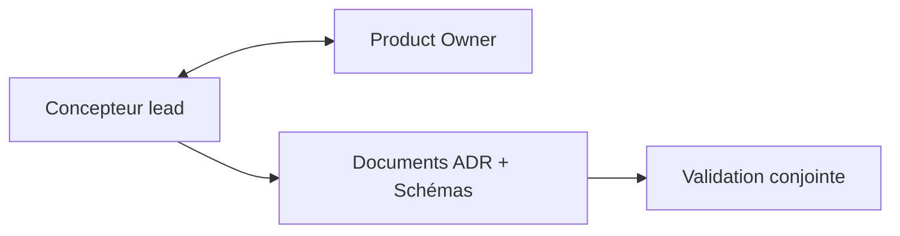
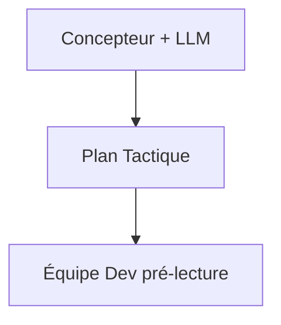
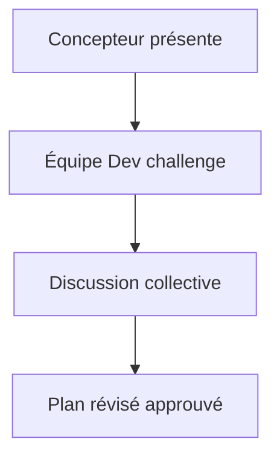
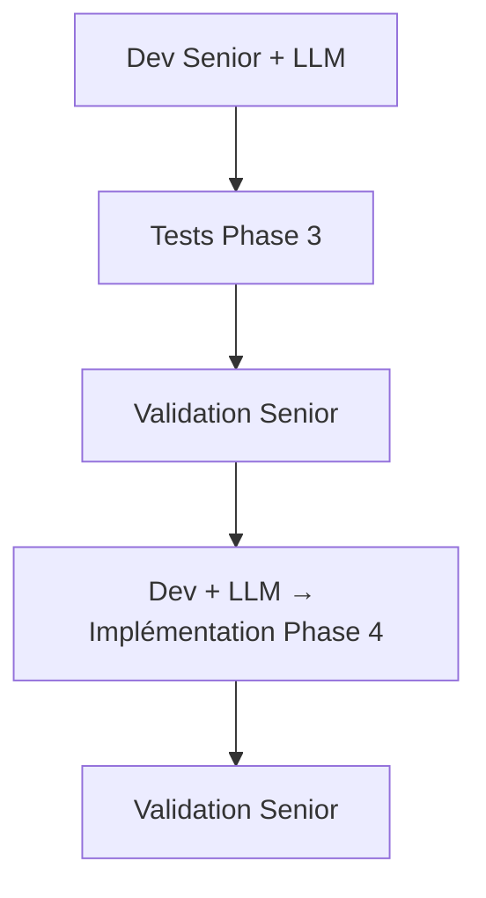
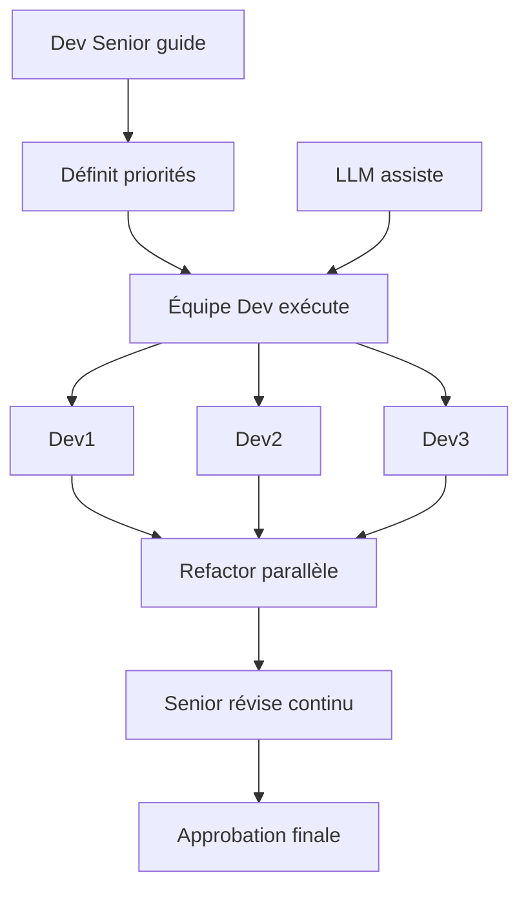
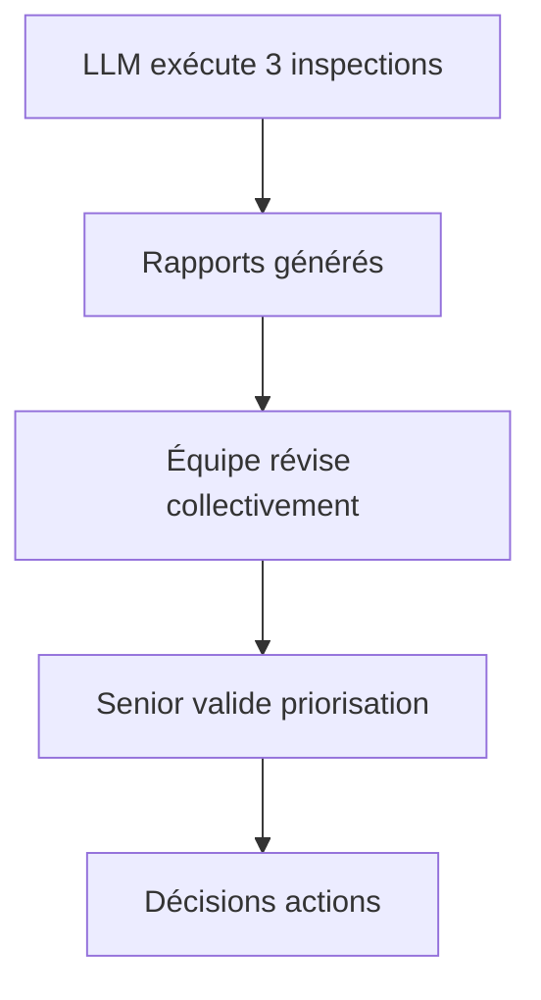

# Rôles et Responsabilités

Ce document définit les rôles clés dans la méthodologie Développement par Contraintes Convergentes (DC²) et leurs responsabilités spécifiques à travers les 6 phases. DC² est conçu pour s'adapter à différentes structures d'équipe, des startups aux grandes entreprises.

## Philosophie des Rôles

**DC² privilégie la flexibilité organisationnelle** : Les rôles décrits ici sont des **responsabilités**, pas des titres de poste rigides. Une même personne peut occuper plusieurs rôles, et un rôle peut être partagé entre plusieurs personnes selon la taille et la structure de votre équipe.

**Principe clé** : Ce qui importe n'est pas *qui* porte le titre, mais *qui* assume la responsabilité à chaque phase.

## Vue d'Ensemble des Rôles

### Rôle Principal par Phase

| Phase | Rôle Principal | Rôles Supports | Ratio Humain/LLM |
|-------|---------------|----------------|------------------|
| Phase 1 | Concepteur | Product Owner | 65% / 35% |
| Phase 2A | Concepteur + LLM | Équipe Dev (révision) | 45% / 55% |
| Phase 2B | Concepteur + Équipe Dev | - | 80% / 20% |
| Phase 3 | Dev Senior + LLM | - | 30% / 70% |
| Phase 4 | Dev + LLM | Dev Senior (validation) | 25% / 75% |
| Phase 5 | Équipe Dev | Senior (guide) | 70% / 30% |
| Phase 6 | Équipe + LLM | Senior (validation) | 40% / 60% |

## Définition des Rôles

### 1. Concepteur

**Qui peut jouer ce rôle** :
- Architecte logiciel (idéal)
- Analyste technique senior
- Tech Lead expérimenté
- Développeur senior avec talent de conception

**Responsabilités principales** :
- Traduire besoins business en décisions architecturales
- Identifier contraintes techniques et compromis
- Créer et documenter les ADR (Architecture Decision Records)
- Valider que les solutions proposées répondent aux objectifs stratégiques
- Guider l'équipe dans la compréhension de la vision architecturale

**Compétences requises** :
- Vision système (comprendre comment les composants s'interconnectent)
- Expérience avec patterns architecturaux et trade-offs
- Capacité d'articuler décisions techniques pour audience business
- Jugement sur scalabilité, performance, maintenabilité

**Engagement temps** :
- Phase 1 : ⏱️⏱️⏱️ - Rôle principal
- Phase 2 : ⏱️⏱️ - Génération + transfert critique
- Phases 3-6 : ⏱️ - Disponibilité consultation 

### 2. Product Owner

**Qui peut jouer ce rôle** :
- Product Owner Scrum/Agile
- Product Manager
- Business Analyst senior
- Chef de produit

**Responsabilités principales** :
- Définir les critères de succès business
- Prioriser les fonctionnalités et arbitrer les compromis
- Valider que la solution répond aux besoins métier
- Représenter les utilisateurs finaux et stakeholders
- Approuver le plan tactique avant développement

**Compétences requises** :
- Connaissance profonde du domaine métier
- Capacité de priorisation et arbitrage
- Communication entre technique et business
- Vision produit et roadmap

**Engagement temps** :
- Phase 1 : ⏱️⏱️ - Validation continue
- Phase 2B : ⏱️ - Transfert Critique
- Phase 6 : ⏱️ - Validation finale optionnelle

### 3. Développeur Senior

**Qui peut jouer ce rôle** :
- Développeur avec 5+ ans expérience
- Tech Lead technique
- Senior Software Engineer
- Développeur avec expertise domaine spécifique

**Responsabilités principales** :
- Valider qualité et complétude des tests (Phase 3)
- Valider justesse implémentation (Phase 4)
- **Guider l'équipe dans le refactoring** (Phase 5)
- Valider résultats des inspections (Phase 6)
- Mentor technique pour développeurs moins expérimentés

**Compétences requises** :
- Expertise technique approfondie du stack technologique
- Expérience TDD et qualité code
- Capacité de mentorat et transmission de connaissances
- Jugement sur maintenabilité et évolution long terme

**Engagement temps** :
- Phase 3 : ⏱️ - Validation tests
- Phase 4 : ⏱️ - Validation implémentation
- Phase 5 : ⏱️⏱️⏱️ - Guidance refactoring continue
- Phase 6 : ⏱️ - Validation inspections

### 4. Équipe de Développement

**Qui peut jouer ce rôle** :
- Développeurs de tous niveaux (junior à senior)
- L'équipe complète assignée au projet
- Peut inclure spécialistes (frontend, backend, data, etc.)

**Responsabilités principales** :
- **Réviser et challenger le plan tactique** (Phase 2B)
- Identifier risques et dépendances techniques
- **Exécuter le refactoring sous guidance senior** (Phase 5)
- Réviser et approuver les inspections (Phase 6)
- Développer ownership collectif du code

**Compétences requises** :
- Compétences techniques dans le stack du projet
- Capacité de travail collaboratif
- Volonté d'apprendre et d'améliorer
- Pensée critique (challenger hypothèses)

**Engagement temps** :
- Phase 2 : ⏱️⏱️ - Pré-lecture plan tactique et Transfert Critique
- Phase 4 : ⏱️ - Génération
- Phase 5 : ⏱️⏱️⏱️ - Travail refactoring actif
- Phase 6 : ⏱️ - Révision inspections

## Dynamiques de Collaboration

### Phase 1 : Architecture Stratégique

**Dynamique** : Dialogue itératif entre vision technique et besoins business. Le Concepteur propose des solutions, le PO valide l'alignement business.

### Phase 2A-2B : Plan Tactique + Transfert Critique

**Phase 2A : Génération Plan**

**Phase 2B : Transfert Critique**

**Dynamique clé** : Le Transfert Critique (Phase 2B) est le moment où la vision du Concepteur rencontre la réalité de l'équipe. L'équipe DOIT challenger activement - une équipe passive signale un problème.

**Red flags** :
- Équipe silencieuse (pas de questions/préoccupations)
- Approbation tampon sans discussion
- Estimations divergentes  > 50% entre Concepteur et Équipe

### Phase 3-4 : TDD RED-GREEN

**Dynamique** : Phases rapides, fortement automatisées. Senior valide mais ne code pas directement. Focus sur rapidité avec qualité garantie par tests.

### Phase 5 : Refactoring (Dynamique Centrale)

**Dynamique clé** : 
- **Senior ne fait PAS tout le travail seul**
- Senior identifie opportunités : "Ce module a de la duplication, qui veut l'extraire ?"
- Équipe propose approches : "On pourrait utiliser pattern Strategy ici ?"
- Senior guide : "Bonne idée, mais attention au sur-engineering."
- Équipe implémente sous guidance
- Senior révise et ajuste en continu

**Bénéfices** :
- Perfectionnement par la pratique (équipe développe compétences)
- Scalabilité (plusieurs refactorings parallèles)
- Ownership (équipe fière du résultat)
- Senior multiplicateur de force (guide 3-4 personnes simultanément)

**Anti-pattern à éviter** :
- Senior fait tout, équipe regarde → Pas d'apprentissage, goulot d'étranglement
- Équipe seule sans guidance → Risque sur-engineering ou sous-refactoring

### Phase 6 : Triple Inspection (Optionnelle)

**Dynamique** : Inspections automatisées, décisions humaines. L'équipe apprend à lire et interpréter rapports d'inspection, Le senior valide que la priorisation est appropriée.

## Adaptation Selon Taille d'Équipe

### Startup / Petite Équipe (2-4 personnes)

**Mapping typique** :
- **Tech Founder** : Concepteur + Dev Senior
- **Dev 1-2** : Équipe Dev
- **Founder/PM** : Product Owner

**Ajustements** :
- Même personne joue plusieurs rôles
- Transfert Critique moins formel (discussion d'équipe)
- Phase 5 : Tech Founder guide mais participe aussi au refactoring
- Décisions plus rapides, moins de documentation formelle

**Exemple concret** :
- **Phase 1** : Tech Founder (2h) définit architecture avec PM
- **Phase 2B** : Discussion équipe 60min autour table
- **Phase 5** : Tech Founder + Dev1 refactor ensemble, pairing

### Équipe Moyenne (5-10 personnes)

**Mapping typique** :
- **Architecte/Tech Lead** : Concepteur
- **Senior Dev (2-3)** : Dev Senior (peuvent se partager)
- **Dev (3-5)** : Équipe Dev
- **Product Owner** : Product Owner

**Ajustements** :
- Rôles plus spécialisés mais toujours flexibles
- Transfert Critique formel avec agenda structuré
- Phase 5 : 2-3 refactorings parallèles sous guidance Seniors
- Documentation complète mais pragmatique

**Exemple concret** :
- **Phase 2B** : Réunion formelle 90min, tous présents
- **Phase 5** : 
  - Senior1 guide Dev1+Dev2 sur Module A
  - Senior2 guide Dev3+Dev4 sur Module B
  - Revue commune fin journée

### Grande Équipe (10+ personnes)

**Mapping typique** :
- **Architecte Principal** : Concepteur
- **Tech Leads (2-3)** : Concepteurs assistants
- **Senior Dev (4-6)** : Dev Senior
- **Dev (10+)** : Équipe Dev
- **Product Manager + BAs** : Product Owner (collectif)

**Ajustements** :
- Hiérarchie plus formelle nécessaire
- Transfert Critique par sous-équipes avec synthèse
- Phase 5 : Multiples refactorings parallèles, coordination essentielle
- Documentation extensive, processus formalisés

**Exemple concret** :
- **Phase 1** : Architecte Principal + 2 Tech Leads co-créent
- **Phase 2B** : 
  - 3 sessions Transfert (une par sous-équipe)
  - Session consolidation finale
- **Phase 5** : 
  - 4 groupes parallèles (Senior + 2-3 Devs chacun)
  - Sync quotidien 30min tous Seniors

## Matrice de Compétences

### Compétences par Rôle

| Compétence | Concepteur | Product Owner | Dev Senior | Équipe Dev |
|-----------|-----------|---------------|------------|-----------|
| **Vision système** | Expert | Intermédiaire | Avancé | Base |
| **Patterns architecturaux** | Expert | - | Avancé | Intermédiaire |
| **Domaine métier** | Intermédiaire | Expert | Intermédiaire | Base |
| **TDD/Tests** | Intermédiaire | - | Expert | Avancé |
| **Refactoring** | Avancé | - | Expert | Intermédiaire+ |
| **Communication technique** | Expert | Expert | Avancé | Intermédiaire |
| **Mentorat** | Avancé | - | Expert | Variable |
| **Trade-offs business** | Avancé | Expert | Intermédiaire | Base |

## Pièges Courants

### 1. Concepteur Isolé
 **Problème** : Concepteur décide seul, équipe exécute aveuglément
 **Solution** : Transfert Critique obligatoire (Phase 2B), équipe challenge activement

### 2. Senior Fait Tout
**Problème** : Senior code tout le refactoring, équipe passive
**Solution** : Senior guide, équipe exécute. Apprentissage > vitesse court terme

### 3. Rôles Rigides
**Problème** : "Je suis Dev, pas Senior, donc je ne peux pas commenter l'architecture"
**Solution** : Encourager contribution tous niveaux. Junior peut avoir insights précieux.

### 4. Product Owner Absent
**Problème** : PO pas impliqué Phase 1-2, découvre résultat Phase 6
**Solution** : PO valide à Phase 1 et Phase 2B minimum. Pas de surprises tardives.

### 5. Équipe Non Challengeante
**Problème** : Équipe approuve tout au Transfert Critique sans questions
**Solution** : Créer culture sécurité psychologique. Questions = force, pas faiblesse.

## Indicateurs Santé Rôles

### Signaux Positifs
-  Équipe pose plusieur questions lors du Transfert Critique
-  Estimations Concepteur vs Équipe divergent < 20%
-  Juniors contribuent aux idées de refactoring Phase 5
-  Product Owner valide sans surprise Phase 2B

### Signaux Négatif
-  Équipe silencieuse au Transfert Critique
-  Estimations divergent >50%
-  Senior code la majorité du refactoring seul
-  Product Owner découvre solution en Phase 6
-  "C'est pas mon rôle" répété fréquemment

## Recommandations Finales

1. **Flexibilité > Rigidité** : Adaptez les rôles à votre contexte organisationnel
2. **Responsabilité > Titre** : Ce qui compte c'est qui fait quoi, pas les cartes de visite
3. **Collaboration > Hiérarchie** : Encouragez contribution tous niveaux
4. **Apprentissage > Vitesse** : Phase 5 en équipe plus lente initialement mais ROI long terme
5. **Ownership Collectif** : Équipe entière responsable qualité, pas juste Senior/Concepteur

**DC² fonctionne mieux quand les rôles sont des responsabilités partagées avec leadership clair, pas des silos étanches.**
